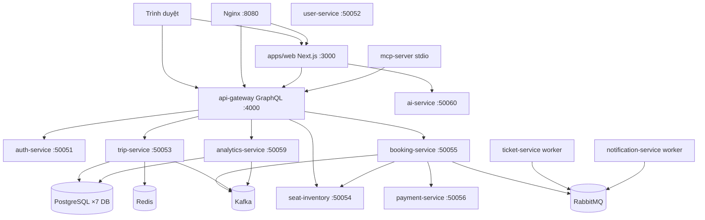
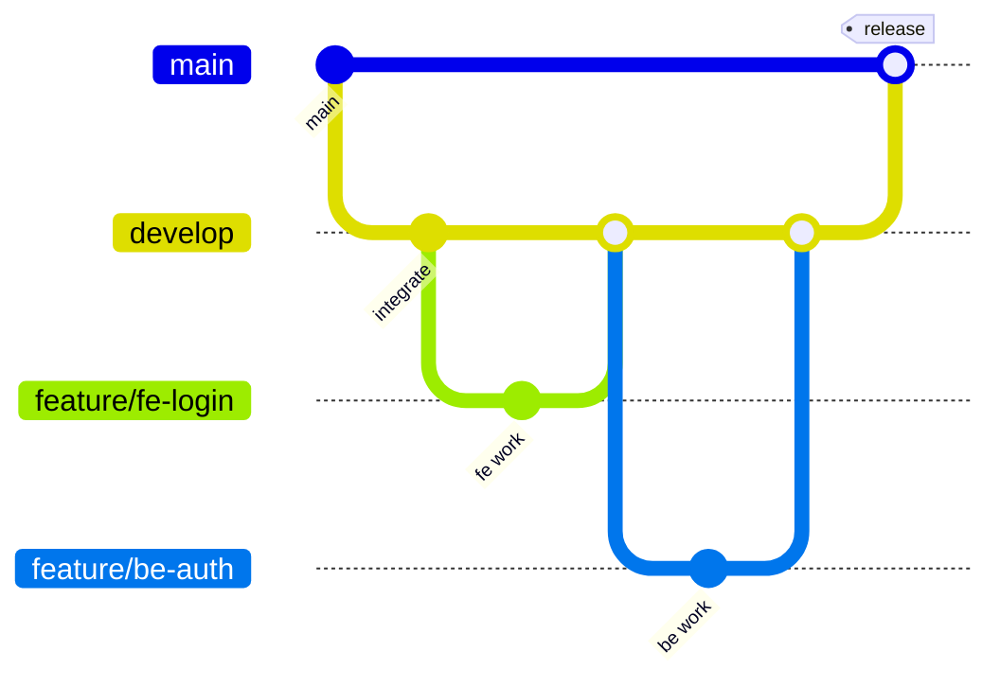
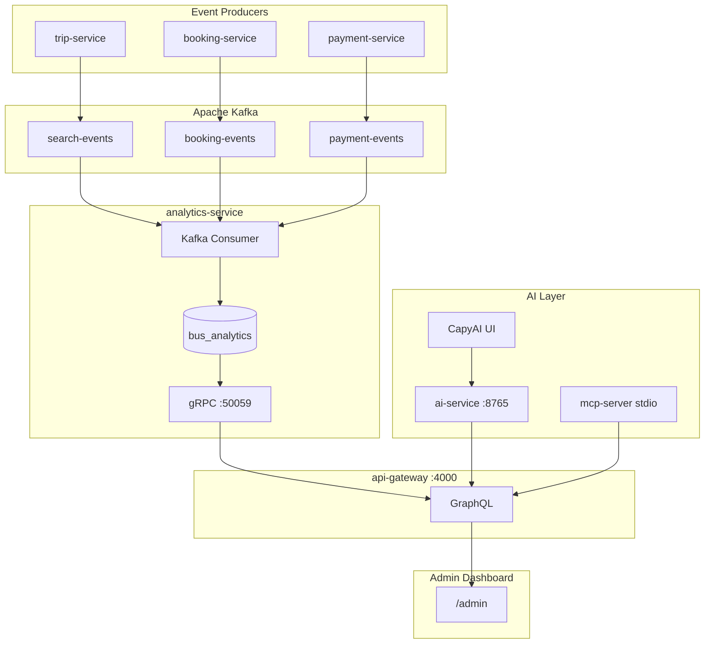

# Ghi chú Cappy Bus — Tài liệu tổng hợp

> **Bản quyền © 2026 Lữ Minh Hoàng.** Mọi quyền được bảo lưu.  
> **Dự án:** Cappy Bus (`bus-booking-platform`) — nhóm 5 người (FE · BE · DE · AI · DO)  
> **Cập nhật:** tháng 6/2026

## Mục lục

| Phần | Nội dung | Ai đọc trước |
|------|----------|--------------|
| [I — Khởi động](#phan-i--khởi-động--vận-hành) | Docker, port, dev local, Capy AI, xử lý lỗi | **Tất cả** |
| [II — Cấu trúc nhóm](#phan-ii--cấu-trúc-nhóm-phát-triển) | Vai trò, file phụ trách, lộ trình 4 tuần | **Tất cả** |
| [III — Chiến lược Git](#phan-iii--chiến-lược-git) | Nhánh, PR, commit convention | **Tất cả** |
| [IV — Module 5](#phan-iv--module-5) | Analytics, Capy AI, MCP | DE, AI, FE (admin), BE |
| — | `services/api-gateway/src/schema.graphql` | FE, BE, AI |

---

<a id="phan-i-khoi-dong"></a>

# Phần I — Khởi động & vận hành

## Bảng port quan trọng

| Port | Service | Ghi chú |
|------|---------|---------|
| **3000** | Web (Next.js) | Trình duyệt: http://localhost:3000 |
| **4000** | API Gateway (GraphQL) | **Bắt buộc** để tìm chuyến / đặt vé |
| **50060** | AI Service (Capy AI) | Chatbot góc phải trang chủ |
| **8080** | Nginx (proxy web + GraphQL) | Dự phòng: http://localhost:8080 |
| 50053 | trip-service (gRPC) | Backend tìm chuyến |
| 50054 | seat-inventory-service | Backend ghế |
| 50055 | booking-service | Backend đặt vé |
| 50051 | auth-service | Đăng nhập |
| 5432 | Postgres | Database |
| 6379 | Redis | Cache |

---

## Cách 1 — Docker một lệnh (khuyên dùng)

Mở **PowerShell** tại thư mục dự án:

```powershell
cd "d:\Web Sum 26"

# Lần đầu hoặc sau khi sửa code backend/docker
docker compose up -d --build

# Đợi service lên (30–60 giây)
Start-Sleep -Seconds 30
```

**Mở trình duyệt:** http://localhost:3000

| URL | Mô tả |
|-----|--------|
| http://localhost:3000 | Website Cappy Bus |
| http://localhost:4000/graphql | GraphQL trực tiếp (api-gateway) |
| http://localhost:4000/health | Health gateway + các service |
| http://localhost:8080/graphql | GraphQL qua Nginx |
| http://localhost:50060/health | AI service (Capy AI) |

**Tài khoản Admin demo:** `admin@bus.demo` / `admin123`

**Dừng toàn bộ:**

```powershell
docker compose down
```

**Deploy đầy đủ (build + test + docker):**

```powershell
npm run deploy
```

---

## Cách 2 — Dev local frontend (sửa UI thường xuyên)

### Bước 0 — Cài dependency (lần đầu)

```powershell
cd "d:\Web Sum 26"
npm install
```

### Backend Docker + frontend local (khuyên dùng khi dev UI)

**Terminal 1 — Backend Docker (gồm api-gateway, trip-service, …):**

```powershell
cd "d:\Web Sum 26"
docker compose stop web
docker compose up -d postgres redis kafka rabbitmq api-gateway trip-service seat-inventory-service booking-service payment-service auth-service analytics-service
```

> ⚠️ **Đừng** chạy `npm run dev:gateway` khi đã dùng Docker `api-gateway` — cả hai cùng cần port **4000** và gateway local **không** tự kết nối được microservice trong Docker (trừ khi bạn biết rõ cách cấu hình gRPC).

**Terminal 2 — Frontend:**

```powershell
cd "d:\Web Sum 26"
npm run dev:web
```

Mở: http://localhost:3000

> Nếu port 3000 bị chiếm bởi container `web`, chạy: `docker compose stop web`

**Terminal 3 (tuỳ chọn) — Capy AI local (Gemini):**

```powershell
cd "d:\Web Sum 26"
npm run dev:ai
```

Chỉ chạy khi **không** có Docker `ai-service` trên port 50060.

---

## Cách 3 — Dev full local (nâng cao, 4+ terminal)

Chỉ dùng khi dev sâu backend / không muốn Docker cho microservice.

**Terminal 1 — Hạ tầng:**

```powershell
npm run dev:infra
```

**Terminal 2 — Microservice backend** (trip, seat, booking, auth, …) — chạy từng service hoặc dùng Docker chỉ cho backend:

```powershell
docker compose up -d trip-service seat-inventory-service booking-service auth-service payment-service analytics-service
```

> Docker-compose đã expose gRPC ra host (`50053`, `50054`, `50055`, `50051`, `50059`) để gateway local kết nối được.

**Terminal 3 — API Gateway local:**

```powershell
npm run dev:gateway
```

Script tự set `TRIP_SERVICE_URL=localhost:50053`, … và tắt Docker `api-gateway` nếu đang chiếm port 4000.

**Terminal 4 — Frontend:**

```powershell
npm run dev:web
```

**Terminal 5 (tuỳ chọn) — Capy AI:**

```powershell
npm run dev:ai
```

Thứ tự: **infra → backend services → gateway → ai → web**.

---

## Script npm hữu ích

| Lệnh | Mô tả |
|------|--------|
| `npm run dev:web` | Chạy Next.js dev (port 3000) |
| `npm run dev:gateway` | Gateway local (4000) — **tự tắt Docker api-gateway + giải phóng port** |
| `npm run dev:ai` | Capy AI local (50060) — **tự tắt Docker ai-service + giải phóng port** |
| `npm run dev:infra` | Chỉ Postgres, Redis, Kafka, RabbitMQ |
| `npm run docker:up` | `docker compose up -d --build` |
| `npm run docker:down` | Dừng Docker |
| `npm run clean:deps` | **Xóa** `node_modules`, `dist`, `.next`, … (giảm dung lượng trước zip/copy) |
| `npm run setup` | **Cài lại** dependency sau clone hoặc sau `clean:deps` |

Script khởi động: `scripts/start-dev-service.cjs` (`gateway` | `ai`).

### Xóa & cài lại dependencies (Git / clone)

Git **đã ignore** `node_modules` — không bắt buộc xóa trước `git push`. Chỉ dùng khi muốn gọn thư mục:

```powershell
cd "d:\Web Sum 26"
npm run clean:deps          # xóa node_modules, dist, .next, ...
# git add / commit / push   # node_modules không lên remote

npm run setup               # sau clone hoặc sau clean:deps — cài lại hết
```

---

## Chạy lệnh ở terminal nào? Thứ tự ra sao?

### 🟢 Cách A — Chỉ cần mở web (1 terminal, khuyên dùng)

| Terminal | Lệnh | Ghi chú |
|----------|------|---------|
| **Terminal 1** | `cd "d:\Web Sum 26"` | Vào thư mục dự án |
| | `npm run docker:up` | Hoặc `docker compose up -d --build` |
| | *(đợi 30–60 giây)* | |
| | Mở **http://localhost:3000** | Tìm chuyến + Capy AI |

**Không cần** `dev:web`, `dev:gateway`, `dev:ai` riêng.

**Dừng:** `npm run docker:down`

---

### 🟡 Cách B — Sửa code frontend (2 terminal)

| Thứ tự | Terminal | Lệnh | Port |
|--------|----------|------|------|
| **1** | Terminal 1 | `docker compose stop web` | Tránh trùng 3000 |
| | | `docker compose up -d` *(hoặc chỉ backend như Cách 2)* | api-gateway **4000** |
| **2** | Terminal 2 | `npm run dev:web` | **3000** |

**Capy AI:** dùng Docker `ai-service` **hoặc** `npm run dev:ai` — **chọn một**, không cả hai.

---

### 🔵 Cách C — Dev full local (xem mục Cách 3 phía trên)

---

### Tóm tắt nhanh — Service nào chạy ở đâu?

| Chức năng | Docker (khuyên dùng) | Local dev |
|-----------|----------------------|-----------|
| Tìm chuyến / đặt vé | `docker compose up -d api-gateway` (+ trip, booking, …) | `dev:gateway` + backend gRPC trên localhost |
| Capy AI | `docker compose up -d ai-service` | `npm run dev:ai` |
| Frontend hot-reload | `docker compose stop web` + `dev:web` | `npm run dev:web` |

---

## Kiến trúc kết nối (quan trọng)

```
Trình duyệt
    │
    ├─► http://localhost:3000        (Web)
    │
    ├─► http://localhost:4000/graphql   (GraphQL — tìm chuyến, đặt vé)
    │       └─► api-gateway
    │               └─► trip-service :50053 (gRPC)
    │               └─► booking-service :50055
    │               └─► seat-inventory-service :50054
    │               └─► auth-service :50051
    │
    └─► http://localhost:50060/chat     (Capy AI)
            └─► Gemini API (Google AI Studio)
```

- Frontend (trình duyệt) gọi **trực tiếp** `http://localhost:4000/graphql` — không qua rewrite Next.js (đã sửa cho Docker standalone).
- Frontend gọi AI qua `/api/chat` → proxy tới **ai-service** port **50060**.

File liên quan:
- `apps/web/src/lib/graphql.ts` — URL GraphQL
- `apps/web/next.config.js` — proxy `/api/chat`
- `services/api-gateway/src/index.ts` — gateway + graceful shutdown
- `services/ai-service/src/index.ts` — Gemini + fallback demo

---

## Cấu hình môi trường (`.env`)

File **`.env`** ở thư mục gốc `d:\Web Sum 26` (đã gitignore). Mẫu: `.env.example`

```env
# Capy AI — Gemini (ưu tiên)
GOOGLE_GENERATIVE_AI_API_KEY=your-gemini-api-key-here

# Tuỳ chọn: model Gemini (mặc định gemini-2.5-flash)
# GEMINI_MODEL=gemini-2.5-flash

# Dự phòng OpenAI (nếu không có Gemini key)
# OPENAI_API_KEY=sk-your-openai-key-here
```

| Biến | Mô tả |
|------|--------|
| `GOOGLE_GENERATIVE_AI_API_KEY` | Key từ [Google AI Studio](https://aistudio.google.com) |
| `GEMINI_MODEL` | Mặc định `gemini-2.5-flash` (tránh `gemini-2.0-flash` nếu hết quota free tier) |
| `OPENAI_API_KEY` | Fallback nếu không có Gemini key |

**Sau khi sửa `.env`:** restart `npm run dev:ai` hoặc `docker compose restart ai-service`.

**Không** commit key lên git / chat / screenshot.

---

## Capy AI — Hướng dẫn & xử lý lỗi

### Cách hoạt động

- Nút **Capy AI** góc phải trang chủ → gửi tin nhắn
- Frontend → **`/api/chat`** → **ai-service** port **50060**
- Có `GOOGLE_GENERATIVE_AI_API_KEY` → dùng **Gemini** (`gemini-2.5-flash`)
- Có `OPENAI_API_KEY` (không có Gemini) → dùng GPT-4o-mini
- API lỗi / hết quota → **tự fallback chế độ demo** (vẫn trả lời cơ bản)

### Tin nhắn thường gặp trên UI

| Chat hiển thị | Ý nghĩa |
|---------------|---------|
| `Capy AI tạm thời không khả dụng` | ai-service **chưa chạy** |
| `⚠️ AI tạm không khả dụng... chế độ demo` | AI chạy nhưng **hết quota** API — kiểm tra Google AI Studio / OpenAI billing |
| Trả lời thông minh (không có ⚠️) | Gemini/OpenAI hoạt động bình thường |

### Khởi động Capy AI — chọn MỘT cách

| Cách | Lệnh |
|------|------|
| Local dev | `npm run dev:ai` |
| Docker | `docker compose up -d ai-service` |

### Kiểm tra AI

```powershell
Invoke-WebRequest -Uri "http://localhost:50060/health" -UseBasicParsing

$body = '{"messages":[{"role":"user","content":"xin chào"}]}'
Invoke-WebRequest -Uri "http://localhost:50060/chat" -Method POST -ContentType "application/json" -Body $body -UseBasicParsing
```

Qua proxy frontend (khi `dev:web` chạy):

```powershell
$body = '{"messages":[{"role":"user","content":"xin chào"}]}'
Invoke-WebRequest -Uri "http://localhost:3000/api/chat" -Method POST -ContentType "application/json" -Body $body -UseBasicParsing
```

---

## Tìm chuyến — Hướng dẫn & xử lý lỗi

### Lỗi thường gặp

| Triệu chứng | Nguyên nhân | Cách xử lý |
|-------------|-------------|------------|
| `Không kết nối được máy chủ (port 4000)` | api-gateway **không chạy** | `docker compose up -d api-gateway` |
| Tìm chuyến lỗi sau khi `dev:gateway` | Gateway **local** không nối được trip-service trong Docker | Dùng Docker gateway: `docker compose up -d api-gateway` và **tắt** `dev:gateway` |
| `502 Bad Gateway` qua port 8080 | Nginx cache IP cũ sau khi restart gateway | `docker compose restart nginx` |
| `14 UNAVAILABLE` (gRPC) | Backend microservice chưa lên | `docker compose up -d trip-service booking-service seat-inventory-service` |

### Kiểm tra tìm chuyến hoạt động

```powershell
$body = '{"query":"query($o:String!,$d:String!,$t:String!){searchTrips(origin:$o,destination:$d,travelDate:$t){id price}}","variables":{"o":"TP.HCM","d":"Da Lat","t":"2026-06-15"}}'
Invoke-WebRequest -Uri "http://localhost:4000/graphql" -Method POST -ContentType "application/json" -Body $body -UseBasicParsing
```

Kết quả đúng: JSON có `"data":{"searchTrips":[...]}` với danh sách chuyến.

### Quy tắc vàng — api-gateway

| Muốn | Làm |
|------|-----|
| Dùng web bình thường (tìm chuyến, đặt vé) | `docker compose up -d api-gateway` (+ các service backend) |
| Dev sửa code gateway | `npm run dev:gateway` — **phải** có backend gRPC trên localhost (Docker expose port hoặc chạy local) |
| **Không** chạy đồng thời | Docker `api-gateway` **và** `npm run dev:gateway` — cùng port **4000** |

---

## Lỗi `EADDRINUSE` (port 4000 / 50060)

```
Error: listen EADDRINUSE: address already in use :::4000
Error: listen EADDRINUSE: address already in use :::50060
```

### Cách fix nhanh

| Lỗi port | Chạy lại | Hoặc dùng Docker |
|----------|----------|------------------|
| **4000** (gateway) | `npm run dev:gateway` | `docker compose up -d api-gateway` |
| **50060** (Capy AI) | `npm run dev:ai` | `docker compose up -d ai-service` |

Script `start-dev-service.cjs` tự:
1. Dừng container Docker tương ứng
2. Kill process cũ trên port đó
3. Khởi động bản local

### ⚠️ Lưu ý đặc biệt port 4000

- `npm run dev:gateway` **tắt** Docker `api-gateway` → nếu bạn chỉ cần **tìm chuyến**, nên **bật lại** Docker gateway thay vì chạy gateway local:
  ```powershell
  docker compose up -d api-gateway
  ```
- Gateway local có **graceful shutdown** khi `tsx watch` reload — tránh port bị kẹt sau khi sửa code.

### Kiểm tra port đang bị ai chiếm

```powershell
netstat -ano | findstr ":4000"
netstat -ano | findstr ":50060"
```

Cột cuối là **PID**. Tắt thủ công:

```powershell
taskkill /PID <PID> /F
```

> Tránh `taskkill /IM node.exe /F` nếu đang chạy `dev:web` — sẽ tắt hết Node.

### Tránh xung đột Local vs Docker

| Tình huống | Xử lý |
|------------|--------|
| Tìm chuyến / đặt vé | Dùng **Docker** `api-gateway` |
| Dev code gateway | `dev:gateway` + backend gRPC sẵn sàng |
| Capy AI local | `docker compose stop ai-service` trước `dev:ai` |
| Capy AI Docker | Không chạy `dev:ai` |

```powershell
docker ps --format "table {{.Names}}\t{{.Ports}}\t{{.Status}}" | findstr -i "gateway ai-service"
```

---

## Xử lý lỗi thường gặp (tổng hợp)

| Triệu chứng | Cách xử lý |
|-------------|------------|
| Port 3000 đã dùng | `docker compose stop web` hoặc tắt Next.js khác |
| Không tìm được chuyến | Kiểm tra `http://localhost:4000/health` — bật `api-gateway` + `trip-service` |
| `Không kết nối được máy chủ (4000)` | `docker compose up -d api-gateway` — **đừng** chỉ chạy `dev:gateway` nếu backend trong Docker |
| Capy AI không trả lời | `npm run dev:ai` hoặc `docker compose up -d ai-service` |
| Capy AI chế độ demo (⚠️) | Nạp quota Gemini / OpenAI hoặc kiểm tra `.env` |
| `EADDRINUSE :::4000` | Chọn **một**: Docker gateway **hoặc** `dev:gateway` |
| `EADDRINUSE :::50060` | Chọn **một**: Docker ai-service **hoặc** `dev:ai` |
| `502` qua :8080 | `docker compose restart nginx` |
| Đổi code frontend không thấy | Ctrl+Shift+R hoặc restart `dev:web` |
| Đổi code Docker web | `docker compose build web && docker compose up -d web` |
| Sửa `.env` / `next.config.js` | Restart service tương ứng |

---

## Luồng demo nhanh (5 phút)

1. `docker compose up -d` → đợi 30s
2. Mở http://localhost:3000
3. Tìm chuyến **TP.HCM → Đà Lạt** → **Tìm chuyến**
4. Chọn chuyến → **Chọn ghế** → điền hành khách → **Tiếp tục thanh toán**
5. Tạo booking → **Thanh toán thành công**
6. **Tra cứu vé** tại `/lookup` với mã booking + email
7. Thử **Capy AI** góc phải — hỏi *"tìm chuyến TP.HCM đi Đà Lạt"*

---

## Checklist khởi động nhanh (copy-paste)

```powershell
cd "d:\Web Sum 26"

# 1. Bật toàn bộ Docker
docker compose up -d --build
Start-Sleep -Seconds 30

# 2. Kiểm tra gateway + tìm chuyến
Invoke-WebRequest -Uri "http://localhost:4000/health" -UseBasicParsing

# 3. Kiểm tra Capy AI
Invoke-WebRequest -Uri "http://localhost:50060/health" -UseBasicParsing

# 4. Mở web
start http://localhost:3000
```

**Dev frontend thêm:**

```powershell
docker compose stop web
npm run dev:web
```

**Capy AI local (có Gemini key trong .env):**

```powershell
docker compose stop ai-service
npm run dev:ai
```

---

<a id="phan-ii-team"></a>

# Phần II — Cấu trúc nhóm phát triển

## Danh sách nhóm & nhánh Git

| STT | Họ tên (điền) | Vai trò | Prefix nhánh | Repo chính làm việc |
|-----|---------------|---------|--------------|-------------------|
| 1 | _____________ | **FE** — Frontend | `feature/fe-` | `apps/web/` |
| 2 | _____________ | **BE** — Backend | `feature/be-` | `services/`, `packages/proto/` |
| 3 | _____________ | **DE** — Data | `feature/de-` | `services/*/prisma/`, `packages/shared/`, `infra/` |
| 4 | _____________ | **AI** — AI/MCP | `feature/ai-` | `services/ai-service/`, `apps/mcp-server/` |
| 5 | _____________ | **DO** — DevOps/QA | `feature/do-` | `docker-compose.yml`, `scripts/`, `.github/` |

**Luồng Git chuẩn:** `feature/<role>-xxx` → PR vào `develop` → khi ổn định merge `develop` → `main`

### Bạn là ai? — Đọc phần nào trước?

| Vai trò | Đọc ngay | Lộ trình 4 tuần |
|---------|----------|-----------------|
| **FE** | [§1 Frontend](#1-frontend-engineer-fe) + [Phần III — Chiến lược Git](#phan-iii--chiến-lược-git) | Tuần 1–4 trong §1 |
| **BE** | [§2 Backend](#2-backend-engineer-be) + `schema.graphql` | Tuần 1–4 trong §2 |
| **DE** | [§3 Data](#3-data-engineer-de) + [Phần IV — Module 5](#phan-iv--module-5) §2–3 | Tuần 1–4 trong §3 |
| **AI** | [§4 AI/MCP](#4-aimcp-engineer-ai) + [Phần IV — Module 5](#phan-iv--module-5) toàn bộ | Tuần 1–4 trong §4 |
| **DO** | [§5 DevOps](#5-devops--qa-engineer-do) + tạo nhánh `develop` | Tuần 1–4 trong §5 |

**Ngày đầu tiên (cả nhóm):**

```powershell
cd "d:\Web Sum 26"
npm install
docker compose up -d
npm run dev:web          # Terminal 1 — FE
# Đọc: GHI-CHU-KHOI-DONG.md + phần vai trò của mình bên dưới
```

---

## Tổng quan kiến trúc



### 5 vị trí và viết tắt

| Viết tắt | Vị trí |
|----------|--------|
| **FE** | Frontend Engineer |
| **BE** | Backend Engineer |
| **DE** | Data Engineer |
| **AI** | AI/MCP Engineer |
| **DO** | DevOps & QA Engineer |

---

## Sơ đồ trách nhiệm dự án

```
                    ┌─────────────────┐
                    │    Frontend     │
                    │  (apps/web)     │
                    └────────┬────────┘
                             │ GraphQL / WS / REST /api/chat
                             ▼
                    ┌─────────────────┐
                    │    Backend      │
                    │ (gateway + gRPC │
                    │   microservices)│
                    └────────┬────────┘
                             │ Prisma / Redis keys / Kafka / RabbitMQ
                             ▼
                    ┌─────────────────┐
                    │      Data       │
                    │ (schema, seed,  │
                    │  event pipeline)│
                    └────────┬────────┘
                             │ GraphQL tools / chat API
                             ▼
                    ┌─────────────────┐
                    │    AI / MCP     │
                    │ (ai-service +   │
                    │   mcp-server)   │
                    └────────┬────────┘
                             │ Docker / CI / test / deploy
                             ▼
                    ┌─────────────────┐
                    │  DevOps & QA    │
                    │ (infra, scripts,│
                    │  health, CI)    │
                    └─────────────────┘
```

**Luồng phối hợp chính:**
- FE ↔ BE: Hợp đồng GraphQL (`schema.graphql`), WebSocket subscription `seatUpdated`, auth JWT
- BE ↔ DE: Prisma schema, Redis key pattern, Kafka topic, seed data, analytics pipeline
- BE ↔ AI: `API_GATEWAY_URL` — AI/MCP gọi GraphQL qua gateway
- FE ↔ AI: `POST /api/chat` (rewrite Next.js → `ai-service`)
- Tất cả ↔ DO: Docker Compose, health check, CI, script dev/deploy/test

---

## Chức năng chưa hoàn thiện / đang làm dở

| # | Chức năng | Trạng thái | Vị trí phụ trách | Ghi chú |
|---|-----------|------------|------------------|---------|
| 1 | Quên / đặt lại mật khẩu | UI ✅ — API ❌ | BE + FE | `forgot-password`, `reset-password` chưa gọi GraphQL thật |
| 2 | User saved passengers (gRPC) | Một phần | BE + DE | Logic đã gộp `auth-service`; kiểm tra `SavedPassenger` |
| 3 | Gửi email thật | Mock | BE + DO | `notification-service` console.log |
| 4 | Thanh toán thật | Simulate | BE | `payment-service` — `simulate_success` |
| 5 | `RouteTicketStat` pipeline | Schema có, chưa ghi | DE | Xem `GHI-CHU-KHOI-DONG.md (Phần IV)` backlog P1 |
| 6 | MCP HTTP port 3100 | Lệch Docker vs stdio | AI + DO | Compose expose 3100, code dùng stdio |
| 7 | Prisma migrations versioned | Chưa có | DE + DO | Hiện `db push` trong Dockerfile |
| 8 | E2E framework | Chưa có | DO | Chỉ `scripts/*.ts` integration |
| 9 | Đăng nhập Google / SĐT | UI placeholder | FE + BE | Toast "sắm khả dụng" |
| 10 | `@apollo/client` | Dependency thừa | FE | Có trong package.json, không dùng |

### Đã hoàn thiện gần đây (tham khảo khi học code)

| Tính năng | File chính |
|-----------|------------|
| Hủy vé — bảo mật (chỉ chủ tài khoản) | `CancelBookingButton.tsx`, `api-gateway/resolvers.ts`, `booking-service` |
| UI auth tối giản (login/register/forgot) | `AuthSplitLayout.tsx`, `login/`, `register/`, `forgot-password/` |
| Vé điện tử / Vé của tôi | `my-tickets/`, `ETicketCard.tsx` |
| Admin CRUD | `admin/buses`, `routes`, `stops`, `trips`, `events` |
| Voucher / ưu đãi | `PromoVoucherCard.tsx`, `marketing.ts` |
| Tra cứu vé + gợi ý ngày | `lookup/page.tsx`, `suggestNearestDate` |

---

# 1. Frontend Engineer (FE)

## Mục tiêu công việc

Xây dựng và duy trì giao diện người dùng Cappy Bus (tiếng Việt): tìm chuyến, chọn ghế real-time, đặt vé, tra cứu, quản trị, SEO, xác thực JWT phía client.

## Chức năng phụ trách

| Chức năng | Route / Component | GraphQL / API |
|-----------|-------------------|---------------|
| Trang chủ + tìm chuyến | `/` `page.tsx` | `autocompleteLocations`, `searchTrips` |
| Tìm chuyến theo query | `/trips` | `searchTrips` |
| SEO tuyến đường | `/[slug]` → `ve-xe-*` | `searchTrips` qua `[slug]/page.tsx` |
| Chi tiết chuyến + chọn ghế | `/trips/[id]` | `tripDetail`, `seatMap`, `holdSeats`, WS `seatUpdated` |
| Đặt vé + thanh toán | `/booking` | `createBooking`, `processPayment` |
| Tra cứu vé | `/lookup` | `bookingByCode`, `ticketsForBooking` |
| Vé của tôi / e-ticket | `/my-tickets`, `/my-tickets/[id]` | `myTickets`, `ticketsForBooking` |
| Hồ sơ tài khoản | `/profile` | Auth session, `AccountDashboard` |
| Đăng nhập / Đăng ký / Quên MK | `/login`, `/register`, `/forgot-password` | `login`, `register` — reset API chưa có |
| Admin dashboard + CRUD | `/admin`, `/admin/buses`, `routes`, `stops`, `trips` | `adminDashboard`, admin mutations |
| Cấu hình ghế bus | `/admin/layout` | `updateBusSeatLayout` |
| Capy AI chat | `CapyAI.tsx` (global) | `POST /api/chat` |
| Auth UI chung | `AuthSplitLayout.tsx` | — |
| Hủy vé (chủ tài khoản) | `CancelBookingButton.tsx` | `cancelBooking` + JWT |
| Auth & routing guard | `AuthProvider`, `AuthGuard` | JWT localStorage |
| SEO metadata | `seo.ts`, `[slug]/page.tsx` | — |
| Hiển thị trạng thái chuyến | `TripAvailabilityBadge` | `bookable`, `availabilityStatus` |

## Thư mục phụ trách

```
apps/web/
├── public/
├── scripts/
└── src/
    ├── app/
    ├── components/
    ├── hooks/
    └── lib/
```

## Module phụ trách

- Next.js 15 App Router (`@bus/web`)
- Tailwind CSS + Framer Motion UI
- Client GraphQL (`lib/graphql.ts` — custom fetch, không Apollo)
- WebSocket GraphQL subscription (native, không `graphql-ws` lib)
- Auth client (`lib/auth.ts`, `lib/session.ts`)
- SEO slug builder (`lib/seo.ts`, `lib/trip-search.ts`)
- Mirror logic: `lib/datetime.ts`, `lib/trip-availability.ts` (đồng bộ với `@bus/shared`)

## API phụ trách (phía client)

| Loại | Endpoint | Ghi chú |
|------|----------|---------|
| GraphQL Query | `autocompleteLocations`, `searchTrips`, `tripDetail`, `seatMap`, `bookingByCode`, `myBookings`, `revenueSummary`, `popularRoutes`, `conversionRate` | Qua `gql()` |
| GraphQL Mutation | `login`, `register`, `holdSeats`, `createBooking`, `processPayment`, `checkIn`, `updateBusSeatLayout` | Qua `gql()` |
| GraphQL Subscription | `seatUpdated` | WS `NEXT_PUBLIC_WS_URL` |
| REST | `POST /api/chat` | Rewrite → ai-service |
| — | `cancelBooking`, `releaseSeats`, `suggestNearestDate` | `cancelBooking` ✅ FE+BE; `suggestNearestDate` ✅ homepage/trips; `releaseSeats` ⚠️ chưa UI |

## Service phụ trách

Không chạy service backend. Tiêu thụ:
- `api-gateway` (:4000 hoặc qua Nginx :8080)
- `ai-service` (:50060 qua rewrite)

## Database phụ trách

Không trực tiếp. Chỉ hiển thị dữ liệu từ GraphQL.

## Công nghệ liên quan

Next.js 15, React 19, TypeScript, Tailwind CSS 3, Framer Motion, Lucide React, react-hot-toast, GraphQL 16 (client fetch)

## Cần học trước

1. Next.js App Router (RSC vs Client Components)
2. GraphQL queries/mutations/subscriptions
3. JWT auth flow phía browser
4. WebSocket `graphql-transport-ws` protocol
5. Tailwind + responsive design
6. SEO dynamic routes (`[slug]`)

## Thứ tự đọc code đề xuất

1. `apps/web/package.json` → `next.config.js`
2. `src/app/layout.tsx` → `src/components/Providers.tsx`
3. `src/lib/graphql.ts` → `src/lib/auth.ts` → `src/lib/session.ts`
4. `src/app/page.tsx` (homepage flow)
5. `src/lib/seo.ts` → `src/lib/trip-search.ts` → `src/lib/trip-availability.ts`
6. `src/app/trips/page.tsx` → `src/app/trips/[id]/page.tsx`
7. `src/components/SeatMapGrid.tsx`
8. `src/app/booking/page.tsx` → `lookup/page.tsx` → `my-bookings/page.tsx`
9. `src/app/login/page.tsx` → `register/page.tsx` → `forgot-password/page.tsx` (`AuthSplitLayout`)
10. `src/app/my-tickets/page.tsx` → `ETicketCard.tsx`
11. `src/app/admin/page.tsx` → `admin/trips/page.tsx` → `admin/buses/page.tsx`
12. `services/api-gateway/src/schema.graphql` (hợp đồng API)

## Công việc hằng ngày

- Sửa UI/UX, fix responsive, accessibility
- Đồng bộ GraphQL fields mới từ BE
- Test flow tìm chuyến → chọn ghế → đặt vé trên localhost:3000
- Review WebSocket seat update trên `/trips/[id]`
- Giữ `CopyrightNotice` và footer bản quyền

## Công việc hằng tuần

- Sync với BE về breaking changes GraphQL schema
- Kiểm tra SEO slug routes (`ve-xe-*`)
- Review performance (LCP, bundle size)
- Triển khai UI cho API đã có nhưng chưa dùng (`releaseSeats` khi rời trang chọn ghế)
- Cập nhật mirror `datetime`/`trip-availability` khi `@bus/shared` thay đổi

## Checklist onboarding

- [ ] Đọc [Phần III — Chiến lược Git](#phan-iii--chiến-lược-git) — tạo `feature/fe-xxx` từ `develop`
- [ ] `npm install` + `npm run dev:web` (backend Docker đang chạy)
- [ ] Mở http://localhost:3000, tìm chuyến HCM → Cần Thơ
- [ ] Đăng nhập `admin@bus.demo` / `admin123`, vào `/admin`
- [ ] Chọn ghế real-time trên `/trips/[id]`
- [ ] Hoàn tất flow đặt vé `/booking`, xem vé `/my-tickets`
- [ ] Đọc `schema.graphql` — biết mọi operation FE dùng
- [ ] Hiểu `NEXT_PUBLIC_GRAPHQL_URL`, `NEXT_PUBLIC_WS_URL`
- [ ] Đọc `GHI-CHU-KHOI-DONG.md` phần dev local frontend

### Lộ trình học 4 tuần — FE

| Tuần | Mục tiêu | Đọc / làm |
|------|----------|-----------|
| 1 | Next.js + GraphQL client | `layout.tsx`, `graphql.ts`, `login/page.tsx`, `page.tsx` (homepage) |
| 2 | Booking flow | `trips/page.tsx` → `trips/[id]` → `SeatMapGrid` → `booking/page.tsx` |
| 3 | Tài khoản & vé | `my-tickets/`, `ETicketCard`, `CancelBookingButton`, `AuthProvider` |
| 4 | Admin + polish | `admin/page.tsx`, `admin/trips`, PR `feature/fe-xxx` vào `develop` |

---

# 2. Backend Engineer (BE)

## Mục tiêu công việc

Thiết kế và triển khai toàn bộ logic nghiệp vụ phía server: GraphQL gateway, gRPC microservices, auth, booking flow, thanh toán mô phỏng, xuất vé async, health check.

## Chức năng phụ trách

| Service | Port gRPC/HTTP | Chức năng |
|---------|----------------|-----------|
| `api-gateway` | HTTP 4000 | GraphQL aggregation, JWT auth, rate limit, WS subscription |
| `auth-service` | gRPC 50051 | Login, Register, ValidateToken, JWT HMAC-SHA256 |
| `trip-service` | gRPC 50053 | SearchTrips, GetTripDetail, Autocomplete, SuggestNearestDate |
| `seat-inventory-service` | gRPC 50054 | GetSeatMap, Hold/Release/Confirm/BlockSeats (Redis) |
| `booking-service` | gRPC 50055 | CreateBooking, ProcessPayment, CheckIn, Cancel, Expire |
| `payment-service` | gRPC 50056 | ProcessPayment simulate, idempotency |
| `user-service` | gRPC 50052 | ⚠️ Handler có, chưa register gRPC service |
| `ticket-service` | Worker | RabbitMQ consumer → generate HTML ticket |
| `notification-service` | Worker | RabbitMQ consumer → ⚠️ email mock |
| `analytics-service` | gRPC 50059 | Revenue, popular routes, conversion (phối hợp DE) |

## Thư mục phụ trách

```
services/
├── api-gateway/
├── auth-service/
├── trip-service/src/
├── seat-inventory-service/
├── booking-service/src/
├── payment-service/src/
├── user-service/src/
├── ticket-service/src/
├── notification-service/
└── analytics-service/src/        # logic gRPC handler — schema thuộc DE

packages/
└── proto/
```

## Module phụ trách

- `@bus/api-gateway` — Apollo Server + Express + graphql-ws
- `@bus/auth-service`, `@bus/trip-service`, `@bus/seat-inventory-service`
- `@bus/booking-service`, `@bus/payment-service`, `@bus/user-service`
- `@bus/ticket-service`, `@bus/notification-service`
- `@bus/analytics-service` (gRPC handlers)
- `@bus/proto` — định nghĩa và load 6 proto files

## API phụ trách

### GraphQL (`services/api-gateway/src/schema.graphql`)

**Query:** `health`, `autocompleteLocations`, `searchTrips`, `tripDetail`, `seatMap`, `booking`, `bookingByCode`, `myBookings`, `suggestNearestDate`, `revenueSummary`, `popularRoutes`, `conversionRate`

**Mutation:** `register`, `login`, `holdSeats`, `releaseSeats`, `createBooking`, `processPayment`, `cancelBooking`, `checkIn`, `blockSeats`, `updateBusSeatLayout`

**Subscription:** `seatUpdated`

### REST

- `GET /health`, `GET /health/self` — api-gateway

### gRPC (6 services qua `@bus/proto`)

| Proto | Service | RPCs |
|-------|---------|------|
| `auth.proto` | AuthService | Login, Register, ValidateToken |
| `trip.proto` | TripService | SearchTrips, GetTripDetail, AutocompleteLocations, SuggestNearestDate |
| `seat.proto` | SeatInventoryService | GetSeatMap, HoldSeats, ReleaseSeats, ConfirmSeats, BlockSeats |
| `booking.proto` | BookingService | CreateBooking, GetBooking, GetBookingByCode, CancelBooking, CheckIn, ListUserBookings, ExpirePendingBookings, ProcessPayment, MarkTicketIssued |
| `payment.proto` | PaymentService | ProcessPayment, GetPaymentStatus |
| `analytics.proto` | AnalyticsService | GetRevenueSummary, GetPopularRoutes, GetConversionRate, GetTicketsSoldByRoute |

## Service phụ trách

Toàn bộ 10 services trong `services/` (trừ `ai-service` thuộc AI).

## Database phụ trách

Không sở hữu schema (DE sở hữu Prisma). BE viết business logic truy vấn qua Prisma Client trong từng service.

## Công nghệ liên quan

Node.js 20+, TypeScript, Express, Apollo Server 4, graphql-ws, @grpc/grpc-js, @grpc/proto-loader, Prisma Client, @bus/shared

## Cần học trước

1. GraphQL schema design + resolvers
2. gRPC + Protobuf
3. Microservice patterns (database-per-service)
4. JWT authentication
5. Redis distributed locking (seat hold)
6. RabbitMQ pub/sub (booking.paid flow)
7. Kafka producer (event publishing)
8. State machine booking status (`@bus/shared/constants`)

## Thứ tự đọc code đề xuất

1. `packages/proto/proto/*.proto` — hợp đồng gRPC
2. `services/api-gateway/src/schema.graphql` → `resolvers.ts` → `context.ts`
3. `packages/shared/src/constants.ts` — status machine, queue names
4. `services/auth-service/src/index.ts`
5. `services/trip-service/src/index.ts`
6. `services/seat-inventory-service/src/index.ts`
7. `packages/shared/src/redis-seats.ts`
8. `services/booking-service/src/index.ts`
9. `services/payment-service/src/index.ts`
10. `services/ticket-service/src/index.ts` → `notification-service/src/index.ts`
11. `services/analytics-service/src/index.ts`
12. `services/user-service/src/index.ts` — ⚠️ incomplete
13. `services/api-gateway/src/health-routes.ts`

## Công việc hằng ngày

- Implement/fix resolvers và gRPC handlers
- Debug cross-service calls (booking → seat → payment)
- Review Prisma queries performance
- Xử lý bug booking flow, seat double-booking

## Công việc hằng tuần

- Sync proto changes với tất cả services
- Review Kafka/RabbitMQ message contracts với DE
- Triển khai API còn thiếu (reset password, user saved passengers)
- Code review gateway auth/authorization (ADMIN/STAFF roles)

## Checklist onboarding

- [ ] Đọc [Phần III — Chiến lược Git](#phan-iii--chiến-lược-git) — nhánh `feature/be-xxx`
- [ ] `npm run setup` + `npm run dev:infra`
- [ ] `npm run dev:gateway` — GraphQL http://localhost:4000/graphql
- [ ] Test query `searchTrips` qua GraphQL Playground
- [ ] Trace flow: holdSeats → createBooking → processPayment
- [ ] Đọc 6 file `.proto`
- [ ] Hiểu `docker-compose.yml` dependency giữa services
- [ ] Chạy `npm run test:production` (Redis tests)
- [ ] Query DB: `docker compose exec postgres psql -U bus_auth -d bus_auth -c "SELECT email FROM users;"`

### Lộ trình học 4 tuần — BE

| Tuần | Mục tiêu | Đọc / làm |
|------|----------|-----------|
| 1 | Gateway + Auth | `schema.graphql`, `resolvers.ts`, `auth-service/src/index.ts` |
| 2 | Trip + Seat | `trip-service`, `seat-inventory-service`, `redis-seats.ts` |
| 3 | Booking + Payment | `booking-service` (Create, Cancel, CheckIn), `payment-service` |
| 4 | Ticket async + API mới | `ticket-service`, `notification-service`, task: `resetPassword` mutation |

---

# 3. Data Engineer (DE)

## Mục tiêu công việc

Thiết kế và vận hành lớp dữ liệu: PostgreSQL schemas, seed, Redis cache/lock patterns, Kafka event pipeline, RabbitMQ queues, analytics aggregation, shared data utilities.

## Chức năng phụ trách

| Lĩnh vực | Chi tiết |
|----------|----------|
| PostgreSQL | 7 database độc lập, `init.sql`, 7 Prisma schemas |
| Redis | Search cache, autocomplete, seat hold/confirm, idempotency, rate limit, bus layout |
| Kafka | Topics: `search-events`, `booking-events`, `payment-events` → analytics consumer |
| RabbitMQ | Exchange `bus.events`, queues: `booking.paid`, `ticket.generate`, `email.send` |
| Seed data | `trip-service/prisma/seed.ts` — locations, routes, trips demo |
| Shared data logic | locations, datetime VN, trip-availability, validation, seat-layout |
| Analytics pipeline | `analytics-service` — Kafka consumer → aggregate tables |

## Thư mục phụ trách

```
infra/postgres/
services/*/prisma/               # schema.prisma + seed.ts
packages/shared/src/
  ├── constants.ts
  ├── datetime.ts
  ├── locations.ts
  ├── trip-availability.ts
  ├── validation.ts
  ├── kafka.ts
  ├── rabbitmq.ts
  ├── redis-seats.ts
  ├── idempotency.ts
  ├── rate-limit.ts
  └── seat-layout.ts
services/analytics-service/prisma/
services/analytics-service/src/  # Kafka consumer logic — phối hợp BE
```

## Database phụ trách

| Database | User | Service | Models chính |
|----------|------|---------|--------------|
| `bus_trip` | bus_trip | trip-service | Location, Operator, Route, RouteStop, Bus, Trip |
| `bus_booking` | bus_booking | booking-service | Booking, Passenger, StatusLog |
| `bus_payment` | bus_payment | payment-service | Payment |
| `bus_ticket` | bus_ticket | ticket-service | Ticket |
| `bus_auth` | bus_auth | auth-service | User |
| `bus_user` | bus_user | user-service | SavedPassenger |
| `bus_analytics` | bus_analytics | analytics-service | SearchEvent, BookingEvent, PaymentEvent, DailyRevenue, RouteSearchStat, RouteTicketStat |

**Redis keys** (từ `packages/shared/src/constants.ts`):
- `search:{origin}:{dest}:{date}`
- `autocomplete:{keyword}`
- `hold:{tripId}:{seatId}`
- `seats:{tripId}:booked|held|blocked`
- `idempotency:{key}`
- `bus:layout:{busId}`
- `ticket:{bookingId}`

**Kafka topics:** `search-events`, `booking-events`, `payment-events`

**RabbitMQ:** exchange `bus.events` (topic), routing `booking.paid` → `ticket.generate`, `email.send`

## Module phụ trách

- `@bus/shared` — data & messaging modules (xem danh sách file bên dưới)
- Prisma schemas cho 7 services
- `infra/postgres/init.sql`
- Analytics data pipeline

## API phụ trách

Không expose API trực tiếp. Cung cấp data layer cho BE/AI:
- GraphQL analytics queries được BE expose (`revenueSummary`, `popularRoutes`, `conversionRate`)
- MCP tool `get_revenue_summary` đọc analytics qua GraphQL

## Công nghệ liên quan

PostgreSQL 16, Prisma 6.5, Redis 7 (ioredis), Kafka (kafkajs + Zookeeper), RabbitMQ 3 (amqplib)

## Cần học trước

1. Database-per-service pattern
2. Prisma schema + `db push` vs migrations
3. Redis data structures (SET, TTL, distributed lock)
4. Kafka consumer groups, at-least-once delivery
5. RabbitMQ topic exchange routing
6. Vietnam timezone date handling (`Asia/Ho_Chi_Minh`)
7. Event-driven analytics aggregation

## Thứ tự đọc code đề xuất

1. `infra/postgres/init.sql`
2. `packages/shared/src/constants.ts`
3. Tất cả `services/*/prisma/schema.prisma`
4. `services/trip-service/prisma/seed.ts`
5. `packages/shared/src/locations.ts` → `datetime.ts` → `trip-availability.ts` → `validation.ts`
6. `packages/shared/src/redis-seats.ts` → `idempotency.ts` → `rate-limit.ts`
7. `packages/shared/src/kafka.ts` → `rabbitmq.ts`
8. `services/trip-service/src/index.ts` — cache + Kafka publish
9. `services/analytics-service/src/index.ts` — Kafka consumer
10. `services/booking-service/src/index.ts` — RabbitMQ publish
11. `scripts/test-double-booking.ts` — Redis concurrency test

## Công việc hằng ngày

- Maintain Prisma schemas, seed data
- Monitor Redis key TTL, seat lock integrity
- Verify Kafka/RabbitMQ message flow
- Tune search cache TTL (trip-service: 5min, autocomplete: 10min)

## Công việc hằng tuần

- Review analytics data accuracy
- Plan Prisma migrations (hiện chưa có — ⚠️)
- Backup/restore strategy cho 7 PostgreSQL databases
- Sync `locations.ts` aliases với seed data
- Chạy `npm run test:search-dates`, `test:production`

## Checklist onboarding

- [ ] Đọc [Phần III — Chiến lược Git](#phan-iii--chiến-lược-git) — nhánh `feature/de-xxx`
- [ ] Đọc `infra/postgres/init.sql` — hiểu 7 DB
- [ ] `docker compose up -d postgres redis kafka rabbitmq`
- [ ] `npm run db:migrate` + `npm run db:seed`
- [ ] Kiểm tra seed: query `searchTrips` HCM → Đà Lạt
- [ ] Trace Kafka message từ trip-service → analytics-service
- [ ] Trace RabbitMQ `booking.paid` → ticket + notification
- [ ] Chạy `scripts/test-double-booking.ts`

### Lộ trình học 4 tuần — DE

| Tuần | Mục tiêu | Đọc / làm |
|------|----------|-----------|
| 1 | PostgreSQL + Prisma | `init.sql`, 7× `schema.prisma`, `trip-service/prisma/seed.ts` |
| 2 | Redis + shared data | `constants.ts`, `redis-seats.ts`, `locations.ts`, `datetime.ts` |
| 3 | Kafka + RabbitMQ | `kafka.ts`, `rabbitmq.ts`, publish trong trip/booking |
| 4 | Analytics | `analytics-service`, task: populate `RouteTicketStat` |

---

# 4. AI/MCP Engineer (AI)

## Mục tiêu công việc

Xây dựng lớp trí tuệ nhân tạo và MCP integration: Capy AI chatbot, tool calling qua GraphQL, MCP server cho agent bên ngoài.

## Chức năng phụ trách

| Thành phần | Chức năng |
|------------|-----------|
| `ai-service` | REST `POST /chat`, `GET /health` — Gemini/OpenAI + tool calling |
| `mcp-server` | MCP stdio — tools + resources proxy GraphQL |
| Capy AI UI | Chat panel trên homepage (`page.tsx`) |
| AI tools | `searchTrips`, `getTripDetail`, `getBookingStatus` |
| MCP tools | `search_trips`, `get_trip_detail`, `get_booking_status`, `get_revenue_summary`, `get_popular_routes` |
| MCP resources | `bus://policy/*`, `bus://routes/popular`, `bus://system/health` |
| Demo mode | Không API key → regex parse + gọi GraphQL thật |

## Thư mục phụ trách

```
services/ai-service/
apps/mcp-server/
```

Phối hợp FE: `apps/web/src/app/page.tsx` (chat UI), `apps/web/next.config.js` (rewrite `/api/chat`)

## Module phụ trách

- `@bus/ai-service`
- `@bus/mcp-server`
- Vercel AI SDK (`ai`, `@ai-sdk/google`, `@ai-sdk/openai`)
- `@modelcontextprotocol/sdk`

## API phụ trách

| API | Method | Mô tả |
|-----|--------|-------|
| `/chat` | POST | AI conversation + tool calls → GraphQL |
| `/health` | GET | ai-service health |
| MCP `search_trips` | Tool | → GraphQL `searchTrips` |
| MCP `get_trip_detail` | Tool | → GraphQL `tripDetail` |
| MCP `get_booking_status` | Tool | → GraphQL `bookingByCode` |
| MCP `get_revenue_summary` | Tool | → GraphQL `revenueSummary` (ADMIN) |
| MCP `get_popular_routes` | Tool | → GraphQL `popularRoutes` |

## Service phụ trách

- `ai-service` — HTTP port 50060
- `mcp-server` — stdio transport (⚠️ docker-compose expose 3100 nhưng code không listen HTTP)

## Database phụ trách

- Redis cache cho MCP `popularRoutes` (5min TTL) — phối hợp DE
- Không có database riêng

## Công nghệ liên quan

Vercel AI SDK, Google Gemini, OpenAI, MCP SDK, Zod validation, `@bus/shared` (sanitize, parseTravelDate)

## Cần học trước

1. LLM tool calling / function calling
2. Vercel AI SDK `streamText`, `generateText`
3. MCP protocol (tools, resources, stdio transport)
4. GraphQL as AI tool backend
5. Prompt engineering cho domain đặt vé xe

## Thứ tự đọc code đề xuất

1. `services/ai-service/src/index.ts`
2. `apps/mcp-server/src/index.ts`
3. `services/api-gateway/src/schema.graphql` — operations AI gọi
4. `apps/web/src/app/page.tsx` — chat UI integration
5. `apps/web/next.config.js` — `/api/chat` rewrite
6. `.env.example` — `GOOGLE_GENERATIVE_AI_API_KEY`, `OPENAI_API_KEY`
7. `packages/shared/src/validation.ts` — input sanitization MCP dùng

## Công việc hằng ngày

- Tune AI prompts và tool descriptions
- Test chat flow trên homepage
- Debug tool calling failures (GraphQL errors)
- Maintain MCP tool schemas

## Công việc hằng tuần

- Evaluate LLM model updates (Gemini/OpenAI)
- Review MCP security (`MCP_API_KEY`, `MCP_ROLE`)
- Sync tools khi GraphQL schema thay đổi
- Fix docker-compose port mismatch cho mcp-server
- Document MCP setup cho Claude Desktop / IDE hỗ trợ MCP

## Checklist onboarding

- [ ] Đọc [Phần III — Chiến lược Git](#phan-iii--chiến-lược-git) — nhánh `feature/ai-xxx`
- [ ] Set `GOOGLE_GENERATIVE_AI_API_KEY` hoặc `OPENAI_API_KEY` trong `.env`
- [ ] `npm run dev:ai` — test http://localhost:50060/health
- [ ] Chat Capy AI — hỏi "tìm xe HCM đi Đà Lạt ngày mai"
- [ ] Test demo mode (không API key)
- [ ] Chạy mcp-server: `npm run dev -w @bus/mcp-server`
- [ ] Đọc `GHI-CHU-KHOI-DONG.md (Phần IV)` toàn bộ

### Lộ trình học 4 tuần — AI

| Tuần | Mục tiêu | Đọc / làm |
|------|----------|-----------|
| 1 | ai-service cơ bản | `ai-service/src/index.ts`, tools `searchTrips` |
| 2 | Capy AI UI | `CapyAI.tsx`, `next.config.js` rewrite `/api/chat` |
| 3 | MCP server | `mcp-server/src/index.ts`, cấu hình MCP client (`mcp.json`) |
| 4 | Nâng cao | Policy resources, parity admin tools, `GHI-CHU-KHOI-DONG.md (Phần IV)` backlog |

---

# 5. DevOps & QA Engineer (DO)

## Mục tiêu công việc

Vận hành hạ tầng, CI/CD, container hóa, reverse proxy, script dev/deploy, health monitoring, integration testing, tài liệu vận hành.

## Chức năng phụ trách

| Lĩnh vực | Chi tiết |
|----------|----------|
| Docker Compose | 18 services: postgres, redis, zookeeper, kafka, rabbitmq, nginx + 12 app services |
| Dockerfiles | 13 Dockerfiles (apps + services) |
| Nginx | Reverse proxy :8080 — `/graphql`, `/`, `/health` |
| CI/CD | `.github/workflows/ci.yml` — build + test:production |
| Dev scripts | `dev-all.cjs`, `bootstrap.cjs`, `start-dev-service.cjs` |
| Deploy | `deploy.ps1`, `deploy.sh` |
| Testing | `run-production-tests.ts`, `test-search-dates.ts`, `test-double-booking.ts` |
| Health checks | `@bus/shared` health module, per-service ports 9101–9109 |
| Env config | `.env.example`, docker env vars |
| Monorepo | Root `package.json` workspaces, `npm run *` scripts |
| Documentation | `GHI-CHU-KHOI-DONG.md` |

## Thư mục phụ trách

```
docker-compose.yml
infra/nginx/
scripts/
.github/workflows/
.env.example
GHI-CHU-KHOI-DONG.md
COPYRIGHT.md
LICENSE
.gitignore
.vscode/
rules/
packages/shared/src/
  ├── health.ts
  ├── service-health-bootstrap.ts
  ├── logger.ts
  ├── retry.ts
  ├── express-middleware.ts
  ├── request-context.ts
  └── grpc-context.ts
**/Dockerfile                    # 13 files
package.json                     # root
package-lock.json
```

## Hạ tầng phụ trách

| Component | Image / Version | Port |
|-----------|-----------------|------|
| PostgreSQL | postgres:16-alpine | 5432 |
| Redis | redis:7-alpine | 6379 |
| Zookeeper | confluentinc/cp-zookeeper:7.6.1 | 2181 |
| Kafka | confluentinc/cp-kafka:7.6.1 | 9092 |
| RabbitMQ | rabbitmq:3-management-alpine | 5672, 15672 |
| Nginx | nginx:1.27-alpine | 8080→80 |
| api-gateway | build | 4000 |
| web | build | 3000 |
| ai-service | build | 50060 |
| mcp-server | build | 3100 (⚠️ code stdio) |
| Microservices | build | 50051–50059, 9101–9109 |

## Công nghệ liên quan

Docker, Docker Compose, Nginx, GitHub Actions, Node.js 20, PowerShell/Bash scripting, pino logging

## Cần học trước

1. Docker multi-stage builds
2. Docker Compose networking & healthchecks
3. Nginx reverse proxy + WebSocket upgrade
4. GitHub Actions service containers
5. Monorepo npm workspaces
6. Integration testing patterns (không unit test framework)

## Thứ tự đọc code đề xuất

1. `docker-compose.yml`
2. `infra/nginx/nginx.conf`
3. `infra/postgres/init.sql`
4. `scripts/dev-all.cjs` → `bootstrap.cjs` → `start-dev-service.cjs`
5. `scripts/deploy.ps1`
6. `.github/workflows/ci.yml`
7. `scripts/run-production-tests.ts`
8. `packages/shared/src/health.ts` → `service-health-bootstrap.ts`
9. `services/api-gateway/src/health-routes.ts`
10. `GHI-CHU-KHOI-DONG.md`
11. Sample Dockerfiles: `apps/web/Dockerfile`, `services/api-gateway/Dockerfile`

## Công việc hằng ngày

- `docker compose up/down`, monitor container health
- Fix CI failures
- Maintain dev scripts, port conflicts
- Update `GHI-CHU-KHOI-DONG.md` khi port/flow thay đổi

## Công việc hằng tuần

- Review Docker image sizes, build times
- Chạy full deploy: `npm run deploy`
- Expand test coverage (E2E framework — ⚠️ chưa có)
- Security review `.env.example`, secrets handling
- Monitor Kafka/Zookeeper/RabbitMQ stability

## Checklist onboarding

- [ ] Đọc [Phần III — Chiến lược Git](#phan-iii--chiến-lược-git) — nhánh `feature/do-xxx`, tạo `develop` nếu chưa có
- [ ] `npm run setup` → `npm run docker:up`
- [ ] Verify http://localhost:8080, :3000, :4000/health
- [ ] Đọc `docker-compose.yml` — biết dependency graph
- [ ] Chạy `npm run test:production` locally
- [ ] Trigger CI workflow trên PR
- [ ] Chạy `npm run deploy` trên Windows
- [ ] Hiểu health ports 9101–9109
- [ ] Duy trì `GHI-CHU-KHOI-DONG.md`, `GHI-CHU-KHOI-DONG.md (Phần II)`

### Lộ trình học 4 tuần — DO

| Tuần | Mục tiêu | Đọc / làm |
|------|----------|-----------|
| 1 | Docker Compose | `docker-compose.yml`, 13 Dockerfiles, `nginx.conf` |
| 2 | Scripts dev/deploy | `dev-all.cjs`, `bootstrap.cjs`, `deploy.ps1` |
| 3 | CI + health | `.github/workflows/ci.yml`, `health.ts`, `run-production-tests.ts` |
| 4 | QA mở rộng | Document branch workflow, đề xuất Playwright E2E |

---

# Bảng phân công Module

| Module | Người phụ trách chính | Người phối hợp |
|--------|----------------------|----------------|
| `apps/web` (Next.js frontend) | FE | BE, AI, DO |
| `apps/web` — Capy AI chat UI | FE | AI |
| `apps/mcp-server` | AI | BE, DO, DE |
| `services/ai-service` | AI | BE, DO |
| `services/api-gateway` | BE | DO, DE, FE |
| `services/auth-service` | BE | DE, DO |
| `services/trip-service` | BE | DE, DO |
| `services/seat-inventory-service` | BE | DE, DO |
| `services/booking-service` | BE | DE, DO |
| `services/payment-service` | BE | DE, DO |
| `services/user-service` | BE | DE, DO |
| `services/ticket-service` | BE | DE, DO |
| `services/notification-service` | BE | DE, DO |
| `services/analytics-service` | DE | BE, DO |
| `packages/proto` | BE | FE, AI, DO |
| `packages/shared` — data/messaging | DE | BE, DO |
| `packages/shared` — health/logging/retry | DO | BE |
| `infra/postgres` | DE | DO |
| `infra/nginx` | DO | BE, FE |
| `docker-compose.yml` + Dockerfiles | DO | BE, DE, AI, FE |
| `scripts/` (dev, deploy, test) | DO | BE, DE, AI, FE |
| `.github/workflows/ci.yml` | DO | BE, DE |
| `GHI-CHU-KHOI-DONG.md` | DO | Tất cả |
| `GHI-CHU-KHOI-DONG.md (Phần II)` | DO | Tất cả |
| `GHI-CHU-KHOI-DONG.md (Phần III)` | DO | Tất cả |
| GraphQL schema (hợp đồng API) | BE | FE, AI |
| Redis seat inventory | DE | BE |
| Kafka event pipeline | DE | BE |
| RabbitMQ async workers | DE | BE |
| PostgreSQL 7 databases | DE | BE, DO |
| SEO routes (`ve-xe-*`) | FE | BE |
| Auth JWT flow | BE | FE |
| Integration tests | DO | BE, DE |
| Copyright / LICENSE | DO | Tất cả |

---

# Ma trận RACI

> **R** = Responsible (thực hiện) · **A** = Accountable (chịu trách nhiệm cuối) · **C** = Consulted (tham vấn) · **I** = Informed (được thông báo)

| Hoạt động / Deliverable | FE | BE | DE | AI | DO |
|-------------------------|----|----|----|----|-----|
| Giao diện người dùng (UI/UX) | **R/A** | C | I | C | I |
| SEO pages & metadata | **R/A** | C | I | I | I |
| GraphQL API design & resolvers | C | **R/A** | C | C | I |
| gRPC proto contracts | I | **R/A** | C | C | I |
| PostgreSQL schema & seed | I | C | **R/A** | I | C |
| Redis cache & seat locking | I | C | **R/A** | C | C |
| Kafka event pipeline | I | C | **R/A** | I | C |
| RabbitMQ async messaging | I | C | **R/A** | I | C |
| Authentication & JWT | C | **R/A** | I | I | I |
| Booking flow end-to-end | C | **R/A** | C | I | C |
| Payment processing (simulate) | I | **R/A** | C | I | I |
| Ticket generation (async) | I | **R/A** | C | I | C |
| Email notifications | I | **R/A** | C | I | C |
| Analytics & reporting data | I | C | **R/A** | C | I |
| Admin dashboard UI | **R/A** | C | C | I | I |
| Capy AI chatbot | C | C | I | **R/A** | I |
| MCP server tools/resources | I | C | C | **R/A** | C |
| Docker & container orchestration | I | C | C | C | **R/A** |
| Nginx reverse proxy | I | C | I | I | **R/A** |
| CI/CD pipeline | I | C | C | I | **R/A** |
| Integration & production tests | C | C | C | I | **R/A** |
| Dev environment scripts | C | C | C | C | **R/A** |
| Deployment (deploy.ps1/sh) | I | C | C | I | **R/A** |
| Health monitoring | I | C | I | I | **R/A** |
| Environment variables & secrets | I | C | I | C | **R/A** |
| Tài liệu vận hành (GHI-CHU-KHOI-DONG) | C | C | C | C | **R/A** |
| WebSocket real-time seats | **R** | **A** | C | I | C |
| Shared package (`@bus/shared`) | C | C | **A** | C | **R** |
| Quên/đặt lại mật khẩu | **R** | **A** | I | I | I |
| Hủy vé (bảo mật chủ booking) | **R** | **A** | I | I | C |
| User saved passengers | I | **R/A** | C | I | I |

---

# Phân công từng file (theo codebase 24/06/2026)

Quy ước: **Chính** = phụ trách chính · **Phối** = phối hợp

> `apps/web` đã mở rộng (UI kit, admin CRUD, domain components, auth split layout). SEO slug dùng `[slug]/page.tsx` — **không còn** `ve-xe-[slug]/RouteSearchClient.tsx`.

## Root (8 files)

| File | Chính | Phối |
|------|-------|------|
| `package.json` | DO | BE, FE, DE, AI |
| `package-lock.json` | DO | — |
| `docker-compose.yml` | DO | BE, DE, AI |
| `.env.example` | DO | AI, BE |
| `.env` | DO | — |
| `.gitignore` | DO | — |
| `COPYRIGHT.md` | DO | Tất cả |
| `LICENSE` | DO | — |
| `GHI-CHU-KHOI-DONG.md` | DO | Tất cả |
| `GHI-CHU-KHOI-DONG.md (Phần II)` | DO | Tất cả |
| `GHI-CHU-KHOI-DONG.md (Phần III)` | DO | Tất cả |
| `GHI-CHU-KHOI-DONG.md (Phần IV)` | DE, AI | BE, FE, DO |

## `rules/` (1 file)

| File | Chính | Phối |
|------|-------|------|
| `rules/copyright-owner.mdc` | DO | Tất cả |

## `.github/` (1 file)

| File | Chính | Phối |
|------|-------|------|
| `.github/workflows/ci.yml` | DO | BE, DE |

## `.vscode/` (1 file)

| File | Chính | Phối |
|------|-------|------|
| `.vscode/settings.json` | DO | — |

## `apps/web/` (118 files)

### Cấu hình & build (8)

| File | Chính | Phối |
|------|-------|------|
| `apps/web/Dockerfile` | DO | FE |
| `apps/web/package.json` | FE | DO |
| `apps/web/next.config.js` | FE | DO, AI |
| `apps/web/next-env.d.ts` | FE | — |
| `apps/web/tsconfig.json` | FE | — |
| `apps/web/tailwind.config.js` | FE | — |
| `apps/web/postcss.config.js` | FE | — |
| `apps/web/scripts/process-logo.cjs` | FE | — |

### `public/` — assets (18)

| File | Chính | Phối |
|------|-------|------|
| `apps/web/public/.gitkeep` | FE | — |
| `apps/web/public/images/cappy-bus-logo.png` | FE | — |
| `apps/web/public/images/cappy-bus-logo-src.png` | FE | — |
| `apps/web/public/images/hero-bus.png` | FE | — |
| `apps/web/public/images/hero-coach.jpg` | FE | — |
| `apps/web/public/images/bus-limousine.jpg` | FE | — |
| `apps/web/public/images/bus-sleeper.jpg` | FE | — |
| `apps/web/public/images/coach-default.svg` | FE | — |
| `apps/web/public/images/operator-default.svg` | FE | — |
| `apps/web/public/images/offer-summer.svg` | FE | — |
| `apps/web/public/images/dest-hcm.jpg` | FE | — |
| `apps/web/public/images/dest-hanoi.jpg` | FE | — |
| `apps/web/public/images/dest-danang.jpg` | FE | — |
| `apps/web/public/images/dest-dalat.jpg` | FE | — |
| `apps/web/public/images/dest-nhatrang.jpg` | FE | — |
| `apps/web/public/images/dest-cantho.jpg` | FE | — |
| `apps/web/public/images/destination-danang.svg` | FE | — |
| `apps/web/public/images/destination-dalat.svg` | FE | — |

### `src/app/` — routes (25)

| File | Chính | Phối |
|------|-------|------|
| `apps/web/src/app/layout.tsx` | FE | — |
| `apps/web/src/app/page.tsx` | FE | AI |
| `apps/web/src/app/globals.css` | FE | — |
| `apps/web/src/app/[slug]/page.tsx` | FE | BE |
| `apps/web/src/app/trips/page.tsx` | FE | BE |
| `apps/web/src/app/trips/[id]/page.tsx` | FE | BE |
| `apps/web/src/app/booking/page.tsx` | FE | BE |
| `apps/web/src/app/lookup/page.tsx` | FE | BE |
| `apps/web/src/app/my-bookings/page.tsx` | FE | BE |
| `apps/web/src/app/my-tickets/page.tsx` | FE | BE |
| `apps/web/src/app/my-tickets/[bookingId]/page.tsx` | FE | BE |
| `apps/web/src/app/profile/page.tsx` | FE | BE |
| `apps/web/src/app/login/page.tsx` | FE | BE |
| `apps/web/src/app/register/page.tsx` | FE | BE |
| `apps/web/src/app/forgot-password/page.tsx` | FE | BE |
| `apps/web/src/app/reset-password/page.tsx` | FE | BE |
| `apps/web/src/app/admin/layout.tsx` | FE | — |
| `apps/web/src/app/admin/page.tsx` | FE | BE, DE |
| `apps/web/src/app/admin/buses/page.tsx` | FE | BE |
| `apps/web/src/app/admin/routes/page.tsx` | FE | BE, DE |
| `apps/web/src/app/admin/stops/page.tsx` | FE | BE, DE |
| `apps/web/src/app/admin/trips/page.tsx` | FE | BE |
| `apps/web/src/app/admin/events/page.tsx` | FE | DE |
| `apps/web/src/app/admin/layout/page.tsx` | FE | BE, DE |
| `apps/web/src/app/admin/layout/default-layouts.ts` | FE | DE |

### `src/components/` — shared UI (15)

| File | Chính | Phối |
|------|-------|------|
| `apps/web/src/components/Navbar.tsx` | FE | — |
| `apps/web/src/components/BrandLogo.tsx` | FE | — |
| `apps/web/src/components/CopyrightNotice.tsx` | FE | DO |
| `apps/web/src/components/AuthProvider.tsx` | FE | BE |
| `apps/web/src/components/AuthGuard.tsx` | FE | BE |
| `apps/web/src/components/AuthLayout.tsx` | FE | — |
| `apps/web/src/components/auth/AuthSplitLayout.tsx` | FE | — |
| `apps/web/src/components/Providers.tsx` | FE | — |
| `apps/web/src/components/ErrorBoundary.tsx` | FE | — |
| `apps/web/src/components/SeatMapGrid.tsx` | FE | BE |
| `apps/web/src/components/TripAvailabilityBadge.tsx` | FE | DE |
| `apps/web/src/components/CapyAI.tsx` | FE | AI |
| `apps/web/src/components/ETicketCard.tsx` | FE | BE |
| `apps/web/src/components/TicketQRCode.tsx` | FE | BE |

### `src/components/domain/` — nghiệp vụ (10)

| File | Chính | Phối |
|------|-------|------|
| `apps/web/src/components/domain/index.ts` | FE | — |
| `apps/web/src/components/domain/TripSearchBox.tsx` | FE | BE |
| `apps/web/src/components/domain/TripResultCard.tsx` | FE | BE |
| `apps/web/src/components/domain/LocationField.tsx` | FE | BE |
| `apps/web/src/components/domain/BookingProgress.tsx` | FE | — |
| `apps/web/src/components/domain/CancelBookingButton.tsx` | FE | BE |
| `apps/web/src/components/domain/PromoVoucherCard.tsx` | FE | — |
| `apps/web/src/components/domain/SavedPassengerPicker.tsx` | FE | BE |
| `apps/web/src/components/domain/AccountDashboard.tsx` | FE | BE |

### `src/components/ui/` — design system (12)

| File | Chính | Phối |
|------|-------|------|
| `apps/web/src/components/ui/index.ts` | FE | — |
| `apps/web/src/components/ui/Button.tsx` | FE | — |
| `apps/web/src/components/ui/Input.tsx` | FE | — |
| `apps/web/src/components/ui/Select.tsx` | FE | — |
| `apps/web/src/components/ui/Textarea.tsx` | FE | — |
| `apps/web/src/components/ui/Field.tsx` | FE | — |
| `apps/web/src/components/ui/Card.tsx` | FE | — |
| `apps/web/src/components/ui/Badge.tsx` | FE | — |
| `apps/web/src/components/ui/Modal.tsx` | FE | — |
| `apps/web/src/components/ui/Table.tsx` | FE | — |
| `apps/web/src/components/ui/Skeleton.tsx` | FE | — |
| `apps/web/src/components/ui/PageShell.tsx` | FE | — |

### `src/components/admin/` — admin dashboard (12)

| File | Chính | Phối |
|------|-------|------|
| `apps/web/src/components/admin/AdminShell.tsx` | FE | — |
| `apps/web/src/components/admin/AdminDataTable.tsx` | FE | — |
| `apps/web/src/components/admin/StatCard.tsx` | FE | DE |
| `apps/web/src/components/admin/DashboardSkeleton.tsx` | FE | — |
| `apps/web/src/components/admin/EmptyState.tsx` | FE | — |
| `apps/web/src/components/admin/RevenueChart.tsx` | FE | DE |
| `apps/web/src/components/admin/TicketsChart.tsx` | FE | DE |
| `apps/web/src/components/admin/TopList.tsx` | FE | DE |
| `apps/web/src/components/admin/OrdersTable.tsx` | FE | BE |
| `apps/web/src/components/admin/CheckInCard.tsx` | FE | BE |
| `apps/web/src/components/admin/TripBookingsModal.tsx` | FE | BE |
| `apps/web/src/components/admin/TripSeatModal.tsx` | FE | BE |

### `src/hooks/` (3)

| File | Chính | Phối |
|------|-------|------|
| `apps/web/src/hooks/useAuth.ts` | FE | BE |
| `apps/web/src/hooks/useDebounce.ts` | FE | — |
| `apps/web/src/hooks/useTodayVN.ts` | FE | DE |

### `src/lib/` (18)

| File | Chính | Phối |
|------|-------|------|
| `apps/web/src/lib/graphql.ts` | FE | BE |
| `apps/web/src/lib/auth.ts` | FE | BE |
| `apps/web/src/lib/auth-errors.ts` | FE | BE |
| `apps/web/src/lib/session.ts` | FE | BE |
| `apps/web/src/lib/seo.ts` | FE | BE |
| `apps/web/src/lib/datetime.ts` | FE | DE |
| `apps/web/src/lib/trip-availability.ts` | FE | DE |
| `apps/web/src/lib/trip-search.ts` | FE | DE |
| `apps/web/src/lib/marketing.ts` | FE | — |
| `apps/web/src/lib/images.ts` | FE | — |
| `apps/web/src/lib/route-catalog.ts` | FE | DE |
| `apps/web/src/lib/roles.ts` | FE | BE |
| `apps/web/src/lib/cn.ts` | FE | — |
| `apps/web/src/lib/tickets.ts` | FE | BE |
| `apps/web/src/lib/saved-passengers.ts` | FE | BE |
| `apps/web/src/lib/admin-crud.ts` | FE | BE |
| `apps/web/src/lib/admin-dashboard.ts` | FE | DE |
| `apps/web/src/lib/admin-datetime.ts` | FE | DE |

## `apps/mcp-server/` (5 files)

| File | Chính | Phối |
|------|-------|------|
| `apps/mcp-server/Dockerfile` | DO | AI |
| `apps/mcp-server/package.json` | AI | DO |
| `apps/mcp-server/tsconfig.json` | AI | — |
| `apps/mcp-server/src/index.ts` | AI | BE, DE |

## `packages/proto/` (13 files)

| File | Chính | Phối |
|------|-------|------|
| `packages/proto/package.json` | BE | DO |
| `packages/proto/tsconfig.json` | BE | — |
| `packages/proto/scripts/generate.js` | BE | DO |
| `packages/proto/src/index.js` | BE | — |
| `packages/proto/src/index.d.ts` | BE | — |
| `packages/proto/proto/auth.proto` | BE | FE, AI |
| `packages/proto/proto/trip.proto` | BE | FE, DE, AI |
| `packages/proto/proto/seat.proto` | BE | DE |
| `packages/proto/proto/booking.proto` | BE | DE |
| `packages/proto/proto/payment.proto` | BE | DE |
| `packages/proto/proto/analytics.proto` | BE | DE, AI |

## `packages/shared/` (22 files)

| File | Chính | Phối |
|------|-------|------|
| `packages/shared/package.json` | DE | DO, BE |
| `packages/shared/tsconfig.json` | DE | DO |
| `packages/shared/src/index.ts` | DE | BE, DO |
| `packages/shared/src/constants.ts` | DE | BE |
| `packages/shared/src/datetime.ts` | DE | FE, BE, AI |
| `packages/shared/src/locations.ts` | DE | BE |
| `packages/shared/src/trip-availability.ts` | DE | FE, BE |
| `packages/shared/src/validation.ts` | DE | BE, AI |
| `packages/shared/src/text.ts` | DE | BE |
| `packages/shared/src/kafka.ts` | DE | BE, DO |
| `packages/shared/src/rabbitmq.ts` | DE | BE, DO |
| `packages/shared/src/redis-seats.ts` | DE | BE |
| `packages/shared/src/idempotency.ts` | DE | BE |
| `packages/shared/src/rate-limit.ts` | DE | BE |
| `packages/shared/src/seat-layout.ts` | DE | FE, BE |
| `packages/shared/src/logger.ts` | DO | BE |
| `packages/shared/src/health.ts` | DO | BE |
| `packages/shared/src/service-health-bootstrap.ts` | DO | BE |
| `packages/shared/src/retry.ts` | DO | BE |
| `packages/shared/src/request-context.ts` | DO | BE |
| `packages/shared/src/grpc-context.ts` | DO | BE |
| `packages/shared/src/express-middleware.ts` | DO | BE |

## `services/api-gateway/` (9 files)

| File | Chính | Phối |
|------|-------|------|
| `services/api-gateway/Dockerfile` | DO | BE |
| `services/api-gateway/package.json` | BE | DO |
| `services/api-gateway/tsconfig.json` | BE | — |
| `services/api-gateway/src/index.ts` | BE | DO |
| `services/api-gateway/src/schema.graphql` | BE | FE, AI |
| `services/api-gateway/src/resolvers.ts` | BE | DE, FE |
| `services/api-gateway/src/context.ts` | BE | DE |
| `services/api-gateway/src/health-routes.ts` | BE | DO |

## `services/auth-service/` (6 files)

| File | Chính | Phối |
|------|-------|------|
| `services/auth-service/Dockerfile` | DO | BE |
| `services/auth-service/package.json` | BE | DO |
| `services/auth-service/tsconfig.json` | BE | — |
| `services/auth-service/prisma/schema.prisma` | DE | BE |
| `services/auth-service/src/index.ts` | BE | DE |

## `services/trip-service/` (7 files)

| File | Chính | Phối |
|------|-------|------|
| `services/trip-service/Dockerfile` | DO | BE |
| `services/trip-service/package.json` | BE | DO |
| `services/trip-service/tsconfig.json` | BE | — |
| `services/trip-service/prisma/schema.prisma` | DE | BE |
| `services/trip-service/prisma/seed.ts` | DE | BE |
| `services/trip-service/src/index.ts` | BE | DE |

## `services/seat-inventory-service/` (5 files)

| File | Chính | Phối |
|------|-------|------|
| `services/seat-inventory-service/Dockerfile` | DO | BE |
| `services/seat-inventory-service/package.json` | BE | DO |
| `services/seat-inventory-service/tsconfig.json` | BE | — |
| `services/seat-inventory-service/src/index.ts` | BE | DE |

## `services/booking-service/` (6 files)

| File | Chính | Phối |
|------|-------|------|
| `services/booking-service/Dockerfile` | DO | BE |
| `services/booking-service/package.json` | BE | DO |
| `services/booking-service/tsconfig.json` | BE | — |
| `services/booking-service/prisma/schema.prisma` | DE | BE |
| `services/booking-service/src/index.ts` | BE | DE |

## `services/payment-service/` (6 files)

| File | Chính | Phối |
|------|-------|------|
| `services/payment-service/Dockerfile` | DO | BE |
| `services/payment-service/package.json` | BE | DO |
| `services/payment-service/tsconfig.json` | BE | — |
| `services/payment-service/prisma/schema.prisma` | DE | BE |
| `services/payment-service/src/index.ts` | BE | DE |

## `services/user-service/` (5 files)

| File | Chính | Phối |
|------|-------|------|
| `services/user-service/Dockerfile` | DO | BE |
| `services/user-service/package.json` | BE | DO |
| `services/user-service/prisma/schema.prisma` | DE | BE |
| `services/user-service/src/index.ts` | BE | DE |

## `services/ticket-service/` (6 files)

| File | Chính | Phối |
|------|-------|------|
| `services/ticket-service/Dockerfile` | DO | BE |
| `services/ticket-service/package.json` | BE | DO |
| `services/ticket-service/tsconfig.json` | BE | — |
| `services/ticket-service/prisma/schema.prisma` | DE | BE |
| `services/ticket-service/src/index.ts` | BE | DE |

## `services/notification-service/` (4 files)

| File | Chính | Phối |
|------|-------|------|
| `services/notification-service/Dockerfile` | DO | BE |
| `services/notification-service/package.json` | BE | DO |
| `services/notification-service/src/index.ts` | BE | DE |

## `services/analytics-service/` (6 files)

| File | Chính | Phối |
|------|-------|------|
| `services/analytics-service/Dockerfile` | DO | DE |
| `services/analytics-service/package.json` | DE | BE, DO |
| `services/analytics-service/tsconfig.json` | DE | — |
| `services/analytics-service/prisma/schema.prisma` | DE | BE |
| `services/analytics-service/src/index.ts` | DE | BE |

## `services/ai-service/` (5 files)

| File | Chính | Phối |
|------|-------|------|
| `services/ai-service/Dockerfile` | DO | AI |
| `services/ai-service/package.json` | AI | DO |
| `services/ai-service/tsconfig.json` | AI | — |
| `services/ai-service/src/index.ts` | AI | BE |

## `infra/` (2 files)

| File | Chính | Phối |
|------|-------|------|
| `infra/postgres/init.sql` | DE | DO |
| `infra/nginx/nginx.conf` | DO | BE, FE |

## `scripts/` (9 files)

| File | Chính | Phối |
|------|-------|------|
| `scripts/bootstrap.cjs` | DO | — |
| `scripts/clean-deps.cjs` | DO | — |
| `scripts/dev-all.cjs` | DO | FE, BE, AI |
| `scripts/start-dev-service.cjs` | DO | BE, AI |
| `scripts/deploy.ps1` | DO | — |
| `scripts/deploy.sh` | DO | — |
| `scripts/run-production-tests.ts` | DO | BE, DE |
| `scripts/test-double-booking.ts` | DO | DE |
| `scripts/test-search-dates.ts` | DO | DE, FE |

---

# Tài liệu bắt buộc đọc (cả nhóm 5 người)

| Thứ tự | File | Ai đọc trước | Nội dung |
|--------|------|--------------|----------|
| 1 | [Phần I — Khởi động](#phan-i--khởi-động--vận-hành) | Tất cả | Chạy Docker, port, tài khoản demo |
| 2 | [Phần III — Chiến lược Git](#phan-iii--chiến-lược-git) | Tất cả | Nhánh Git, PR, commit message |
| 3 | **GHI-CHU-KHOI-DONG.md — Phần II** | Tất cả | Vai trò + file phụ trách |
| 4 | [Phần IV — Module 5](#phan-iv--module-5) | DE, AI, FE (admin), BE | Analytics, Capy AI, MCP |
| 5 | `services/api-gateway/src/schema.graphql` | FE, BE, AI | Hợp đồng API |

### Sprint đề xuất — phân việc 5 người (tuần 1)

| Người | Task đề xuất | Nhánh mẫu |
|-------|--------------|-----------|
| FE | Polish admin mobile + `releaseSeats` UI khi rời trang chọn ghế | `feature/fe-release-seats-ui` |
| BE | GraphQL `requestPasswordReset` + `resetPassword` | `feature/be-reset-password` |
| DE | Pipeline `RouteTicketStat` + seed tuyến Cần Thơ | `feature/de-route-ticket-stat` |
| AI | Capy AI hiển thị nguồn tool + test MCP trên IDE local | `feature/ai-capy-sources` |
| DO | Tạo `develop`, CI trên PR, cập nhật port doc | `feature/do-develop-branch-ci` |

---

# Tổng kết phạm vi bao phủ

| Hạng mục | Số lượng | Bao phủ |
|----------|----------|---------|
| File nguồn | ~275 (apps/web 118 + services + packages + infra) | 100% — mỗi file có Chính + Phối |
| Workspace packages | 16 | 100% |
| Microservices | 11 (+ gateway) | 100% |
| PostgreSQL databases | 7 | 100% |
| gRPC proto services | 6 | 100% |
| GraphQL operations | 22 (12 query + 9 mutation + 1 subscription) | 100% |
| Docker services | 18 | 100% |
| Infrastructure | Postgres, Redis, Kafka, RabbitMQ, Nginx | 100% |
| Test scripts | 3 | 100% |

**Nguyên tắc phân chia:**
- Mỗi file có **đúng 1** người phụ trách chính
- Phối hợp được ghi rõ, không trùng trách nhiệm chính
- `@bus/shared` chia theo domain: data modules → DE, platform modules → DO
- `analytics-service`: DE chính (data pipeline), BE phối hợp (gRPC handlers)
- Chức năng chưa hoàn thiện được đánh dấu ⚠️ với owner đề xuất

---

*Cập nhật theo codebase `Web Sum 26` — 24/06/2026. Git workflow: [Phần III — Chiến lược Git](#phan-iii--chiến-lược-git). Module 5: [Phần IV — Module 5](#phan-iv--module-5).*

---

<a id="phan-iii-git"></a>

# Phần III — Chiến lược Git

## 1. Mục tiêu

- 5 người làm song song **không đè code** lẫn nhau
- Mỗi người có **prefix nhánh riêng** theo vai trò
- Code ổn định luôn nằm trên `main`
- Tích hợp qua `develop` trước khi merge `main`

---

## 2. Sơ đồ nhánh



### Cây nhánh chuẩn

```
main          ← production / demo / bài nộp (protected)
  └── develop ← tích hợp hằng ngày (5 người merge vào đây)
        ├── feature/fe-<tên-tính-năng>     ← Người 1 — Frontend
        ├── feature/be-<tên-tính-năng>     ← Người 2 — Backend
        ├── feature/de-<tên-tính-năng>     ← Người 3 — Data
        ├── feature/ai-<tên-tính-năng>     ← Người 4 — AI/MCP
        ├── feature/do-<tên-tính-năng>     ← Người 5 — DevOps/QA
        ├── fix/<mô-tả-ngắn>               ← Sửa lỗi (ai cũng được mở)
        └── hotfix/<mô-tả>                 ← Khẩn cấp từ main
```

---

## 3. Phân nhánh theo 5 thành viên

| STT | Vai trò | Viết tắt | Prefix nhánh | Ví dụ nhánh hợp lệ |
|-----|---------|----------|--------------|-------------------|
| 1 | Frontend Engineer | **FE** | `feature/fe-` | `feature/fe-my-tickets-ui` |
| 2 | Backend Engineer | **BE** | `feature/be-` | `feature/be-reset-password` |
| 3 | Data Engineer | **DE** | `feature/de-` | `feature/de-route-ticket-stat` |
| 4 | AI/MCP Engineer | **AI** | `feature/ai-` | `feature/ai-capy-tool-sources` |
| 5 | DevOps & QA Engineer | **DO** | `feature/do-` | `feature/do-ci-e2e-playwright` |

**Quy tắc đặt tên:**

- Chữ thường, nối bằng `-`, không dấu tiếng Việt
- Ngắn gọn, mô tả **một** tính năng hoặc **một** bug
- Ví dụ tốt: `feature/fe-promo-voucher-card`, `fix/be-cancel-booking-403`
- Ví dụ tránh: `feature/sua-loi`, `feature/nhanh`, `test`

---

## 4. Ai được commit vào đâu?

| Nhánh | Ai được push | Ai review trước merge |
|-------|--------------|------------------------|
| `main` | **Không** push trực tiếp | Lead / người được chỉ định |
| `develop` | Cả 5 (sau khi PR pass) | Ít nhất 1 người **khác vai trò** |
| `feature/*` | Chủ nhánh (người tạo) | — |
| `fix/*` | Người sửa lỗi | Người liên quan module |
| `hotfix/*` | DO hoặc BE lead | DO + người sở hữu module |

---

## 5. Quy trình làm việc hằng ngày

### Bước 1 — Lấy code mới nhất

```powershell
cd "d:\Web Sum 26"
git fetch origin
git checkout develop
git pull origin develop
```

> Lần đầu setup: tạo `develop` từ `main` (chỉ cần 1 lần):
>
> ```powershell
> git checkout main
> git pull origin main
> git checkout -b develop
> git push -u origin develop
> ```

### Bước 2 — Tạo nhánh feature của bạn

```powershell
# Ví dụ FE
git checkout develop
git pull origin develop
git checkout -b feature/fe-admin-trips-filter
```

### Bước 3 — Code + commit

```powershell
git add apps/web/src/app/admin/trips/page.tsx
git commit -m "feat(fe): thêm bộ lọc nhà xe trên trang admin trips"
```

**Quy ước commit message:**

| Prefix | Ý nghĩa | Ví dụ |
|--------|---------|-------|
| `feat(fe):` | Tính năng frontend | `feat(fe): thêm PromoVoucherCard` |
| `feat(be):` | Tính năng backend | `feat(be): mutation resetPassword` |
| `feat(de):` | Data / schema / seed | `feat(de): seed thêm tuyến HCM-Cần Thơ` |
| `feat(ai):` | AI / MCP | `feat(ai): tool get_popular_routes cache` |
| `feat(do):` | Infra / CI | `feat(do): thêm health check workflow` |
| `fix(fe):` | Sửa lỗi FE | `fix(fe): sửa onSearch truyền event` |
| `fix(be):` | Sửa lỗi BE | `fix(be): cancelBooking kiểm tra userId` |
| `docs:` | Tài liệu | `docs: cập nhật GHI-CHU-KHOI-DONG` |
| `chore:` | Việc lặt vặt | `chore: cập nhật .gitignore` |

### Bước 4 — Push và mở Pull Request

```powershell
git push -u origin feature/fe-admin-trips-filter
```

Trên GitHub: **base = `develop`**, không phải `main`.

### Bước 5 — Merge vào develop

- CI pass (nếu có)
- Ít nhất 1 approve
- Xóa nhánh feature sau merge (khuyến nghị)

### Bước 6 — Release lên main (cuối sprint / demo)

```powershell
git checkout main
git pull origin main
git merge develop
git push origin main
```

Chỉ merge `develop` → `main` khi:
- Demo chạy được end-to-end
- `npm run test:production` pass (DO chạy)
- Không còn conflict lớn

---

## 6. Tránh conflict — ai sửa file nào?

| Khu vực | Chủ yếu | Người khác |
|---------|---------|------------|
| `apps/web/` | FE | AI (CapyAI), DO (Dockerfile) |
| `services/api-gateway/` | BE | FE (đọc schema), AI |
| `services/*-service/` (trừ analytics) | BE | DE (prisma schema) |
| `services/analytics-service/` | DE | BE |
| `packages/shared/` data | DE | BE |
| `packages/shared/` health/logging | DO | BE |
| `packages/proto/` | BE | DE, AI |
| `services/ai-service/`, `apps/mcp-server/` | AI | BE, DO |
| `docker-compose.yml`, `scripts/`, `.github/` | DO | BE, DE |
| `infra/postgres/` | DE | DO |
| `GHI-CHU-KHOI-DONG.md (Phần II)`, `GHI-CHU-KHOI-DONG.md (Phần III)` | DO | Cả nhóm review |

**Trước khi sửa file chung** (`schema.graphql`, `docker-compose.yml`, `packages/shared`):

1. Báo nhóm (chat/issue)
2. Nhánh ngắn, merge nhanh
3. Không refactor lớn cùng lúc

---

## 7. Kịch bản thường gặp

### A — FE cần API mới từ BE

1. BE mở `feature/be-xxx`, thêm vào `schema.graphql` + resolver
2. BE merge `develop`, báo FE
3. FE `git pull origin develop` rồi gọi API mới

### B — DE đổi Prisma schema

1. DE mở `feature/de-xxx`, sửa `schema.prisma` + seed
2. BE cùng review (ảnh hưởng handler)
3. DO chạy lại `docker compose up -d --build <service>`

### C — Conflict khi merge

```powershell
git checkout feature/fe-xxx
git fetch origin
git merge origin/develop
# Sửa file conflict
git add .
git commit -m "merge: đồng bộ develop vào feature/fe-xxx"
git push
```

### D — Lỗi khẩn trên main (demo ngày mai)

```powershell
git checkout main
git pull origin main
git checkout -b hotfix/be-payment-timeout
# sửa lỗi
git commit -m "fix(be): timeout processPayment"
git push -u origin hotfix/be-payment-timeout
# PR vào main VÀ cherry-pick / merge vào develop
```

---

## 8. Checklist trước mỗi Pull Request

- [ ] Đã `git pull origin develop` gần nhất
- [ ] Commit message đúng prefix vai trò
- [ ] Không commit `.env`, `node_modules`, `.next`
- [ ] Đã test local (xem checklist vai trò trong `GHI-CHU-KHOI-DONG.md (Phần II)`)
- [ ] PR mô tả: **làm gì / tại sao / test thế nào**
- [ ] Screenshot (nếu đổi UI)

---

## 9. Lệnh Git tham khảo (PowerShell)

```powershell
# Xem nhánh
git branch -a

# Xem ai đang sửa gì
git status
git log --oneline -10

# Hủy thay đổi chưa commit (cẩn thận)
git checkout -- path/to/file

# Đổi tên nhánh local
git branch -m feature/fe-old feature/fe-new

# Xóa nhánh local sau merge
git branch -d feature/fe-old

# Xem diff trước commit
git diff
```

---


---

<a id="phan-iv-module5"></a>

# Phần IV — Module 5 — Phân tích Dữ liệu, Chatbot AI & MCP

## 1. Mục tiêu

Module 5 là **điểm nhấn** của project: hệ thống không chỉ đặt vé mà còn:

1. **Thu thập & phân tích hành vi** (tìm kiếm, đặt vé, thanh toán) qua Kafka
2. **Chatbot AI (Capy AI)** hỗ trợ khách hàng tra cứu chuyến, chính sách, booking
3. **MCP Server** cho phép agent bên ngoài (Claude Desktop, VS Code MCP…) gọi tool nội bộ an toàn



---

## 2. Phân tích Dữ liệu (Analytics)

### 2.1 Kafka Topics

| Topic | Hằng số | Producer | Event types |
|-------|---------|----------|-------------|
| `search-events` | `KAFKA_TOPICS.SEARCH_EVENTS` | `trip-service` | `search.performed` |
| `booking-events` | `KAFKA_TOPICS.BOOKING_EVENTS` | `booking-service` | `booking.created`, `booking.paid`, `booking.cancelled`, `booking.checked_in` |
| `payment-events` | `KAFKA_TOPICS.PAYMENT_EVENTS` | `payment-service` | `payment.success`, `payment.failed` |

**File tham chiếu:**

| File | Vai trò |
|------|---------|
| `packages/shared/src/constants.ts` | Định nghĩa tên topic |
| `packages/shared/src/kafka.ts` | `publishSearchEvent`, `createKafkaConsumer` |
| `services/trip-service/src/index.ts` | Publish khi `searchTrips` + autocomplete |
| `services/booking-service/src/index.ts` | Publish lifecycle booking |
| `services/payment-service/src/index.ts` | Publish kết quả thanh toán |
| `services/analytics-service/src/index.ts` | **Consumer duy nhất** — ghi DB |

**Payload mẫu `search-events`:**

```json
{
  "eventType": "search.performed",
  "keyword": "TP.HCM Đà Lạt",
  "origin": "TP.HCM",
  "destination": "Đà Lạt",
  "travelDate": "2026-06-25",
  "resultCount": 12,
  "userId": null
}
```

### 2.2 Analytics Consumer → Lưu trữ

Database: **`bus_analytics`** (`services/analytics-service/prisma/schema.prisma`)

| Bảng | Nguồn event | Mục đích |
|------|---------------|----------|
| `SearchEvent` | `search-events` | Lịch sử tìm kiếm thô |
| `RouteSearchStat` | `search-events` | Đếm `searchCount` theo cặp origin/destination |
| `BookingEvent` | `booking-events` | Lưu sự kiện booking (audit) |
| `PaymentEvent` | `payment-events` | Lưu thanh toán thành công |
| `DailyRevenue` | `payment-events` (`payment.success`) | Doanh thu + số vé theo ngày |
| `RouteTicketStat` | — | **Schema có, chưa có pipeline ghi** |

**Logic aggregate** (`analytics-service/src/index.ts`):

- Search → `RouteSearchStat.searchCount++`
- Payment success → `DailyRevenue.revenue += amount`, `bookingCount++`
- Conversion rate → `booking.paid` events / `SearchEvent` count (gRPC `GetConversionRate`)

### 2.3 gRPC & GraphQL cho Admin

**Proto:** `packages/proto/proto/analytics.proto`

| gRPC (analytics-service) | GraphQL (api-gateway) | Quyền |
|--------------------------|----------------------|-------|
| `GetRevenueSummary` | `revenueSummary` | ADMIN, EMPLOYEE |
| `GetPopularRoutes` | `popularRoutes` | Public |
| `GetConversionRate` | `conversionRate` | Public |
| `GetTicketsSoldByRoute` | *(chưa expose)* | — |

**Dashboard tổng hợp** — query `adminDashboard` (`api-gateway/src/resolvers.ts`):

| Chỉ số UI | Nguồn dữ liệu |
|-----------|---------------|
| Doanh thu 7/30 ngày | analytics-service → `DailyRevenue` |
| Tỷ lệ chuyển đổi | analytics `GetConversionRate` |
| Top tuyến / nhà xe / khách | booking-service `GetAdminInsights` |
| Vé bán theo ngày (chart) | `revenue7Days.bookingCount` |
| Đơn gần đây | booking-service `recentOrders` |

**Frontend Admin:**

| File | Mô tả |
|------|-------|
| `apps/web/src/app/admin/page.tsx` | Trang dashboard |
| `apps/web/src/lib/admin-dashboard.ts` | GraphQL query + format tiền |
| `apps/web/src/components/admin/RevenueChart.tsx` | Biểu đồ doanh thu |
| `apps/web/src/components/admin/TicketsChart.tsx` | Biểu đồ vé bán |
| `apps/web/src/components/admin/OrdersTable.tsx` | Bảng đơn hàng |
| `apps/web/src/components/admin/CheckInCard.tsx` | Check-in tại dashboard |

### 2.4 Khởi động & Kiểm thử Analytics

```powershell
# Hạ tầng (cần Kafka healthy)
npm run dev:infra
docker compose up -d analytics-service trip-service booking-service payment-service

# Gửi event gián tiếp: tìm chuyến trên web → Kafka → analytics
# Mở http://localhost:3000/trips?origin=TP.HCM&destination=Đà Lạt&date=...

# Xem dashboard admin
# http://localhost:3000/admin  (admin@bus.demo / admin123)

# GraphQL thủ công
curl -X POST http://localhost:4000/graphql -H "Content-Type: application/json" ^
  -d "{\"query\":\"{ popularRoutes(limit:5){ origin destination searchCount } conversionRate }\"}"
```

---

## 3. Chatbot AI (Capy AI)

### 3.1 Kiến trúc

```
Người dùng → CapyAI.tsx (floating widget)
          → POST /api/chat (Next.js rewrite)
          → ai-service :8765/chat
          → LLM + Tools HOẶC demoReply fallback
          → GraphQL api-gateway :4000
```

| File | Vai trò |
|------|---------|
| `apps/web/src/components/CapyAI.tsx` | UI chat, hiển thị ở `/`, `/trips`, `/booking`, `/lookup`… |
| `apps/web/src/app/layout.tsx` | Mount global CapyAI |
| `apps/web/next.config.js` | Proxy `/api/chat` → `ai-service` |
| `services/ai-service/src/index.ts` | Backend chat + tool calling |

### 3.2 Tools nội bộ (ai-service)

| Tool | GraphQL | Mô tả |
|------|---------|-------|
| `searchTrips` | `searchTrips` | **Bắt buộc** khi hỏi chuyến — không bịa dữ liệu |
| `getTripDetail` | `tripDetail` | Chi tiết sau khi search |
| `getBookingStatus` | `bookingByCode` | Cần **cả** `bookingCode` + `email` |

### 3.3 Chính sách nội bộ (Policy)

Định nghĩa inline trong `ai-service` (`POLICIES`):

```typescript
cancellation: "Theo chính sách hủy vé nội bộ: Hủy trước 24 giờ được hoàn 80%..."
checkin:      "Theo hướng dẫn check-in nội bộ: Có mặt trước 30 phút..."
booking:      "Hướng dẫn đặt vé: Chọn điểm đi/đến → chọn chuyến → chọn ghế..."
```

System prompt yêu cầu LLM **trích dẫn nguồn** khi trả lời chính sách.

### 3.4 Chế độ vận hành

| Chế độ | Điều kiện | Hành vi |
|--------|-----------|---------|
| **LLM** | Có `GOOGLE_GENERATIVE_AI_API_KEY` hoặc `OPENAI_API_KEY` | Vercel AI SDK `generateText` + tools, `maxSteps: 5` |
| **Demo** | Không có API key / provider lỗi | `demoReply()` — regex tuyến/ngày, vẫn gọi `searchTripsTool.execute` thật |

**Ví dụ câu hỏi tự nhiên:**

> "Tối mai có xe từ Sài Gòn đi Đà Lạt không?"

→ `extractRouteFromMessage` + `parseTravelDate('ngày mai')` → `searchTrips(TP.HCM, Đà Lạt, YYYY-MM-DD)`

### 3.5 Bảo mật tra cứu booking

- Tool `getBookingStatus` **bắt buộc** `bookingCode` + `email`
- GraphQL `bookingByCode` xác thực email khớp
- Thiếu thông tin → chatbot từ chối / báo không tìm thấy

### 3.6 Cấu hình

```env
# .env (root hoặc ai-service)
GOOGLE_GENERATIVE_AI_API_KEY=...   # ưu tiên Gemini
# hoặc
OPENAI_API_KEY=...
API_GATEWAY_URL=http://localhost:4000
```

```powershell
npm run dev:ai          # Chỉ ai-service
npm run dev             # Full stack (gateway + ai + web)
```

Kiểm tra: `http://localhost:8765/health`

---

## 4. MCP Server

### 4.1 Vị trí & Transport

| Thuộc tính | Giá trị |
|------------|---------|
| Package | `apps/mcp-server` |
| SDK | `@modelcontextprotocol/sdk` |
| Transport | **Stdio** (`StdioServerTransport`) |
| Docker | Có image + port `3100` nhưng **stdio không lắng nghe HTTP** — dùng local / cấu hình MCP client |

### 4.2 Tools

| Tool | Input | Backend | Quyền |
|------|-------|---------|-------|
| `search_trips` | `origin`, `destination`, `travelDate` | GraphQL `searchTrips` | Public |
| `get_trip_detail` | `tripId` | GraphQL `tripDetail` | Public |
| `get_booking_status` | `bookingCode`, `email` | GraphQL `bookingByCode` | Public |
| `get_revenue_summary` | — | GraphQL `revenueSummary` | **ADMIN** |
| `get_popular_routes` | `limit?` | GraphQL `popularRoutes` + Redis cache 5 phút | Public |

**File:** `apps/mcp-server/src/index.ts`

### 4.3 Resources

| URI | Nội dung |
|-----|----------|
| `bus://policy/cancellation` | Chính sách hủy vé |
| `bus://policy/checkin` | Hướng dẫn check-in |
| `bus://routes/popular` | JSON top tuyến (GraphQL + cache) |
| `bus://system/health` | Health aggregated gateway |

### 4.4 Xác thực

```env
MCP_API_KEY=bus-mcp-demo-key      # Session key
MCP_SESSION_KEY=bus-mcp-demo-key  # Client gửi khi connect
MCP_ROLE=admin                    # Cho phép get_revenue_summary
API_GATEWAY_URL=http://localhost:4000
REDIS_URL=redis://localhost:6379
```

### 4.5 Cấu hình MCP client (ví dụ)

Thêm vào **MCP settings** của IDE (`mcp.json`):

```json
{
  "mcpServers": {
    "cappy-bus": {
      "command": "npx",
      "args": ["tsx", "apps/mcp-server/src/index.ts"],
      "cwd": "D:/Web Sum 26",
      "env": {
        "MCP_SESSION_KEY": "bus-mcp-demo-key",
        "MCP_ROLE": "admin",
        "API_GATEWAY_URL": "http://localhost:4000",
        "REDIS_URL": "redis://localhost:6379"
      }
    }
  }
}
```

> Đảm bảo `api-gateway`, `redis`, và các backend gRPC đang chạy trước khi gọi tool.

---

## 5. Sơ đồ luồng end-to-end

### 5.1 Tìm chuyến → Analytics

```
User search /trips
  → trip-service searchTrips()
  → publishSearchEvent → Kafka search-events
  → analytics-service consumer
  → SearchEvent + RouteSearchStat
  → adminDashboard.popularRoutes / conversionRate
```

### 5.2 Đặt vé → Doanh thu

```
booking.created  → booking-events → BookingEvent (audit)
payment.success  → payment-events → PaymentEvent + DailyRevenue
booking.paid     → booking-events (dùng cho conversion)
```

### 5.3 Chatbot tra chuyến

```
"Tối mai SG đi Đà Lạt?"
  → ai-service demoReply / LLM
  → searchTripsTool → GraphQL
  → trip-service (dữ liệu thật)
  → Trả danh sách chuyến + giá + ghế trống
```

---

## 6. Cấu trúc thư mục Module 5

```
packages/shared/src/
  constants.ts          # KAFKA_TOPICS
  kafka.ts              # Producer / Consumer helpers

services/analytics-service/
  prisma/schema.prisma  # Bảng aggregate
  src/index.ts          # Consumer + gRPC

services/ai-service/
  src/index.ts          # Chat + tools + policies

apps/mcp-server/
  src/index.ts          # MCP tools + resources
  package.json

apps/web/src/
  components/CapyAI.tsx
  app/admin/page.tsx
  lib/admin-dashboard.ts
  components/admin/*.tsx

services/api-gateway/src/
  resolvers.ts          # adminDashboard, popularRoutes, conversionRate
  schema.graphql
```

---

## 7. Checklist đối chiếu yêu cầu

### Phân tích Dữ liệu

| # | Yêu cầu | Trạng thái | Ghi chú |
|---|---------|------------|---------|
| 1 | Ghi search vào `search-events` | ✅ | `trip-service` |
| 2 | Ghi booking vào `booking-events` | ✅ | `booking-service` |
| 3 | Ghi payment vào `payment-events` | ✅ | `payment-service` |
| 4 | Analytics Consumer aggregate | ✅ | `analytics-service` |
| 5 | Admin xem doanh thu theo ngày | ✅ | `RevenueChart`, `DailyRevenue` |
| 6 | Admin xem vé bán theo tuyến | ⚠️ | Top routes từ **booking-service**; `RouteTicketStat` chưa populate |
| 7 | Top tuyến tìm kiếm nhiều | ✅ | `RouteSearchStat` → `popularRoutes` |
| 8 | Tỷ lệ booking / search | ✅ | `conversionRate` |

### Chatbot AI

| # | Yêu cầu | Trạng thái | Ghi chú |
|---|---------|------------|---------|
| 1 | Mở chat ở trang tìm chuyến / booking | ✅ | `CapyAI.tsx` route match |
| 2 | Trả lời chính sách đổi/hủy + nguồn | ✅ | `POLICIES.cancellation` |
| 3 | Gợi ý chuyến câu tự nhiên | ✅ | `demoReply` + LLM tools |
| 4 | Gọi `searchTrips` thật | ✅ | Không hallucinate trips |
| 5 | Hướng dẫn đặt vé | ✅ | `POLICIES.booking` |
| 6 | Tra cứu booking (mã + email) | ✅ | `getBookingStatusTool` |
| 7 | Từ chối nếu thiếu email/mã | ✅ | Zod required + GraphQL verify |
| 8 | Hiển thị nguồn tham chiếu | ✅ | System prompt + prefix "Theo chính sách..." |

### MCP Server

| # | Yêu cầu | Trạng thái | Ghi chú |
|---|---------|------------|---------|
| `search_trips` | ✅ | |
| `get_trip_detail` | ✅ | |
| `get_booking_status` | ✅ | |
| `get_revenue_summary` | ✅ | Admin only |
| `get_popular_routes` | ✅ | Redis cache |
| Resources policy | ✅ | `bus://policy/*` |

---

## 8. Việc cần làm tiếp (Backlog)

| Ưu tiên | Hạng mục | Mô tả |
|---------|----------|-------|
| P1 | `RouteTicketStat` pipeline | Consumer `booking.paid` → aggregate vé theo tuyến |
| P2 | GraphQL `ticketsSoldByRoute` | Expose `GetTicketsSoldByRoute` cho admin |
| P3 | ai-service admin tools | `get_revenue_summary`, `get_popular_routes` (parity MCP) |
| P4 | MCP HTTP transport | Hoặc bỏ port 3100 trong compose nếu chỉ dùng stdio |
| P5 | CapyAI hiển thị `toolCalls` | UI badge "Nguồn: searchTrips" |
| P6 | Policy markdown files | Tách `POLICIES` ra `docs/policies/*.md` + MCP resources đọc file |

---

## 9. Lệnh nhanh

```powershell
# Full dev (Kafka + analytics + AI + web)
npm run dev

# Riêng lẻ
npm run dev:infra
npm run dev:gateway
npm run dev:ai
docker compose up -d analytics-service

# Test production pipeline
npm run test:production
```

---

*Bản quyền © 2026 **Lữ Minh Hoàng**. All rights reserved. — Cappy Bus*
