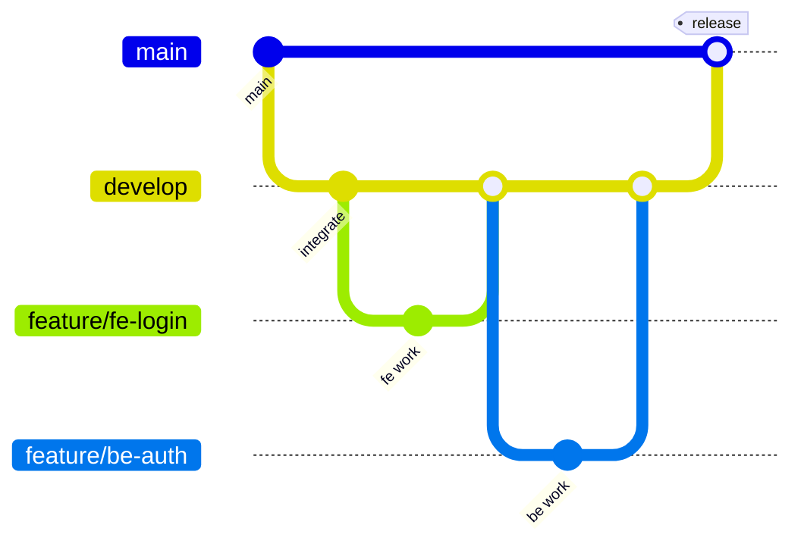

# Chiến lược nhánh Git — Cappy Bus (nhóm 5 người)

> **Dự án:** Cappy Bus (`bus-booking-platform`)  
> **Bản quyền:** © 2026 Lữ Minh Hoàng  
> **Nhánh gốc hiện tại:** `main`  
> **Cập nhật:** 24/06/2026

---

## 1. Mục tiêu

- 5 người làm song song **không đè code** lẫn nhau
- Mỗi người có **prefix nhánh riêng** theo vai trò
- Code ổn định luôn nằm trên `main`
- Tích hợp qua `develop` trước khi merge `main`

---

## 2. Sơ đồ nhánh



### Cây nhánh chuẩn

```
main          ← production / demo / bài nộp (protected)
  └── develop ← tích hợp hằng ngày (5 người merge vào đây)
        ├── feature/fe-<tên-tính-năng>     ← Người 1 — Frontend
        ├── feature/be-<tên-tính-năng>     ← Người 2 — Backend
        ├── feature/de-<tên-tính-năng>     ← Người 3 — Data
        ├── feature/ai-<tên-tính-năng>     ← Người 4 — AI/MCP
        ├── feature/do-<tên-tính-năng>     ← Người 5 — DevOps/QA
        ├── fix/<mô-tả-ngắn>               ← Sửa lỗi (ai cũng được mở)
        └── hotfix/<mô-tả>                 ← Khẩn cấp từ main
```

---

## 3. Phân nhánh theo 5 thành viên

| STT | Vai trò | Viết tắt | Prefix nhánh | Ví dụ nhánh hợp lệ |
|-----|---------|----------|--------------|-------------------|
| 1 | Frontend Engineer | **FE** | `feature/fe-` | `feature/fe-my-tickets-ui` |
| 2 | Backend Engineer | **BE** | `feature/be-` | `feature/be-reset-password` |
| 3 | Data Engineer | **DE** | `feature/de-` | `feature/de-route-ticket-stat` |
| 4 | AI/MCP Engineer | **AI** | `feature/ai-` | `feature/ai-capy-tool-sources` |
| 5 | DevOps & QA Engineer | **DO** | `feature/do-` | `feature/do-ci-e2e-playwright` |

**Quy tắc đặt tên:**

- Chữ thường, nối bằng `-`, không dấu tiếng Việt
- Ngắn gọn, mô tả **một** tính năng hoặc **một** bug
- Ví dụ tốt: `feature/fe-promo-voucher-card`, `fix/be-cancel-booking-403`
- Ví dụ tránh: `feature/sua-loi`, `feature/nhanh`, `test`

---

## 4. Ai được commit vào đâu?

| Nhánh | Ai được push | Ai review trước merge |
|-------|--------------|------------------------|
| `main` | **Không** push trực tiếp | Lead / người được chỉ định |
| `develop` | Cả 5 (sau khi PR pass) | Ít nhất 1 người **khác vai trò** |
| `feature/*` | Chủ nhánh (người tạo) | — |
| `fix/*` | Người sửa lỗi | Người liên quan module |
| `hotfix/*` | DO hoặc BE lead | DO + người sở hữu module |

---

## 5. Quy trình làm việc hằng ngày

### Bước 1 — Lấy code mới nhất

```powershell
cd "d:\Web Sum 26"
git fetch origin
git checkout develop
git pull origin develop
```

> Lần đầu setup: tạo `develop` từ `main` (chỉ cần 1 lần):
>
> ```powershell
> git checkout main
> git pull origin main
> git checkout -b develop
> git push -u origin develop
> ```

### Bước 2 — Tạo nhánh feature của bạn

```powershell
# Ví dụ FE
git checkout develop
git pull origin develop
git checkout -b feature/fe-admin-trips-filter
```

### Bước 3 — Code + commit

```powershell
git add apps/web/src/app/admin/trips/page.tsx
git commit -m "feat(fe): thêm bộ lọc nhà xe trên trang admin trips"
```

**Quy ước commit message:**

| Prefix | Ý nghĩa | Ví dụ |
|--------|---------|-------|
| `feat(fe):` | Tính năng frontend | `feat(fe): thêm PromoVoucherCard` |
| `feat(be):` | Tính năng backend | `feat(be): mutation resetPassword` |
| `feat(de):` | Data / schema / seed | `feat(de): seed thêm tuyến HCM-Cần Thơ` |
| `feat(ai):` | AI / MCP | `feat(ai): tool get_popular_routes cache` |
| `feat(do):` | Infra / CI | `feat(do): thêm health check workflow` |
| `fix(fe):` | Sửa lỗi FE | `fix(fe): sửa onSearch truyền event` |
| `fix(be):` | Sửa lỗi BE | `fix(be): cancelBooking kiểm tra userId` |
| `docs:` | Tài liệu | `docs: cập nhật TEAM_STRUCTURE` |
| `chore:` | Việc lặt vặt | `chore: cập nhật .gitignore` |

### Bước 4 — Push và mở Pull Request

```powershell
git push -u origin feature/fe-admin-trips-filter
```

Trên GitHub: **base = `develop`**, không phải `main`.

### Bước 5 — Merge vào develop

- CI pass (nếu có)
- Ít nhất 1 approve
- Xóa nhánh feature sau merge (khuyến nghị)

### Bước 6 — Release lên main (cuối sprint / demo)

```powershell
git checkout main
git pull origin main
git merge develop
git push origin main
```

Chỉ merge `develop` → `main` khi:
- Demo chạy được end-to-end
- `npm run test:production` pass (DO chạy)
- Không còn conflict lớn

---

## 6. Tránh conflict — ai sửa file nào?

| Khu vực | Chủ yếu | Người khác |
|---------|---------|------------|
| `apps/web/` | FE | AI (CapyAI), DO (Dockerfile) |
| `services/api-gateway/` | BE | FE (đọc schema), AI |
| `services/*-service/` (trừ analytics) | BE | DE (prisma schema) |
| `services/analytics-service/` | DE | BE |
| `packages/shared/` data | DE | BE |
| `packages/shared/` health/logging | DO | BE |
| `packages/proto/` | BE | DE, AI |
| `services/ai-service/`, `apps/mcp-server/` | AI | BE, DO |
| `docker-compose.yml`, `scripts/`, `.github/` | DO | BE, DE |
| `infra/postgres/` | DE | DO |
| `TEAM_STRUCTURE.md`, `GIT_BRANCH_STRATEGY.md` | DO | Cả nhóm review |

**Trước khi sửa file chung** (`schema.graphql`, `docker-compose.yml`, `packages/shared`):

1. Báo nhóm (chat/issue)
2. Nhánh ngắn, merge nhanh
3. Không refactor lớn cùng lúc

---

## 7. Kịch bản thường gặp

### A — FE cần API mới từ BE

1. BE mở `feature/be-xxx`, thêm vào `schema.graphql` + resolver
2. BE merge `develop`, báo FE
3. FE `git pull origin develop` rồi gọi API mới

### B — DE đổi Prisma schema

1. DE mở `feature/de-xxx`, sửa `schema.prisma` + seed
2. BE cùng review (ảnh hưởng handler)
3. DO chạy lại `docker compose up -d --build <service>`

### C — Conflict khi merge

```powershell
git checkout feature/fe-xxx
git fetch origin
git merge origin/develop
# Sửa file conflict
git add .
git commit -m "merge: đồng bộ develop vào feature/fe-xxx"
git push
```

### D — Lỗi khẩn trên main (demo ngày mai)

```powershell
git checkout main
git pull origin main
git checkout -b hotfix/be-payment-timeout
# sửa lỗi
git commit -m "fix(be): timeout processPayment"
git push -u origin hotfix/be-payment-timeout
# PR vào main VÀ cherry-pick / merge vào develop
```

---

## 8. Checklist trước mỗi Pull Request

- [ ] Đã `git pull origin develop` gần nhất
- [ ] Commit message đúng prefix vai trò
- [ ] Không commit `.env`, `node_modules`, `.next`
- [ ] Đã test local (xem checklist vai trò trong `TEAM_STRUCTURE.md`)
- [ ] PR mô tả: **làm gì / tại sao / test thế nào**
- [ ] Screenshot (nếu đổi UI)

---

## 9. Lệnh Git tham khảo (PowerShell)

```powershell
# Xem nhánh
git branch -a

# Xem ai đang sửa gì
git status
git log --oneline -10

# Hủy thay đổi chưa commit (cẩn thận)
git checkout -- path/to/file

# Đổi tên nhánh local
git branch -m feature/fe-old feature/fe-new

# Xóa nhánh local sau merge
git branch -d feature/fe-old

# Xem diff trước commit
git diff
```

---

## 10. Tài liệu liên quan

| File | Nội dung |
|------|----------|
| [TEAM_STRUCTURE.md](./TEAM_STRUCTURE.md) | Phân công 5 vai trò, lộ trình học |
| [MODULE_5.md](./MODULE_5.md) | Analytics + AI + MCP |
| [GHI-CHU-KHOI-DONG.md](./GHI-CHU-KHOI-DONG.md) | Chạy project local |

---

*© 2026 Lữ Minh Hoàng — Cappy Bus*
