# Module 5 — Phân tích Dữ liệu, Chatbot AI & Máy chủ MCP

> **Dự án:** Cappy Bus — Nền tảng đặt vé xe khách  
> **Bản quyền:** © 2026 Lữ Minh Hoàng  
> **Trạng thái:** Đã triển khai phần lớn — xem [§7 Checklist](#7-checklist-đối-chiếu-yêu-cầu)  
> **Nhóm 5 người:** Phân vai & Git workflow → [TEAM_STRUCTURE.md](./TEAM_STRUCTURE.md) · [GIT_BRANCH_STRATEGY.md](./GIT_BRANCH_STRATEGY.md)

| Vai trò | Trọng tâm Module 5 |
|---------|-------------------|
| **DE** | Kafka pipeline, `analytics-service`, `RouteTicketStat` |
| **AI** | `ai-service`, `mcp-server`, Capy AI tools |
| **BE** | GraphQL analytics queries, gRPC handlers phối hợp DE |
| **FE** | Admin dashboard charts, `CapyAI.tsx` |
| **DO** | Docker MCP port, health check AI service |

---

## 1. Mục tiêu

Module 5 là **điểm nhấn** của project: hệ thống không chỉ đặt vé mà còn:

1. **Thu thập & phân tích hành vi** (tìm kiếm, đặt vé, thanh toán) qua Kafka
2. **Chatbot AI (Capy AI)** hỗ trợ khách hàng tra cứu chuyến, chính sách, booking
3. **MCP Server** cho phép agent bên ngoài (Cursor, Claude Desktop…) gọi tool nội bộ an toàn

```mermaid
flowchart TB
  subgraph Producers["Event Producers"]
    TS[trip-service]
    BS[booking-service]
    PS[payment-service]
  end

  subgraph Kafka["Apache Kafka"]
    SE[search-events]
    BE[booking-events]
    PE[payment-events]
  end

  subgraph Analytics["analytics-service"]
    KC[Kafka Consumer]
    DB[(bus_analytics)]
    GRPC[gRPC :50059]
  end

  subgraph Gateway["api-gateway :4000"]
    GQL[GraphQL]
  end

  subgraph AI["AI Layer"]
    CAPY[CapyAI UI]
    AIS[ai-service :8765]
    MCP[mcp-server stdio]
  end

  subgraph Admin["Admin Dashboard"]
    WEB["/admin"]
  end

  TS --> SE
  BS --> BE
  PS --> PE
  SE & BE & PE --> KC --> DB --> GRPC --> GQL
  GQL --> WEB
  CAPY --> AIS
  AIS --> GQL
  MCP --> GQL
```



---

## 2. Phân tích Dữ liệu (Analytics)

### 2.1 Kafka Topics

| Topic | Hằng số | Producer | Event types |
|-------|---------|----------|-------------|
| `search-events` | `KAFKA_TOPICS.SEARCH_EVENTS` | `trip-service` | `search.performed` |
| `booking-events` | `KAFKA_TOPICS.BOOKING_EVENTS` | `booking-service` | `booking.created`, `booking.paid`, `booking.cancelled`, `booking.checked_in` |
| `payment-events` | `KAFKA_TOPICS.PAYMENT_EVENTS` | `payment-service` | `payment.success`, `payment.failed` |

**File tham chiếu:**

| File | Vai trò |
|------|---------|
| `packages/shared/src/constants.ts` | Định nghĩa tên topic |
| `packages/shared/src/kafka.ts` | `publishSearchEvent`, `createKafkaConsumer` |
| `services/trip-service/src/index.ts` | Publish khi `searchTrips` + autocomplete |
| `services/booking-service/src/index.ts` | Publish lifecycle booking |
| `services/payment-service/src/index.ts` | Publish kết quả thanh toán |
| `services/analytics-service/src/index.ts` | **Consumer duy nhất** — ghi DB |

**Payload mẫu `search-events`:**

```json
{
  "eventType": "search.performed",
  "keyword": "TP.HCM Đà Lạt",
  "origin": "TP.HCM",
  "destination": "Đà Lạt",
  "travelDate": "2026-06-25",
  "resultCount": 12,
  "userId": null
}
```

### 2.2 Analytics Consumer → Lưu trữ

Database: **`bus_analytics`** (`services/analytics-service/prisma/schema.prisma`)

| Bảng | Nguồn event | Mục đích |
|------|---------------|----------|
| `SearchEvent` | `search-events` | Lịch sử tìm kiếm thô |
| `RouteSearchStat` | `search-events` | Đếm `searchCount` theo cặp origin/destination |
| `BookingEvent` | `booking-events` | Lưu sự kiện booking (audit) |
| `PaymentEvent` | `payment-events` | Lưu thanh toán thành công |
| `DailyRevenue` | `payment-events` (`payment.success`) | Doanh thu + số vé theo ngày |
| `RouteTicketStat` | — | **Schema có, chưa có pipeline ghi** |

**Logic aggregate** (`analytics-service/src/index.ts`):

- Search → `RouteSearchStat.searchCount++`
- Payment success → `DailyRevenue.revenue += amount`, `bookingCount++`
- Conversion rate → `booking.paid` events / `SearchEvent` count (gRPC `GetConversionRate`)

### 2.3 gRPC & GraphQL cho Admin

**Proto:** `packages/proto/proto/analytics.proto`

| gRPC (analytics-service) | GraphQL (api-gateway) | Quyền |
|--------------------------|----------------------|-------|
| `GetRevenueSummary` | `revenueSummary` | ADMIN, EMPLOYEE |
| `GetPopularRoutes` | `popularRoutes` | Public |
| `GetConversionRate` | `conversionRate` | Public |
| `GetTicketsSoldByRoute` | *(chưa expose)* | — |

**Dashboard tổng hợp** — query `adminDashboard` (`api-gateway/src/resolvers.ts`):

| Chỉ số UI | Nguồn dữ liệu |
|-----------|---------------|
| Doanh thu 7/30 ngày | analytics-service → `DailyRevenue` |
| Tỷ lệ chuyển đổi | analytics `GetConversionRate` |
| Top tuyến / nhà xe / khách | booking-service `GetAdminInsights` |
| Vé bán theo ngày (chart) | `revenue7Days.bookingCount` |
| Đơn gần đây | booking-service `recentOrders` |

**Frontend Admin:**

| File | Mô tả |
|------|-------|
| `apps/web/src/app/admin/page.tsx` | Trang dashboard |
| `apps/web/src/lib/admin-dashboard.ts` | GraphQL query + format tiền |
| `apps/web/src/components/admin/RevenueChart.tsx` | Biểu đồ doanh thu |
| `apps/web/src/components/admin/TicketsChart.tsx` | Biểu đồ vé bán |
| `apps/web/src/components/admin/OrdersTable.tsx` | Bảng đơn hàng |
| `apps/web/src/components/admin/CheckInCard.tsx` | Check-in tại dashboard |

### 2.4 Khởi động & Kiểm thử Analytics

```powershell
# Hạ tầng (cần Kafka healthy)
npm run dev:infra
docker compose up -d analytics-service trip-service booking-service payment-service

# Gửi event gián tiếp: tìm chuyến trên web → Kafka → analytics
# Mở http://localhost:3000/trips?origin=TP.HCM&destination=Đà Lạt&date=...

# Xem dashboard admin
# http://localhost:3000/admin  (admin@bus.demo / admin123)

# GraphQL thủ công
curl -X POST http://localhost:4000/graphql -H "Content-Type: application/json" ^
  -d "{\"query\":\"{ popularRoutes(limit:5){ origin destination searchCount } conversionRate }\"}"
```

---

## 3. Chatbot AI (Capy AI)

### 3.1 Kiến trúc

```
Người dùng → CapyAI.tsx (floating widget)
          → POST /api/chat (Next.js rewrite)
          → ai-service :8765/chat
          → LLM + Tools HOẶC demoReply fallback
          → GraphQL api-gateway :4000
```

| File | Vai trò |
|------|---------|
| `apps/web/src/components/CapyAI.tsx` | UI chat, hiển thị ở `/`, `/trips`, `/booking`, `/lookup`… |
| `apps/web/src/app/layout.tsx` | Mount global CapyAI |
| `apps/web/next.config.js` | Proxy `/api/chat` → `ai-service` |
| `services/ai-service/src/index.ts` | Backend chat + tool calling |

### 3.2 Tools nội bộ (ai-service)

| Tool | GraphQL | Mô tả |
|------|---------|-------|
| `searchTrips` | `searchTrips` | **Bắt buộc** khi hỏi chuyến — không bịa dữ liệu |
| `getTripDetail` | `tripDetail` | Chi tiết sau khi search |
| `getBookingStatus` | `bookingByCode` | Cần **cả** `bookingCode` + `email` |

### 3.3 Chính sách nội bộ (Policy)

Định nghĩa inline trong `ai-service` (`POLICIES`):

```typescript
cancellation: "Theo chính sách hủy vé nội bộ: Hủy trước 24 giờ được hoàn 80%..."
checkin:      "Theo hướng dẫn check-in nội bộ: Có mặt trước 30 phút..."
booking:      "Hướng dẫn đặt vé: Chọn điểm đi/đến → chọn chuyến → chọn ghế..."
```

System prompt yêu cầu LLM **trích dẫn nguồn** khi trả lời chính sách.

### 3.4 Chế độ vận hành

| Chế độ | Điều kiện | Hành vi |
|--------|-----------|---------|
| **LLM** | Có `GOOGLE_GENERATIVE_AI_API_KEY` hoặc `OPENAI_API_KEY` | Vercel AI SDK `generateText` + tools, `maxSteps: 5` |
| **Demo** | Không có API key / provider lỗi | `demoReply()` — regex tuyến/ngày, vẫn gọi `searchTripsTool.execute` thật |

**Ví dụ câu hỏi tự nhiên:**

> "Tối mai có xe từ Sài Gòn đi Đà Lạt không?"

→ `extractRouteFromMessage` + `parseTravelDate('ngày mai')` → `searchTrips(TP.HCM, Đà Lạt, YYYY-MM-DD)`

### 3.5 Bảo mật tra cứu booking

- Tool `getBookingStatus` **bắt buộc** `bookingCode` + `email`
- GraphQL `bookingByCode` xác thực email khớp
- Thiếu thông tin → chatbot từ chối / báo không tìm thấy

### 3.6 Cấu hình

```env
# .env (root hoặc ai-service)
GOOGLE_GENERATIVE_AI_API_KEY=...   # ưu tiên Gemini
# hoặc
OPENAI_API_KEY=...
API_GATEWAY_URL=http://localhost:4000
```

```powershell
npm run dev:ai          # Chỉ ai-service
npm run dev             # Full stack (gateway + ai + web)
```

Kiểm tra: `http://localhost:8765/health`

---

## 4. MCP Server

### 4.1 Vị trí & Transport

| Thuộc tính | Giá trị |
|------------|---------|
| Package | `apps/mcp-server` |
| SDK | `@modelcontextprotocol/sdk` |
| Transport | **Stdio** (`StdioServerTransport`) |
| Docker | Có image + port `3100` nhưng **stdio không lắng nghe HTTP** — dùng local / Cursor config |

### 4.2 Tools

| Tool | Input | Backend | Quyền |
|------|-------|---------|-------|
| `search_trips` | `origin`, `destination`, `travelDate` | GraphQL `searchTrips` | Public |
| `get_trip_detail` | `tripId` | GraphQL `tripDetail` | Public |
| `get_booking_status` | `bookingCode`, `email` | GraphQL `bookingByCode` | Public |
| `get_revenue_summary` | — | GraphQL `revenueSummary` | **ADMIN** |
| `get_popular_routes` | `limit?` | GraphQL `popularRoutes` + Redis cache 5 phút | Public |

**File:** `apps/mcp-server/src/index.ts`

### 4.3 Resources

| URI | Nội dung |
|-----|----------|
| `bus://policy/cancellation` | Chính sách hủy vé |
| `bus://policy/checkin` | Hướng dẫn check-in |
| `bus://routes/popular` | JSON top tuyến (GraphQL + cache) |
| `bus://system/health` | Health aggregated gateway |

### 4.4 Xác thực

```env
MCP_API_KEY=bus-mcp-demo-key      # Session key
MCP_SESSION_KEY=bus-mcp-demo-key  # Client gửi khi connect
MCP_ROLE=admin                    # Cho phép get_revenue_summary
API_GATEWAY_URL=http://localhost:4000
REDIS_URL=redis://localhost:6379
```

### 4.5 Cấu hình Cursor (ví dụ)

Thêm vào Cursor **MCP settings** (`mcp.json`):

```json
{
  "mcpServers": {
    "cappy-bus": {
      "command": "npx",
      "args": ["tsx", "apps/mcp-server/src/index.ts"],
      "cwd": "D:/Web Sum 26",
      "env": {
        "MCP_SESSION_KEY": "bus-mcp-demo-key",
        "MCP_ROLE": "admin",
        "API_GATEWAY_URL": "http://localhost:4000",
        "REDIS_URL": "redis://localhost:6379"
      }
    }
  }
}
```

> Đảm bảo `api-gateway`, `redis`, và các backend gRPC đang chạy trước khi gọi tool.

---

## 5. Sơ đồ luồng end-to-end

### 5.1 Tìm chuyến → Analytics

```
User search /trips
  → trip-service searchTrips()
  → publishSearchEvent → Kafka search-events
  → analytics-service consumer
  → SearchEvent + RouteSearchStat
  → adminDashboard.popularRoutes / conversionRate
```

### 5.2 Đặt vé → Doanh thu

```
booking.created  → booking-events → BookingEvent (audit)
payment.success  → payment-events → PaymentEvent + DailyRevenue
booking.paid     → booking-events (dùng cho conversion)
```

### 5.3 Chatbot tra chuyến

```
"Tối mai SG đi Đà Lạt?"
  → ai-service demoReply / LLM
  → searchTripsTool → GraphQL
  → trip-service (dữ liệu thật)
  → Trả danh sách chuyến + giá + ghế trống
```

---

## 6. Cấu trúc thư mục Module 5

```
packages/shared/src/
  constants.ts          # KAFKA_TOPICS
  kafka.ts              # Producer / Consumer helpers

services/analytics-service/
  prisma/schema.prisma  # Bảng aggregate
  src/index.ts          # Consumer + gRPC

services/ai-service/
  src/index.ts          # Chat + tools + policies

apps/mcp-server/
  src/index.ts          # MCP tools + resources
  package.json

apps/web/src/
  components/CapyAI.tsx
  app/admin/page.tsx
  lib/admin-dashboard.ts
  components/admin/*.tsx

services/api-gateway/src/
  resolvers.ts          # adminDashboard, popularRoutes, conversionRate
  schema.graphql
```

---

## 7. Checklist đối chiếu yêu cầu

### Phân tích Dữ liệu

| # | Yêu cầu | Trạng thái | Ghi chú |
|---|---------|------------|---------|
| 1 | Ghi search vào `search-events` | ✅ | `trip-service` |
| 2 | Ghi booking vào `booking-events` | ✅ | `booking-service` |
| 3 | Ghi payment vào `payment-events` | ✅ | `payment-service` |
| 4 | Analytics Consumer aggregate | ✅ | `analytics-service` |
| 5 | Admin xem doanh thu theo ngày | ✅ | `RevenueChart`, `DailyRevenue` |
| 6 | Admin xem vé bán theo tuyến | ⚠️ | Top routes từ **booking-service**; `RouteTicketStat` chưa populate |
| 7 | Top tuyến tìm kiếm nhiều | ✅ | `RouteSearchStat` → `popularRoutes` |
| 8 | Tỷ lệ booking / search | ✅ | `conversionRate` |

### Chatbot AI

| # | Yêu cầu | Trạng thái | Ghi chú |
|---|---------|------------|---------|
| 1 | Mở chat ở trang tìm chuyến / booking | ✅ | `CapyAI.tsx` route match |
| 2 | Trả lời chính sách đổi/hủy + nguồn | ✅ | `POLICIES.cancellation` |
| 3 | Gợi ý chuyến câu tự nhiên | ✅ | `demoReply` + LLM tools |
| 4 | Gọi `searchTrips` thật | ✅ | Không hallucinate trips |
| 5 | Hướng dẫn đặt vé | ✅ | `POLICIES.booking` |
| 6 | Tra cứu booking (mã + email) | ✅ | `getBookingStatusTool` |
| 7 | Từ chối nếu thiếu email/mã | ✅ | Zod required + GraphQL verify |
| 8 | Hiển thị nguồn tham chiếu | ✅ | System prompt + prefix "Theo chính sách..." |

### MCP Server

| # | Yêu cầu | Trạng thái | Ghi chú |
|---|---------|------------|---------|
| `search_trips` | ✅ | |
| `get_trip_detail` | ✅ | |
| `get_booking_status` | ✅ | |
| `get_revenue_summary` | ✅ | Admin only |
| `get_popular_routes` | ✅ | Redis cache |
| Resources policy | ✅ | `bus://policy/*` |

---

## 8. Việc cần làm tiếp (Backlog)

| Ưu tiên | Hạng mục | Mô tả |
|---------|----------|-------|
| P1 | `RouteTicketStat` pipeline | Consumer `booking.paid` → aggregate vé theo tuyến |
| P2 | GraphQL `ticketsSoldByRoute` | Expose `GetTicketsSoldByRoute` cho admin |
| P3 | ai-service admin tools | `get_revenue_summary`, `get_popular_routes` (parity MCP) |
| P4 | MCP HTTP transport | Hoặc bỏ port 3100 trong compose nếu chỉ dùng stdio |
| P5 | CapyAI hiển thị `toolCalls` | UI badge "Nguồn: searchTrips" |
| P6 | Policy markdown files | Tách `POLICIES` ra `docs/policies/*.md` + MCP resources đọc file |

---

## 9. Lệnh nhanh

```powershell
# Full dev (Kafka + analytics + AI + web)
npm run dev

# Riêng lẻ
npm run dev:infra
npm run dev:gateway
npm run dev:ai
docker compose up -d analytics-service

# Test production pipeline
npm run test:production
```

---

## 10. Tài liệu liên quan

| File | Nội dung |
|------|----------|
| [TEAM_STRUCTURE.md](./TEAM_STRUCTURE.md) | Phân chia 5 vai trò, lộ trình học 4 tuần |
| [GIT_BRANCH_STRATEGY.md](./GIT_BRANCH_STRATEGY.md) | Nhánh Git, PR, quy trình nhóm 5 người |
| [GHI-CHU-KHOI-DONG.md](./GHI-CHU-KHOI-DONG.md) | Ghi chú khởi động local |
| [COPYRIGHT.md](./COPYRIGHT.md) | Bản quyền Lữ Minh Hoàng |

---

*Tài liệu Module 5 — Cập nhật theo codebase `Web Sum 26`.*
