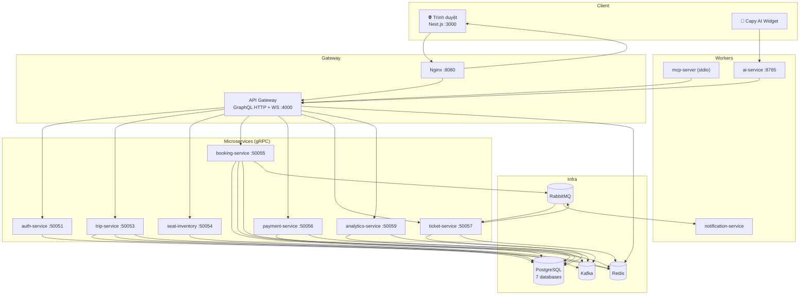

<div align="center">

# 🚌 Cappy Bus — Nền tảng đặt vé xe khách

**Hệ thống đặt vé xe khách trực tuyến theo kiến trúc microservices, tích hợp AI chatbot, phân tích dữ liệu và MCP Server.**

[](https://nodejs.org/)
[](https://nextjs.org/)
[](https://www.typescriptlang.org/)
[](https://graphql.org/)
[](https://www.postgresql.org/)
[](https://redis.io/)
[](https://kafka.apache.org/)
[](https://www.docker.com/)
[](LICENSE)

*Tác giả: [Lữ Minh Hoàng](COPYRIGHT.md) · © 2026*

</div>

---

## 📋 Mục lục

- [Giới thiệu](#-giới-thiệu)
- [Kiến trúc hệ thống](#-kiến-trúc-hệ-thống)
- [Chức năng người dùng](#-chức-năng-người-dùng)
- [Chức năng Admin](#-chức-năng-admin)
- [AI & Phân tích dữ liệu](#-ai--phân-tích-dữ-liệu)
- [Công nghệ](#-công-nghệ)
- [Cấu trúc thư mục](#-cấu-trúc-thư-mục)
- [Cài đặt](#-cài-đặt)
- [Hình ảnh hệ thống](#-hình-ảnh-hệ-thống)
- [Roadmap](#-roadmap)
- [Tác giả](#-tác-giả)
- [Giấy phép](#-giấy-phép)

---

## 🎯 Giới thiệu

**Cappy Bus** là nền tảng web cho phép hành khách **tìm chuyến**, **chọn ghế**, **đặt vé**, **thanh toán** và **tra cứu vé điện tử** trực tuyến. Hệ thống mô phỏng quy trình vận hành thực tế của nhà xe: quản trị tuyến, chuyến, xe, sơ đồ ghế, voucher, đánh giá và check-in.

### Mục tiêu

- Xây dựng nền tảng đặt vé **microservices** có thể mở rộng, tách biệt domain rõ ràng
- Cung cấp trải nghiệm đặt vé **không bắt buộc đăng nhập** (guest booking) và hỗ trợ tài khoản khách hàng
- Tích hợp **Capy AI** — chatbot hỗ trợ tìm chuyến, tra cứu vé, giải thích chính sách
- Thu thập và phân tích hành vi người dùng qua **Apache Kafka** → analytics pipeline
- Cung cấp **MCP Server** để agent AI bên ngoài gọi tool nội bộ an toàn
- Admin Panel tích hợp trong web app cho quản trị viên và nhân viên

### Công nghệ cốt lõi

Next.js · React · TypeScript · GraphQL · gRPC · Prisma · PostgreSQL · Redis · Kafka · RabbitMQ · Docker · Gemini / OpenAI

---

## 🏗 Kiến trúc hệ thống



### Frontend (`apps/web`)

- **Next.js 15** App Router, React 19, TypeScript, Tailwind CSS
- Giao diện khách hàng và **Admin Panel** (`/admin`) trong cùng một ứng dụng
- GraphQL client tự viết (`fetch` + `graphql-ws` cho subscription ghế real-time)
- JWT lưu `localStorage`, context `AuthProvider`
- Framer Motion, Lucide icons, react-hot-toast, QR code vé điện tử

### Backend (`services/*`)

| Service | Port gRPC | Health | Trách nhiệm |
|---------|-----------|--------|-------------|
| `api-gateway` | — | — | GraphQL HTTP `:4000`, WebSocket subscription, JWT, rate-limit |
| `auth-service` | 50051 | 9101 | Đăng ký/đăng nhập, JWT, hành khách đã lưu |
| `trip-service` | 50053 | 9103 | Tìm chuyến, catalog, marketing, Admin CRUD tuyến/xe/chuyến |
| `seat-inventory-service` | 50054 | 9104 | Sơ đồ ghế, giữ/thả/xác nhận/khóa ghế (Redis) |
| `booking-service` | 50055 | 9105 | Booking, voucher, review, check-in, admin insights |
| `payment-service` | 50056 | 9106 | Thanh toán mô phỏng, idempotency |
| `ticket-service` | 50057 | 9107 | Vé điện tử, QR, consume RabbitMQ |
| `analytics-service` | 50059 | 9109 | Consumer Kafka, doanh thu, thống kê |
| `notification-service` | — | 9108 | Email mock qua RabbitMQ |
| `ai-service` | — | — | REST chatbot `:8765` |
| `user-service` | — | 9102 | ⚠️ Deprecated — đã gộp vào auth-service |

### GraphQL (`services/api-gateway`)

- **47 Query**, **28 Mutation**, **1 Subscription** (`seatUpdated`)
- Apollo Server 4 trên Express, không dùng GraphQL Federation
- Phân quyền: `admin`, `employee` (staff), `customer`
- Admin đọc: ADMIN + EMPLOYEE · Admin ghi (CRUD): ADMIN only

### Database (PostgreSQL + Prisma)

Multi-database, khởi tạo qua `infra/postgres/init.sql`:

| Database | Service | Models chính |
|----------|---------|--------------|
| `bus_auth` | auth-service | User, SavedPassenger |
| `bus_trip` | trip-service | Location, Operator, Route, RouteStop, Bus, Trip |
| `bus_booking` | booking-service | Booking, Passenger, Voucher, Review, StatusLog |
| `bus_payment` | payment-service | Payment |
| `bus_ticket` | ticket-service | Ticket |
| `bus_analytics` | analytics-service | SearchEvent, BookingEvent, PaymentEvent, DailyRevenue, RouteStat |

### AI Chatbot (`services/ai-service`)

- REST `POST /chat`, `GET /health` trên port **8765**
- Vercel AI SDK + **Google Gemini 2.5 Flash** hoặc **OpenAI gpt-4o-mini**
- Tools gọi GraphQL: `searchTrips`, `getTripDetail`, `getBookingStatus`
- Demo mode khi không có API key — vẫn gọi tool thật, không bịa dữ liệu

### MCP Server (`apps/mcp-server`)

- Transport **stdio**, health endpoint `:3100` (Docker)
- Tools: `search_trips`, `get_trip_detail`, `get_booking_status`, `get_revenue_summary`, `get_popular_routes`
- Resources: chính sách hủy vé, check-in, tuyến phổ biến, system health
- Auth qua `MCP_API_KEY`, role `MCP_ROLE`

### Kafka

Topics: `search-events`, `booking-events`, `payment-events`

| Producer | Sự kiện |
|----------|---------|
| trip-service | `search.performed` |
| booking-service | `booking.created`, `booking.paid`, `booking.cancelled`, `booking.checked_in` |
| payment-service | `payment.success`, `payment.failed` |

**Consumer:** `analytics-service` → ghi analytics DB (doanh thu, tuyến phổ biến, conversion rate)

### RabbitMQ

Exchange `bus.events` — sau thanh toán thành công:
- `ticket.generate` → ticket-service tạo vé điện tử
- `email.send` → notification-service gửi email mock

---

## 👤 Chức năng người dùng

| Tính năng | Route | Mô tả |
|-----------|-------|-------|
| ✅ Tìm chuyến | `/`, `/trips` | Autocomplete điểm đi/đến, lọc nhà xe/loại xe/giá, sắp xếp, gợi ý ngày gần nhất |
| ✅ Chi tiết chuyến | `/trips/[id]` | Sơ đồ ghế đa tầng, giữ ghế real-time, nhập hành khách 2 bước |
| ✅ Chọn ghế | `/trips/[id]` | `holdSeats` / `releaseSeats`, countdown giữ ghế, WebSocket `seatUpdated` |
| ✅ Đặt vé | `/booking` | Guest booking, hành khách đã lưu, draft `sessionStorage` |
| ✅ Thanh toán | `/booking` | Voucher, 3 phương thức UI (QR/chuyển khoản/ví), phí dịch vụ 2% — **mô phỏng** qua `processPayment` |
| ✅ Vé điện tử | `/my-tickets`, `/lookup` | QR code, in/tải PDF, hủy vé, đánh giá chuyến |
| ✅ Tra cứu vé | `/lookup` | Tra cứu bằng mã vé + email/SĐT, auto-lookup qua query params |
| ✅ Vé của tôi | `/my-tickets` | Lọc UPCOMING/COMPLETED/CANCELLED, tìm kiếm, đánh giá |
| ✅ Đăng nhập | `/login` | Email + mật khẩu qua GraphQL |
| ✅ Đăng ký | `/register` | Tạo tài khoản khách hàng |
| ✅ Hồ sơ cá nhân | `/profile` | Thông tin tài khoản, liên kết vé, tab cài đặt |
| ✅ Chatbot AI | Widget nổi | **Capy AI** — tìm chuyến, tra cứu, chính sách |
| ✅ Responsive | Toàn bộ | Tailwind breakpoints, navbar mobile, admin sidebar responsive |

### Luồng đặt vé

```
/ hoặc /trips → /trips/[id] (chọn ghế + hành khách)
  → /booking (tạo booking + thanh toán)
  → /booking/success (khách) hoặc /my-tickets (đã đăng nhập)
```

### Trang bổ sung

- `/about` — Giới thiệu · `/contact` — Liên hệ (form mock)
- `/forgot-password`, `/reset-password` — UI hoàn chỉnh, **chưa kết nối API**
- SEO redirect `/[slug]` — slug `ve-xe-*` → `/trips?...`

---

## 🛠 Chức năng Admin

> Truy cập: `http://localhost:3000/admin` · Yêu cầu vai trò **admin** hoặc **employee**

| Tính năng | Route | Quyền | Trạng thái |
|-----------|-------|-------|------------|
| ✅ Dashboard | `/admin` | Staff | Doanh thu, vé bán, khách hàng, chuyến hôm nay, tỷ lệ chuyển đổi |
| ✅ Biểu đồ doanh thu | `/admin` | Staff | RevenueChart 7 ngày & 30 ngày |
| ✅ Biểu đồ vé | `/admin` | Staff | TicketsChart |
| ✅ Top tuyến / nhà xe / khách | `/admin` | Staff | TopList widgets |
| ✅ Đơn đặt vé gần đây | `/admin` | Staff | OrdersTable trên dashboard |
| ✅ Check-in vé | `/admin` | Staff | Nhập mã / quét QR (BarcodeDetector) |
| ✅ Quản lý tuyến | `/admin/routes` | Admin CRUD | Phân trang, tìm kiếm |
| ✅ Quản lý điểm dừng | `/admin/stops` | Admin CRUD | Lọc theo tuyến |
| ✅ Quản lý xe | `/admin/buses` | Admin CRUD | Biển số, loại xe, layout ghế |
| ✅ Quản lý chuyến | `/admin/trips` | Admin CRUD | Booking/ghế của chuyến, khóa ghế |
| ✅ Cấu hình sơ đồ ghế | `/admin/layout` | Admin | JSON layout theo loại xe |
| ⚠️ Quản lý nhà xe | — | — | Chỉ đọc (`adminOperators`) cho dropdown, **không có CRUD** |
| ⚠️ Quản lý người dùng | — | — | **Chưa triển khai** |
| ⚠️ Trang đơn hàng riêng | — | — | Chỉ widget trên dashboard |
| ⚠️ Xuất báo cáo | — | — | **Chưa triển khai** |
| 🚧 Nhật ký sự kiện | `/admin/events` | — | Feature flag tắt, hiện placeholder |

### Phân quyền

| Vai trò | Quyền |
|---------|-------|
| `admin` | CRUD đầy đủ, truy cập toàn bộ admin |
| `employee` | Xem dashboard và dữ liệu, không sửa CRUD |
| `customer` | Không truy cập admin |

---

## 🤖 AI & Phân tích dữ liệu

### Chatbot Capy AI

- Widget nổi trên trang chủ, tìm chuyến, chi tiết chuyến, booking, tra cứu
- `POST /api/chat` → rewrite tới `ai-service:8765`
- Hỗ trợ: tìm chuyến, chi tiết chuyến, tra cứu booking, chính sách hủy/check-in

### MCP Server

- Cho phép agent AI (Cursor, Claude Desktop, v.v.) gọi tool đặt vé an toàn
- Chạy: `npm run dev:mcp`
- Cấu hình: `MCP_API_KEY`, `MCP_ROLE`, `GRAPHQL_URL`

### Phân tích dữ liệu

| Nguồn | Pipeline | Kết quả |
|-------|----------|---------|
| Tìm kiếm chuyến | Kafka `search-events` | RouteSearchStat, SearchEvent |
| Đặt vé / thanh toán | Kafka `booking-events`, `payment-events` | DailyRevenue, BookingEvent, ConversionRate |
| Marketing | GraphQL public queries | `platformStats`, `featuredOperators`, `featuredReviews` |

### Gợi ý tìm kiếm

- `autocompleteLocations` — gợi ý điểm đi/đến
- `suggestNearestDate` — gợi ý ngày gần nhất khi không có chuyến
- `routeCatalog` — danh mục tuyến cho form tìm kiếm

---

## 💻 Công nghệ

### Frontend

| Công nghệ | Phiên bản | Ghi chú |
|-----------|-----------|---------|
| Next.js | 15.2 | App Router, `output: 'standalone'` |
| React | 19 | |
| TypeScript | 5.8 | |
| Tailwind CSS | 3.4 | PostCSS, Autoprefixer |
| Framer Motion | 12 | Animation |
| graphql / graphql-ws | 16 / 6 | Client tự viết, subscription ghế |
| qrcode | 1.5 | QR vé điện tử |
| Lucide React | — | Icons |
| react-hot-toast | — | Thông báo |

### Backend

| Công nghệ | Ghi chú |
|-----------|---------|
| Node.js | ≥ 20 |
| TypeScript | 5.8 |
| Express | API Gateway, AI Service |
| Apollo Server | 4 — GraphQL gateway |
| gRPC | `@grpc/grpc-js` + Protocol Buffers |
| Prisma | 6.5 ORM |
| PostgreSQL | 16 — multi-database |
| Redis | 7 — cache, ghế, rate-limit, idempotency |
| Apache Kafka | 7.6 — event streaming (KafkaJS) |
| RabbitMQ | 3 — async ticket & email |
| bcryptjs | Hash mật khẩu |
| pino | Structured logging (`@bus/shared`) |

### AI & MCP

| Công nghệ | Ghi chú |
|-----------|---------|
| Vercel AI SDK | `ai` v4 |
| Google Gemini | `gemini-2.5-flash` (ưu tiên) |
| OpenAI | `gpt-4o-mini` (fallback) |
| MCP SDK | `@modelcontextprotocol/sdk` v1.1 |

### DevOps

| Công nghệ | Ghi chú |
|-----------|---------|
| Docker & Compose | Full stack containerized |
| Nginx | 1.27 — reverse proxy `:8080` |
| npm workspaces | Monorepo |

> **Lưu ý:** Dự án **không sử dụng NestJS**. Microservices là Node.js + TypeScript thuần với gRPC.

---

## 📁 Cấu trúc thư mục

```
bus-booking-platform/
├── apps/
│   ├── web/                        # Next.js — giao diện khách + admin
│   │   ├── public/                 # Static assets, hình ảnh marketing
│   │   └── src/
│   │       ├── app/                # App Router pages
│   │       ├── components/         # UI, domain, admin components
│   │       └── lib/                # GraphQL, auth, booking, admin helpers
│   └── mcp-server/                 # MCP Server (stdio transport)
│       └── src/
├── services/
│   ├── api-gateway/                # GraphQL gateway (Express + Apollo)
│   ├── auth-service/               # Xác thực, JWT, saved passengers
│   ├── trip-service/               # Tìm chuyến, catalog, admin CRUD
│   ├── seat-inventory-service/     # Quản lý ghế (Redis)
│   ├── booking-service/            # Booking, voucher, review, check-in
│   ├── payment-service/            # Thanh toán mô phỏng
│   ├── ticket-service/             # Vé điện tử, QR
│   ├── analytics-service/          # Kafka consumer, thống kê
│   ├── notification-service/       # Email worker (mock)
│   ├── ai-service/                 # Capy AI chatbot
│   └── user-service/               # Deprecated (gộp vào auth)
├── packages/
│   ├── proto/                      # gRPC definitions (.proto)
│   └── shared/                     # Constants, Kafka, Redis, health, validation
├── infra/
│   ├── nginx/                      # Reverse proxy config
│   └── postgres/                   # init.sql — tạo 7 databases
├── scripts/
│   ├── dev-all.cjs                 # npm run dev — full stack hybrid
│   ├── bootstrap.cjs               # npm run setup
│   ├── start-dev-service.cjs       # Khởi động từng service
│   └── test-*.ts                   # Integration tests
├── docker-compose.yml
├── package.json                    # Root workspace scripts
├── .env.example
└── README.md
```

---

## ⚙️ Cài đặt

### Yêu cầu

- [Node.js](https://nodejs.org/) ≥ 20
- [Docker Desktop](https://www.docker.com/products/docker-desktop/) (khuyên dùng)
- Git

### 1. Clone repository

```bash
git clone <url-repo>
cd "Web Sum 26"
```

### 2. Cài đặt dependencies

```bash
npm run setup
```

Lệnh này chạy `npm install` và build `@bus/shared`.

### 3. Cấu hình môi trường

```bash
cp .env.example .env
```

Chỉnh sửa `.env`:

```env
# AI Chatbot (tùy chọn — không có key vẫn chạy demo mode)
GOOGLE_GENERATIVE_AI_API_KEY=your-gemini-api-key

# Truy cập từ thiết bị khác cùng WiFi (tùy chọn)
# NEXT_PUBLIC_GRAPHQL_URL=http://192.168.1.10:4000/graphql
# NEXT_PUBLIC_WS_URL=ws://192.168.1.10:4000/graphql
```

### 4. Database & Prisma

Docker tự khởi tạo PostgreSQL qua `infra/postgres/init.sql`. Chạy migration:

```bash
npm run db:migrate
npm run db:seed      # Seed dữ liệu tuyến/chuyến demo (trip-service)
```

### 5. Docker — Full stack (khuyên dùng)

```bash
npm run docker:up
# hoặc
docker compose up -d --build
```

Đợi 30–60 giây, sau đó truy cập:

| URL | Mô tả |
|-----|--------|
| http://localhost:3000 | Website Cappy Bus |
| http://localhost:4000/graphql | GraphQL API (Playground) |
| http://localhost:3000/admin | Admin Panel |
| http://localhost:8765/health | Capy AI health |
| http://localhost:8080 | Nginx reverse proxy |
| http://localhost:15672 | RabbitMQ Management (`bus` / `bus123`) |

### 6. Dev hybrid (hot-reload)

Chạy infrastructure + backend trên Docker, frontend/gateway/AI local:

```bash
npm run dev
```

Hoặc chạy riêng lẻ:

```bash
npm run dev:infra      # Postgres, Redis, Kafka, RabbitMQ
npm run dev:gateway    # API Gateway :4000
npm run dev:ai         # Capy AI :8765
npm run dev:web        # Frontend :3000
npm run dev:mcp        # MCP Server (stdio)
```

### 7. Chạy Frontend & Admin

Frontend và Admin Panel nằm trong **cùng** ứng dụng Next.js:

```bash
npm run dev:web        # http://localhost:3000
# Admin: http://localhost:3000/admin
```

### Tài khoản demo

> Kích hoạt khi `SEED_DEMO_ACCOUNTS=true` (mặc định trong Docker)

| Vai trò | Email | Mật khẩu |
|---------|-------|----------|
| Admin | `admin@bus.demo` | `admin123` |
| Nhân viên | `employee@bus.demo` | `employee123` |
| Khách hàng | `customer@bus.demo` | `customer123` |

### Script hữu ích

| Lệnh | Mô tả |
|------|--------|
| `npm run dev` | Full stack hybrid (một lệnh) |
| `npm run docker:up` | Bật toàn bộ Docker |
| `npm run docker:down` | Dừng Docker |
| `npm run build` | Build tất cả workspaces |
| `npm run typecheck` | Kiểm tra TypeScript |
| `npm run proto:gen` | Generate gRPC từ `.proto` |
| `npm run test:production` | Test pipeline end-to-end |
| `npm run test:auth` | Test luồng xác thực |
| `npm run test:admin-crud` | Test admin CRUD |
| `npm run deploy` | Deploy script (PowerShell) |

---

## 📸 Hình ảnh hệ thống

> Thêm screenshot vào thư mục `docs/screenshots/` và cập nhật đường dẫn bên dưới.

### Trang chủ


*Hero carousel, ô tìm chuyến, thống kê nền tảng, tuyến phổ biến*

### Tìm chuyến


*Bộ lọc nhà xe, loại xe, giá, sắp xếp kết quả*

### Chọn ghế


*Sơ đồ ghế đa tầng, giữ ghế real-time, countdown*

### Thanh toán


*Voucher, phương thức thanh toán, tóm tắt đơn hàng*

### Vé điện tử


*QR code, thông tin chuyến, in/tải PDF*

### Tra cứu vé


*Tra cứu bằng mã vé + email/SĐT*

### Vé của tôi


*Danh sách vé, lọc trạng thái, đánh giá chuyến*

### Admin Dashboard


*Doanh thu, biểu đồ, top tuyến, check-in vé*

---

## 🗺 Roadmap

### ✅ Đã hoàn thành

- [x] Tìm kiếm chuyến với autocomplete, lọc, sắp xếp
- [x] Chọn ghế real-time (WebSocket subscription)
- [x] Luồng đặt vé guest + đăng nhập
- [x] Thanh toán mô phỏng + voucher
- [x] Vé điện tử QR, tra cứu, hủy vé
- [x] Đăng ký / đăng nhập JWT
- [x] Hồ sơ cá nhân, hành khách đã lưu
- [x] Đánh giá chuyến đi sau khi hoàn thành
- [x] Admin Dashboard với biểu đồ doanh thu & vé
- [x] Admin CRUD: tuyến, điểm dừng, xe, chuyến, sơ đồ ghế
- [x] Check-in vé (mã / QR)
- [x] Capy AI chatbot (Gemini / OpenAI)
- [x] MCP Server cho agent bên ngoài
- [x] Kafka analytics pipeline
- [x] Docker Compose full stack
- [x] Responsive UI (mobile + desktop)

### 🚧 Đang phát triển

- [ ] Nhật ký sự kiện admin (code sẵn, feature flag đang tắt)
- [ ] Quên / đặt lại mật khẩu (UI có, chưa kết nối API)
- [ ] Cổng thanh toán thật (MoMo, VNPay, ZaloPay)
- [ ] Đăng nhập Google / OTP SĐT

### 📌 Dự kiến

- [ ] Admin CRUD nhà xe (operators)
- [ ] Quản lý người dùng
- [ ] Trang đơn hàng & xuất báo cáo PDF/Excel
- [ ] Ứng dụng mobile native
- [ ] Đa ngôn ngữ (i18n)
- [ ] PWA installable đầy đủ

---

## 👨‍💻 Tác giả

**Lữ Minh Hoàng**

- Dự án: Cappy Bus — Nền tảng đặt vé xe khách
- © 2026 Lữ Minh Hoàng. All rights reserved.
- Chi tiết bản quyền: [COPYRIGHT.md](COPYRIGHT.md)

---

## 📄 Giấy phép

Dự án được phát hành theo giấy phép [MIT](LICENSE).

```
MIT License

Copyright (c) 2026 Lữ Minh Hoàng

Permission is hereby granted, free of charge, to any person obtaining a copy
of this software and associated documentation files (the "Software"), to deal
in the Software without restriction, including without limitation the rights
to use, copy, modify, merge, publish, distribute, sublicense, and/or sell
copies of the Software, and to permit persons to whom the Software is
furnished to do so, subject to the following conditions:

The above copyright notice and this permission notice shall be included in all
copies or substantial portions of the Software.

THE SOFTWARE IS PROVIDED "AS IS", WITHOUT WARRANTY OF ANY KIND, EXPRESS OR
IMPLIED, INCLUDING BUT NOT LIMITED TO THE WARRANTIES OF MERCHANTABILITY,
FITNESS FOR A PARTICULAR PURPOSE AND NONINFRINGEMENT. IN NO EVENT SHALL THE
AUTHORS OR COPYRIGHT HOLDERS BE LIABLE FOR ANY CLAIM, DAMAGES OR OTHER
LIABILITY, WHETHER IN AN ACTION OF CONTRACT, TORT OR OTHERWISE, ARISING FROM,
OUT OF OR IN CONNECTION WITH THE SOFTWARE OR THE USE OR OTHER DEALINGS IN THE
SOFTWARE.
```

---

<div align="center">

**🚌 Cappy Bus** — Đặt vé xe khách thông minh · Made with ❤️ by Lữ Minh Hoàng

</div>
