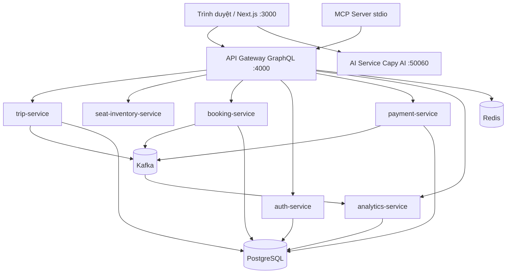

# Cappy Bus — Nền tảng đặt vé xe khách

**Đồ án / Dự án tốt nghiệp** — Hệ thống đặt vé xe khách trực tuyến theo kiến trúc microservices, tích hợp trí tuệ nhân tạo và phân tích dữ liệu hành vi người dùng.

| | |
|---|---|
| **Tác giả** | [Lữ Minh Hoàng](COPYRIGHT.md) |
| **Mã nguồn** | `bus-booking-platform` |
| **Bản quyền** | © 2026 Lữ Minh Hoàng — All rights reserved |
| **Cập nhật** | Tháng 6/2026 |

---

## Giới thiệu

**Cappy Bus** là nền tảng web cho phép hành khách **tìm chuyến**, **chọn ghế**, **đặt vé** và **tra cứu booking** trực tuyến. Hệ thống hướng tới mô hình vận hành thực tế của nhà xe: quản trị tuyến, chuyến, xe, sơ đồ ghế, thanh toán và nhật ký sự kiện.

Điểm nhấn của đồ án:

- **Kiến trúc microservices** với gRPC nội bộ và **GraphQL** làm API gateway cho frontend
- **Admin Panel** quản trị tuyến xe, chuyến, ghế, dashboard doanh thu
- **Capy AI** — chatbot hỗ trợ tìm chuyến, tra cứu vé, giải thích chính sách (Gemini / OpenAI)
- **Analytics pipeline** qua Apache Kafka — thu thập tìm kiếm, đặt vé, thanh toán
- **MCP Server** — cho phép agent bên ngoài gọi tool nội bộ an toàn

---

## Tính năng chính

### Khách hàng (Web)

- Tìm chuyến theo điểm đi / đến / ngày
- Chọn ghế trực quan, đặt vé nhiều hành khách
- Thanh toán mô phỏng, tra cứu vé bằng mã + email
- Đăng ký / đăng nhập, quản lý vé và hồ sơ
- Chat **Capy AI** góc phải màn hình

### Quản trị (Admin)

- Dashboard: doanh thu, vé bán, tỷ lệ chuyển đổi, top tuyến
- CRUD tuyến xe, điểm dừng, xe, chuyến
- Cấu hình sơ đồ ghế theo loại xe

### Hạ tầng & tích hợp

- Docker Compose — chạy full stack một lệnh
- Health check từng service, script test production
- CI workflow (GitHub Actions)

---

## Kiến trúc tổng quan



---

## Công nghệ sử dụng

| Lớp | Công nghệ |
|-----|-----------|
| Frontend | Next.js 15, React, TypeScript, Tailwind CSS |
| API | GraphQL (Apollo), gRPC, Protocol Buffers |
| Backend | Node.js 20+, Express / Fastify microservices |
| Cơ sở dữ liệu | PostgreSQL (Prisma ORM), Redis |
| Message queue | Apache Kafka, RabbitMQ |
| AI | Gemini / OpenAI (Vercel AI SDK), MCP SDK |
| DevOps | Docker, Docker Compose, Nginx, GitHub Actions |

---

## Cấu trúc thư mục

```
bus-booking-platform/
├── apps/
│   ├── web/              # Next.js — giao diện khách + admin
│   └── mcp-server/       # MCP tools cho agent bên ngoài
├── services/
│   ├── api-gateway/      # GraphQL gateway
│   ├── trip-service/
│   ├── seat-inventory-service/
│   ├── booking-service/
│   ├── payment-service/
│   ├── auth-service/
│   ├── analytics-service/
│   └── ai-service/       # Capy AI chatbot
├── packages/
│   ├── proto/            # gRPC definitions
│   └── shared/           # Constants, Kafka, health, logging
├── infra/                # Postgres init, Nginx
├── scripts/              # Dev, deploy, test scripts
├── docker-compose.yml
├── GHI-CHU-KHOI-DONG.md  # Tài liệu chi tiết (khởi động, nhóm, Git, Module 5)
└── COPYRIGHT.md
```

---

## Khởi động nhanh

### Yêu cầu

- [Node.js](https://nodejs.org/) ≥ 20
- [Docker Desktop](https://www.docker.com/products/docker-desktop/) (khuyên dùng)
- Git

### Chạy bằng Docker (khuyên dùng)

```powershell
git clone <url-repo>
cd "Web Sum 26"

npm install
docker compose up -d --build
```

Đợi khoảng 30–60 giây, sau đó mở:

| URL | Mô tả |
|-----|--------|
| http://localhost:3000 | Website Cappy Bus |
| http://localhost:4000/graphql | GraphQL API |
| http://localhost:3000/admin | Admin Panel |

**Tài khoản demo Admin:** `admin@bus.demo` / `admin123`

### Dev frontend (hot-reload)

```powershell
docker compose stop web
npm run dev:web
```

Chi tiết đầy đủ (port, Capy AI, xử lý lỗi, nhóm 5 người, Git workflow): **[GHI-CHU-KHOI-DONG.md](./GHI-CHU-KHOI-DONG.md)**

---

## Nhóm phát triển (đồ án 5 người)

| Vai trò | Trọng tâm |
|---------|-----------|
| **FE** — Frontend | `apps/web/`, UI/UX, Admin |
| **BE** — Backend | `services/`, GraphQL, gRPC |
| **DE** — Data | Prisma, seed, Kafka analytics |
| **AI** — AI/MCP | `ai-service`, `mcp-server`, Capy AI |
| **DO** — DevOps/QA | Docker, CI, scripts, tài liệu |

---

## Script hữu ích

| Lệnh | Mô tả |
|------|--------|
| `npm run docker:up` | Bật toàn bộ stack Docker |
| `npm run docker:down` | Dừng Docker |
| `npm run dev:web` | Frontend dev (port 3000) |
| `npm run dev:ai` | Capy AI local (port 50060) |
| `npm run test:production` | Kiểm thử pipeline end-to-end |
| `npm run setup` | Cài dependency sau clone |

---

## Demo nhanh (5 phút)

1. `docker compose up -d` → đợi service lên
2. Mở http://localhost:3000
3. Tìm chuyến **TP.HCM → Đà Lạt** → chọn ghế → đặt vé
4. Tra cứu vé tại `/lookup`
5. Đăng nhập Admin → xem dashboard tại `/admin`
6. Thử **Capy AI** — hỏi *"tìm chuyến TP.HCM đi Đà Lạt"*

---

## Tài liệu liên quan

| File | Nội dung |
|------|----------|
| [GHI-CHU-KHOI-DONG.md](./GHI-CHU-KHOI-DONG.md) | Hướng dẫn đầy đủ: khởi động, phân vai, Git, Module 5 |
| [COPYRIGHT.md](./COPYRIGHT.md) | Thông tin bản quyền |
| [LICENSE](./LICENSE) | Giấy phép sử dụng mã nguồn |
| `services/api-gateway/src/schema.graphql` | Hợp đồng API GraphQL |

---

## Bản quyền

Dự án **Cappy Bus** thuộc bản quyền **Lữ Minh Hoàng** (© 2026).

Không được sao chép, phân phối hoặc sử dụng thương mại mà không có sự đồng ý bằng văn bản của tác giả. Xem [COPYRIGHT.md](./COPYRIGHT.md) để biết chi tiết.

---

*Cappy Bus — Đồ án tốt nghiệp · Lữ Minh Hoàng · 2026*
