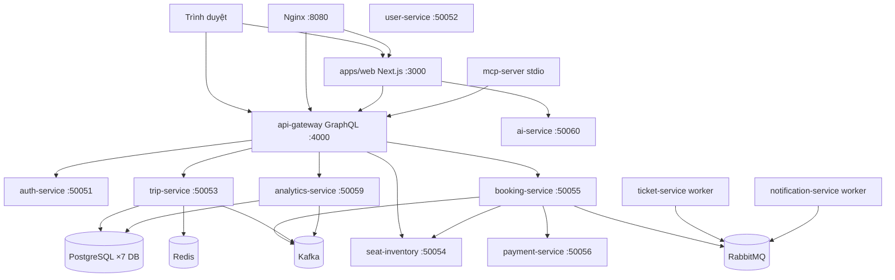

# Cấu trúc nhóm phát triển — Cappy Bus

> **Dự án:** Cappy Bus (`bus-booking-platform`)  
> **Bản quyền:** © 2026 Lữ Minh Hoàng  
> **Ngày phân tích:** 24/06/2026  
> **Phạm vi:** Toàn bộ 162 file nguồn trong repo (không gồm `node_modules`, `.git`, `dist`, `.next`)

---

## Tổng quan kiến trúc



### 5 vị trí và viết tắt

| Viết tắt | Vị trí |
|----------|--------|
| **FE** | Frontend Engineer |
| **BE** | Backend Engineer |
| **DE** | Data Engineer |
| **AI** | AI/MCP Engineer |
| **DO** | DevOps & QA Engineer |

---

## Sơ đồ trách nhiệm dự án

```
                    ┌─────────────────┐
                    │    Frontend     │
                    │  (apps/web)     │
                    └────────┬────────┘
                             │ GraphQL / WS / REST /api/chat
                             ▼
                    ┌─────────────────┐
                    │    Backend      │
                    │ (gateway + gRPC │
                    │   microservices)│
                    └────────┬────────┘
                             │ Prisma / Redis keys / Kafka / RabbitMQ
                             ▼
                    ┌─────────────────┐
                    │      Data       │
                    │ (schema, seed,  │
                    │  event pipeline)│
                    └────────┬────────┘
                             │ GraphQL tools / chat API
                             ▼
                    ┌─────────────────┐
                    │    AI / MCP     │
                    │ (ai-service +   │
                    │   mcp-server)   │
                    └────────┬────────┘
                             │ Docker / CI / test / deploy
                             ▼
                    ┌─────────────────┐
                    │  DevOps & QA    │
                    │ (infra, scripts,│
                    │  health, CI)    │
                    └─────────────────┘
```

**Luồng phối hợp chính:**
- FE ↔ BE: Hợp đồng GraphQL (`schema.graphql`), WebSocket subscription `seatUpdated`, auth JWT
- BE ↔ DE: Prisma schema, Redis key pattern, Kafka topic, seed data, analytics pipeline
- BE ↔ AI: `API_GATEWAY_URL` — AI/MCP gọi GraphQL qua gateway
- FE ↔ AI: `POST /api/chat` (rewrite Next.js → `ai-service`)
- Tất cả ↔ DO: Docker Compose, health check, CI, script dev/deploy/test

---

## Chức năng chưa hoàn thiện / chưa có người phụ trách rõ

| # | Chức năng | Trạng thái trong code | Vị trí phụ trách chính | Ghi chú |
|---|-----------|----------------------|------------------------|---------|
| 1 | Quên mật khẩu | UI only — `forgot-password/page.tsx` dòng 34: *"backend chưa có mutation reset password"* | BE + FE | Không có GraphQL mutation |
| 2 | Đặt lại mật khẩu | UI mock — `reset-password/page.tsx` chỉ `setTimeout`, không gọi API | BE + FE | Không có token validation backend |
| 3 | User saved passengers | `user-service` có handler `GetSavedPassengers` nhưng **không** `server.addService()`, không có `user.proto` | BE + DE | gRPC port 50052 bind nhưng không expose service |
| 4 | Gửi email thật | `notification-service` — `[EMAIL MOCK]` console.log | BE + DO | RabbitMQ consumer hoạt động, email mock |
| 5 | Thanh toán thật | `payment-service` — `simulate_success` flag, không gateway thật | BE | Chỉ mô phỏng |
| 6 | Hiển thị vé điện tử | `booking/page.tsx` dòng 217: *"gửi qua email (mock)"* | FE + BE | Ticket HTML tạo ở `ticket-service` nhưng FE không hiển thị |
| 7 | Hủy đặt vé (`cancelBooking`) | GraphQL mutation có trong `resolvers.ts`, **không** dùng ở frontend | FE | API sẵn, UI thiếu |
| 8 | Gợi ý ngày gần nhất (`suggestNearestDate`) | GraphQL query có, **không** dùng ở frontend | FE | API sẵn, UI thiếu |
| 9 | Nhả ghế (`releaseSeats`) | GraphQL mutation có, **không** dùng ở frontend | FE | API sẵn, UI thiếu |
| 10 | MCP HTTP port 3100 | `docker-compose.yml` expose 3100, code dùng `StdioServerTransport` | AI + DO | Lệch cấu hình Docker vs code |
| 11 | Prisma migrations | Chỉ `prisma db push` trong Dockerfile, **không** có thư mục `migrations/` | DE + DO | Không có versioned migration |
| 12 | E2E / unit test framework | Không Jest/Vitest/Playwright — chỉ script `scripts/*.ts` | DO | CI chỉ chạy `test:production` |
| 13 | `@apollo/client` | Khai báo trong `apps/web/package.json`, **không** import trong code | FE | Dependency thừa |
| 14 | `mockRating` trên homepage | `page.tsx` — rating giả theo operator name | FE | Chưa có dữ liệu thật |

---

# 1. Frontend Engineer (FE)

## Mục tiêu công việc

Xây dựng và duy trì giao diện người dùng Cappy Bus (tiếng Việt): tìm chuyến, chọn ghế real-time, đặt vé, tra cứu, quản trị, SEO, xác thực JWT phía client.

## Chức năng phụ trách

| Chức năng | Route / Component | GraphQL / API |
|-----------|-------------------|---------------|
| Trang chủ + tìm chuyến | `/` `page.tsx` | `autocompleteLocations`, `searchTrips` |
| Tìm chuyến theo query | `/trips` | `searchTrips` |
| SEO tuyến đường | `/[slug]` → `ve-xe-*` | `searchTrips` qua `RouteSearchClient` |
| Chi tiết chuyến + chọn ghế | `/trips/[id]` | `tripDetail`, `seatMap`, `holdSeats`, WS `seatUpdated` |
| Đặt vé + thanh toán | `/booking` | `createBooking`, `processPayment` |
| Tra cứu vé | `/lookup` | `bookingByCode`, `tripDetail` |
| Vé của tôi | `/my-bookings` | `myBookings` |
| Đăng nhập / Đăng ký | `/login`, `/register` | `login`, `register` |
| Quên / đặt lại MK | `/forgot-password`, `/reset-password` | ⚠️ UI only — chưa có backend |
| Admin dashboard | `/admin` | `revenueSummary`, `popularRoutes`, `conversionRate`, `checkIn` |
| Cấu hình ghế bus | `/admin/layout` | `updateBusSeatLayout` |
| Capy AI chat UI | `page.tsx` (panel chat) | `POST /api/chat` |
| Auth & routing guard | `AuthProvider`, `AuthGuard` | JWT localStorage |
| SEO metadata | `seo.ts`, `[slug]/page.tsx` | — |
| Hiển thị trạng thái chuyến | `TripAvailabilityBadge` | `bookable`, `availabilityStatus` |

## Thư mục phụ trách

```
apps/web/
├── public/
├── scripts/
└── src/
    ├── app/
    ├── components/
    ├── hooks/
    └── lib/
```

## Module phụ trách

- Next.js 15 App Router (`@bus/web`)
- Tailwind CSS + Framer Motion UI
- Client GraphQL (`lib/graphql.ts` — custom fetch, không Apollo)
- WebSocket GraphQL subscription (native, không `graphql-ws` lib)
- Auth client (`lib/auth.ts`, `lib/session.ts`)
- SEO slug builder (`lib/seo.ts`, `lib/trip-search.ts`)
- Mirror logic: `lib/datetime.ts`, `lib/trip-availability.ts` (đồng bộ với `@bus/shared`)

## API phụ trách (phía client)

| Loại | Endpoint | Ghi chú |
|------|----------|---------|
| GraphQL Query | `autocompleteLocations`, `searchTrips`, `tripDetail`, `seatMap`, `bookingByCode`, `myBookings`, `revenueSummary`, `popularRoutes`, `conversionRate` | Qua `gql()` |
| GraphQL Mutation | `login`, `register`, `holdSeats`, `createBooking`, `processPayment`, `checkIn`, `updateBusSeatLayout` | Qua `gql()` |
| GraphQL Subscription | `seatUpdated` | WS `NEXT_PUBLIC_WS_URL` |
| REST | `POST /api/chat` | Rewrite → ai-service |
| — | `cancelBooking`, `releaseSeats`, `suggestNearestDate` | ⚠️ Backend có, FE chưa implement |

## Service phụ trách

Không chạy service backend. Tiêu thụ:
- `api-gateway` (:4000 hoặc qua Nginx :8080)
- `ai-service` (:50060 qua rewrite)

## Database phụ trách

Không trực tiếp. Chỉ hiển thị dữ liệu từ GraphQL.

## Công nghệ liên quan

Next.js 15, React 19, TypeScript, Tailwind CSS 3, Framer Motion, Lucide React, react-hot-toast, GraphQL 16 (client fetch)

## Cần học trước

1. Next.js App Router (RSC vs Client Components)
2. GraphQL queries/mutations/subscriptions
3. JWT auth flow phía browser
4. WebSocket `graphql-transport-ws` protocol
5. Tailwind + responsive design
6. SEO dynamic routes (`[slug]`)

## Thứ tự đọc code đề xuất

1. `apps/web/package.json` → `next.config.js`
2. `src/app/layout.tsx` → `src/components/Providers.tsx`
3. `src/lib/graphql.ts` → `src/lib/auth.ts` → `src/lib/session.ts`
4. `src/app/page.tsx` (homepage flow)
5. `src/lib/seo.ts` → `src/lib/trip-search.ts` → `src/lib/trip-availability.ts`
6. `src/app/trips/page.tsx` → `src/app/trips/[id]/page.tsx`
7. `src/components/SeatMapGrid.tsx`
8. `src/app/booking/page.tsx` → `lookup/page.tsx` → `my-bookings/page.tsx`
9. `src/app/login/page.tsx` → `register/page.tsx`
10. `src/app/admin/page.tsx` → `admin/layout/page.tsx`
11. `services/api-gateway/src/schema.graphql` (hợp đồng API)

## Công việc hằng ngày

- Sửa UI/UX, fix responsive, accessibility
- Đồng bộ GraphQL fields mới từ BE
- Test flow tìm chuyến → chọn ghế → đặt vé trên localhost:3000
- Review WebSocket seat update trên `/trips/[id]`
- Giữ `CopyrightNotice` và footer bản quyền

## Công việc hằng tuần

- Sync với BE về breaking changes GraphQL schema
- Kiểm tra SEO slug routes (`ve-xe-*`)
- Review performance (LCP, bundle size)
- Triển khai UI cho API đã có nhưng chưa dùng (`cancelBooking`, `suggestNearestDate`)
- Cập nhật mirror `datetime`/`trip-availability` khi `@bus/shared` thay đổi

## Checklist onboarding

- [ ] `npm install` + `npm run dev:web` (backend Docker đang chạy)
- [ ] Mở http://localhost:3000, tìm chuyến HCM → Đà Lạt
- [ ] Đăng nhập `admin@bus.demo` / `admin123`, vào `/admin`
- [ ] Chọn ghế real-time trên `/trips/[id]`
- [ ] Hoàn tất flow đặt vé `/booking`
- [ ] Đọc `schema.graphql` — biết mọi operation FE dùng
- [ ] Hiểu `NEXT_PUBLIC_GRAPHQL_URL`, `NEXT_PUBLIC_WS_URL`, `API_GATEWAY_URL`
- [ ] Đọc `GHI-CHU-KHOI-DONG.md` phần dev local frontend

---

# 2. Backend Engineer (BE)

## Mục tiêu công việc

Thiết kế và triển khai toàn bộ logic nghiệp vụ phía server: GraphQL gateway, gRPC microservices, auth, booking flow, thanh toán mô phỏng, xuất vé async, health check.

## Chức năng phụ trách

| Service | Port gRPC/HTTP | Chức năng |
|---------|----------------|-----------|
| `api-gateway` | HTTP 4000 | GraphQL aggregation, JWT auth, rate limit, WS subscription |
| `auth-service` | gRPC 50051 | Login, Register, ValidateToken, JWT HMAC-SHA256 |
| `trip-service` | gRPC 50053 | SearchTrips, GetTripDetail, Autocomplete, SuggestNearestDate |
| `seat-inventory-service` | gRPC 50054 | GetSeatMap, Hold/Release/Confirm/BlockSeats (Redis) |
| `booking-service` | gRPC 50055 | CreateBooking, ProcessPayment, CheckIn, Cancel, Expire |
| `payment-service` | gRPC 50056 | ProcessPayment simulate, idempotency |
| `user-service` | gRPC 50052 | ⚠️ Handler có, chưa register gRPC service |
| `ticket-service` | Worker | RabbitMQ consumer → generate HTML ticket |
| `notification-service` | Worker | RabbitMQ consumer → ⚠️ email mock |
| `analytics-service` | gRPC 50059 | Revenue, popular routes, conversion (phối hợp DE) |

## Thư mục phụ trách

```
services/
├── api-gateway/
├── auth-service/
├── trip-service/src/
├── seat-inventory-service/
├── booking-service/src/
├── payment-service/src/
├── user-service/src/
├── ticket-service/src/
├── notification-service/
└── analytics-service/src/        # logic gRPC handler — schema thuộc DE

packages/
└── proto/
```

## Module phụ trách

- `@bus/api-gateway` — Apollo Server + Express + graphql-ws
- `@bus/auth-service`, `@bus/trip-service`, `@bus/seat-inventory-service`
- `@bus/booking-service`, `@bus/payment-service`, `@bus/user-service`
- `@bus/ticket-service`, `@bus/notification-service`
- `@bus/analytics-service` (gRPC handlers)
- `@bus/proto` — định nghĩa và load 6 proto files

## API phụ trách

### GraphQL (`services/api-gateway/src/schema.graphql`)

**Query:** `health`, `autocompleteLocations`, `searchTrips`, `tripDetail`, `seatMap`, `booking`, `bookingByCode`, `myBookings`, `suggestNearestDate`, `revenueSummary`, `popularRoutes`, `conversionRate`

**Mutation:** `register`, `login`, `holdSeats`, `releaseSeats`, `createBooking`, `processPayment`, `cancelBooking`, `checkIn`, `blockSeats`, `updateBusSeatLayout`

**Subscription:** `seatUpdated`

### REST

- `GET /health`, `GET /health/self` — api-gateway

### gRPC (6 services qua `@bus/proto`)

| Proto | Service | RPCs |
|-------|---------|------|
| `auth.proto` | AuthService | Login, Register, ValidateToken |
| `trip.proto` | TripService | SearchTrips, GetTripDetail, AutocompleteLocations, SuggestNearestDate |
| `seat.proto` | SeatInventoryService | GetSeatMap, HoldSeats, ReleaseSeats, ConfirmSeats, BlockSeats |
| `booking.proto` | BookingService | CreateBooking, GetBooking, GetBookingByCode, CancelBooking, CheckIn, ListUserBookings, ExpirePendingBookings, ProcessPayment, MarkTicketIssued |
| `payment.proto` | PaymentService | ProcessPayment, GetPaymentStatus |
| `analytics.proto` | AnalyticsService | GetRevenueSummary, GetPopularRoutes, GetConversionRate, GetTicketsSoldByRoute |

## Service phụ trách

Toàn bộ 10 services trong `services/` (trừ `ai-service` thuộc AI).

## Database phụ trách

Không sở hữu schema (DE sở hữu Prisma). BE viết business logic truy vấn qua Prisma Client trong từng service.

## Công nghệ liên quan

Node.js 20+, TypeScript, Express, Apollo Server 4, graphql-ws, @grpc/grpc-js, @grpc/proto-loader, Prisma Client, @bus/shared

## Cần học trước

1. GraphQL schema design + resolvers
2. gRPC + Protobuf
3. Microservice patterns (database-per-service)
4. JWT authentication
5. Redis distributed locking (seat hold)
6. RabbitMQ pub/sub (booking.paid flow)
7. Kafka producer (event publishing)
8. State machine booking status (`@bus/shared/constants`)

## Thứ tự đọc code đề xuất

1. `packages/proto/proto/*.proto` — hợp đồng gRPC
2. `services/api-gateway/src/schema.graphql` → `resolvers.ts` → `context.ts`
3. `packages/shared/src/constants.ts` — status machine, queue names
4. `services/auth-service/src/index.ts`
5. `services/trip-service/src/index.ts`
6. `services/seat-inventory-service/src/index.ts`
7. `packages/shared/src/redis-seats.ts`
8. `services/booking-service/src/index.ts`
9. `services/payment-service/src/index.ts`
10. `services/ticket-service/src/index.ts` → `notification-service/src/index.ts`
11. `services/analytics-service/src/index.ts`
12. `services/user-service/src/index.ts` — ⚠️ incomplete
13. `services/api-gateway/src/health-routes.ts`

## Công việc hằng ngày

- Implement/fix resolvers và gRPC handlers
- Debug cross-service calls (booking → seat → payment)
- Review Prisma queries performance
- Xử lý bug booking flow, seat double-booking

## Công việc hằng tuần

- Sync proto changes với tất cả services
- Review Kafka/RabbitMQ message contracts với DE
- Triển khai API còn thiếu (reset password, user saved passengers)
- Code review gateway auth/authorization (ADMIN/STAFF roles)

## Checklist onboarding

- [ ] `npm run setup` + `npm run dev:infra`
- [ ] `npm run dev:gateway` — GraphQL http://localhost:4000/graphql
- [ ] Test query `searchTrips` qua GraphQL Playground
- [ ] Trace flow: holdSeats → createBooking → processPayment
- [ ] Đọc 6 file `.proto`
- [ ] Hiểu `docker-compose.yml` dependency giữa services
- [ ] Chạy `npm run test:production` (Redis tests)

---

# 3. Data Engineer (DE)

## Mục tiêu công việc

Thiết kế và vận hành lớp dữ liệu: PostgreSQL schemas, seed, Redis cache/lock patterns, Kafka event pipeline, RabbitMQ queues, analytics aggregation, shared data utilities.

## Chức năng phụ trách

| Lĩnh vực | Chi tiết |
|----------|----------|
| PostgreSQL | 7 database độc lập, `init.sql`, 7 Prisma schemas |
| Redis | Search cache, autocomplete, seat hold/confirm, idempotency, rate limit, bus layout |
| Kafka | Topics: `search-events`, `booking-events`, `payment-events` → analytics consumer |
| RabbitMQ | Exchange `bus.events`, queues: `booking.paid`, `ticket.generate`, `email.send` |
| Seed data | `trip-service/prisma/seed.ts` — locations, routes, trips demo |
| Shared data logic | locations, datetime VN, trip-availability, validation, seat-layout |
| Analytics pipeline | `analytics-service` — Kafka consumer → aggregate tables |

## Thư mục phụ trách

```
infra/postgres/
services/*/prisma/               # schema.prisma + seed.ts
packages/shared/src/
  ├── constants.ts
  ├── datetime.ts
  ├── locations.ts
  ├── trip-availability.ts
  ├── validation.ts
  ├── kafka.ts
  ├── rabbitmq.ts
  ├── redis-seats.ts
  ├── idempotency.ts
  ├── rate-limit.ts
  └── seat-layout.ts
services/analytics-service/prisma/
services/analytics-service/src/  # Kafka consumer logic — phối hợp BE
```

## Database phụ trách

| Database | User | Service | Models chính |
|----------|------|---------|--------------|
| `bus_trip` | bus_trip | trip-service | Location, Operator, Route, RouteStop, Bus, Trip |
| `bus_booking` | bus_booking | booking-service | Booking, Passenger, StatusLog |
| `bus_payment` | bus_payment | payment-service | Payment |
| `bus_ticket` | bus_ticket | ticket-service | Ticket |
| `bus_auth` | bus_auth | auth-service | User |
| `bus_user` | bus_user | user-service | SavedPassenger |
| `bus_analytics` | bus_analytics | analytics-service | SearchEvent, BookingEvent, PaymentEvent, DailyRevenue, RouteSearchStat, RouteTicketStat |

**Redis keys** (từ `packages/shared/src/constants.ts`):
- `search:{origin}:{dest}:{date}`
- `autocomplete:{keyword}`
- `hold:{tripId}:{seatId}`
- `seats:{tripId}:booked|held|blocked`
- `idempotency:{key}`
- `bus:layout:{busId}`
- `ticket:{bookingId}`

**Kafka topics:** `search-events`, `booking-events`, `payment-events`

**RabbitMQ:** exchange `bus.events` (topic), routing `booking.paid` → `ticket.generate`, `email.send`

## Module phụ trách

- `@bus/shared` — data & messaging modules (xem danh sách file bên dưới)
- Prisma schemas cho 7 services
- `infra/postgres/init.sql`
- Analytics data pipeline

## API phụ trách

Không expose API trực tiếp. Cung cấp data layer cho BE/AI:
- GraphQL analytics queries được BE expose (`revenueSummary`, `popularRoutes`, `conversionRate`)
- MCP tool `get_revenue_summary` đọc analytics qua GraphQL

## Công nghệ liên quan

PostgreSQL 16, Prisma 6.5, Redis 7 (ioredis), Kafka (kafkajs + Zookeeper), RabbitMQ 3 (amqplib)

## Cần học trước

1. Database-per-service pattern
2. Prisma schema + `db push` vs migrations
3. Redis data structures (SET, TTL, distributed lock)
4. Kafka consumer groups, at-least-once delivery
5. RabbitMQ topic exchange routing
6. Vietnam timezone date handling (`Asia/Ho_Chi_Minh`)
7. Event-driven analytics aggregation

## Thứ tự đọc code đề xuất

1. `infra/postgres/init.sql`
2. `packages/shared/src/constants.ts`
3. Tất cả `services/*/prisma/schema.prisma`
4. `services/trip-service/prisma/seed.ts`
5. `packages/shared/src/locations.ts` → `datetime.ts` → `trip-availability.ts` → `validation.ts`
6. `packages/shared/src/redis-seats.ts` → `idempotency.ts` → `rate-limit.ts`
7. `packages/shared/src/kafka.ts` → `rabbitmq.ts`
8. `services/trip-service/src/index.ts` — cache + Kafka publish
9. `services/analytics-service/src/index.ts` — Kafka consumer
10. `services/booking-service/src/index.ts` — RabbitMQ publish
11. `scripts/test-double-booking.ts` — Redis concurrency test

## Công việc hằng ngày

- Maintain Prisma schemas, seed data
- Monitor Redis key TTL, seat lock integrity
- Verify Kafka/RabbitMQ message flow
- Tune search cache TTL (trip-service: 5min, autocomplete: 10min)

## Công việc hằng tuần

- Review analytics data accuracy
- Plan Prisma migrations (hiện chưa có — ⚠️)
- Backup/restore strategy cho 7 PostgreSQL databases
- Sync `locations.ts` aliases với seed data
- Chạy `npm run test:search-dates`, `test:production`

## Checklist onboarding

- [ ] Đọc `infra/postgres/init.sql` — hiểu 7 DB
- [ ] `docker compose up -d postgres redis kafka rabbitmq`
- [ ] `npm run db:migrate` + `npm run db:seed`
- [ ] Kiểm tra seed: query `searchTrips` HCM → Đà Lạt
- [ ] Trace Kafka message từ trip-service → analytics-service
- [ ] Trace RabbitMQ `booking.paid` → ticket + notification
- [ ] Chạy `scripts/test-double-booking.ts`

---

# 4. AI/MCP Engineer (AI)

## Mục tiêu công việc

Xây dựng lớp trí tuệ nhân tạo và MCP integration: Capy AI chatbot, tool calling qua GraphQL, MCP server cho agent bên ngoài.

## Chức năng phụ trách

| Thành phần | Chức năng |
|------------|-----------|
| `ai-service` | REST `POST /chat`, `GET /health` — Gemini/OpenAI + tool calling |
| `mcp-server` | MCP stdio — tools + resources proxy GraphQL |
| Capy AI UI | Chat panel trên homepage (`page.tsx`) |
| AI tools | `searchTrips`, `getTripDetail`, `getBookingStatus` |
| MCP tools | `search_trips`, `get_trip_detail`, `get_booking_status`, `get_revenue_summary`, `get_popular_routes` |
| MCP resources | `bus://policy/*`, `bus://routes/popular`, `bus://system/health` |
| Demo mode | Không API key → regex parse + gọi GraphQL thật |

## Thư mục phụ trách

```
services/ai-service/
apps/mcp-server/
```

Phối hợp FE: `apps/web/src/app/page.tsx` (chat UI), `apps/web/next.config.js` (rewrite `/api/chat`)

## Module phụ trách

- `@bus/ai-service`
- `@bus/mcp-server`
- Vercel AI SDK (`ai`, `@ai-sdk/google`, `@ai-sdk/openai`)
- `@modelcontextprotocol/sdk`

## API phụ trách

| API | Method | Mô tả |
|-----|--------|-------|
| `/chat` | POST | AI conversation + tool calls → GraphQL |
| `/health` | GET | ai-service health |
| MCP `search_trips` | Tool | → GraphQL `searchTrips` |
| MCP `get_trip_detail` | Tool | → GraphQL `tripDetail` |
| MCP `get_booking_status` | Tool | → GraphQL `bookingByCode` |
| MCP `get_revenue_summary` | Tool | → GraphQL `revenueSummary` (ADMIN) |
| MCP `get_popular_routes` | Tool | → GraphQL `popularRoutes` |

## Service phụ trách

- `ai-service` — HTTP port 50060
- `mcp-server` — stdio transport (⚠️ docker-compose expose 3100 nhưng code không listen HTTP)

## Database phụ trách

- Redis cache cho MCP `popularRoutes` (5min TTL) — phối hợp DE
- Không có database riêng

## Công nghệ liên quan

Vercel AI SDK, Google Gemini, OpenAI, MCP SDK, Zod validation, `@bus/shared` (sanitize, parseTravelDate)

## Cần học trước

1. LLM tool calling / function calling
2. Vercel AI SDK `streamText`, `generateText`
3. MCP protocol (tools, resources, stdio transport)
4. GraphQL as AI tool backend
5. Prompt engineering cho domain đặt vé xe

## Thứ tự đọc code đề xuất

1. `services/ai-service/src/index.ts`
2. `apps/mcp-server/src/index.ts`
3. `services/api-gateway/src/schema.graphql` — operations AI gọi
4. `apps/web/src/app/page.tsx` — chat UI integration
5. `apps/web/next.config.js` — `/api/chat` rewrite
6. `.env.example` — `GOOGLE_GENERATIVE_AI_API_KEY`, `OPENAI_API_KEY`
7. `packages/shared/src/validation.ts` — input sanitization MCP dùng

## Công việc hằng ngày

- Tune AI prompts và tool descriptions
- Test chat flow trên homepage
- Debug tool calling failures (GraphQL errors)
- Maintain MCP tool schemas

## Công việc hằng tuần

- Evaluate LLM model updates (Gemini/OpenAI)
- Review MCP security (`MCP_API_KEY`, `MCP_ROLE`)
- Sync tools khi GraphQL schema thay đổi
- Fix docker-compose port mismatch cho mcp-server
- Document MCP setup cho Cursor/Claude Desktop

## Checklist onboarding

- [ ] Set `GOOGLE_GENERATIVE_AI_API_KEY` hoặc `OPENAI_API_KEY` trong `.env`
- [ ] `npm run dev:ai` — test http://localhost:50060/health
- [ ] Chat Capy AI trên homepage — hỏi "tìm xe HCM đi Đà Lạt ngày mai"
- [ ] Test demo mode (không API key)
- [ ] Chạy mcp-server local: `npm run dev -w @bus/mcp-server`
- [ ] Đọc MCP tools list trong `apps/mcp-server/src/index.ts`

---

# 5. DevOps & QA Engineer (DO)

## Mục tiêu công việc

Vận hành hạ tầng, CI/CD, container hóa, reverse proxy, script dev/deploy, health monitoring, integration testing, tài liệu vận hành.

## Chức năng phụ trách

| Lĩnh vực | Chi tiết |
|----------|----------|
| Docker Compose | 18 services: postgres, redis, zookeeper, kafka, rabbitmq, nginx + 12 app services |
| Dockerfiles | 13 Dockerfiles (apps + services) |
| Nginx | Reverse proxy :8080 — `/graphql`, `/`, `/health` |
| CI/CD | `.github/workflows/ci.yml` — build + test:production |
| Dev scripts | `dev-all.cjs`, `bootstrap.cjs`, `start-dev-service.cjs` |
| Deploy | `deploy.ps1`, `deploy.sh` |
| Testing | `run-production-tests.ts`, `test-search-dates.ts`, `test-double-booking.ts` |
| Health checks | `@bus/shared` health module, per-service ports 9101–9109 |
| Env config | `.env.example`, docker env vars |
| Monorepo | Root `package.json` workspaces, `npm run *` scripts |
| Documentation | `GHI-CHU-KHOI-DONG.md` |

## Thư mục phụ trách

```
docker-compose.yml
infra/nginx/
scripts/
.github/workflows/
.env.example
GHI-CHU-KHOI-DONG.md
COPYRIGHT.md
LICENSE
.gitignore
.vscode/
.cursor/rules/
packages/shared/src/
  ├── health.ts
  ├── service-health-bootstrap.ts
  ├── logger.ts
  ├── retry.ts
  ├── express-middleware.ts
  ├── request-context.ts
  └── grpc-context.ts
**/Dockerfile                    # 13 files
package.json                     # root
package-lock.json
```

## Hạ tầng phụ trách

| Component | Image / Version | Port |
|-----------|-----------------|------|
| PostgreSQL | postgres:16-alpine | 5432 |
| Redis | redis:7-alpine | 6379 |
| Zookeeper | confluentinc/cp-zookeeper:7.6.1 | 2181 |
| Kafka | confluentinc/cp-kafka:7.6.1 | 9092 |
| RabbitMQ | rabbitmq:3-management-alpine | 5672, 15672 |
| Nginx | nginx:1.27-alpine | 8080→80 |
| api-gateway | build | 4000 |
| web | build | 3000 |
| ai-service | build | 50060 |
| mcp-server | build | 3100 (⚠️ code stdio) |
| Microservices | build | 50051–50059, 9101–9109 |

## Công nghệ liên quan

Docker, Docker Compose, Nginx, GitHub Actions, Node.js 20, PowerShell/Bash scripting, pino logging

## Cần học trước

1. Docker multi-stage builds
2. Docker Compose networking & healthchecks
3. Nginx reverse proxy + WebSocket upgrade
4. GitHub Actions service containers
5. Monorepo npm workspaces
6. Integration testing patterns (không unit test framework)

## Thứ tự đọc code đề xuất

1. `docker-compose.yml`
2. `infra/nginx/nginx.conf`
3. `infra/postgres/init.sql`
4. `scripts/dev-all.cjs` → `bootstrap.cjs` → `start-dev-service.cjs`
5. `scripts/deploy.ps1`
6. `.github/workflows/ci.yml`
7. `scripts/run-production-tests.ts`
8. `packages/shared/src/health.ts` → `service-health-bootstrap.ts`
9. `services/api-gateway/src/health-routes.ts`
10. `GHI-CHU-KHOI-DONG.md`
11. Sample Dockerfiles: `apps/web/Dockerfile`, `services/api-gateway/Dockerfile`

## Công việc hằng ngày

- `docker compose up/down`, monitor container health
- Fix CI failures
- Maintain dev scripts, port conflicts
- Update `GHI-CHU-KHOI-DONG.md` khi port/flow thay đổi

## Công việc hằng tuần

- Review Docker image sizes, build times
- Chạy full deploy: `npm run deploy`
- Expand test coverage (E2E framework — ⚠️ chưa có)
- Security review `.env.example`, secrets handling
- Monitor Kafka/Zookeeper/RabbitMQ stability

## Checklist onboarding

- [ ] `npm run setup` → `npm run docker:up`
- [ ] Verify http://localhost:8080, :3000, :4000/health
- [ ] Đọc `docker-compose.yml` — biết dependency graph
- [ ] Chạy `npm run test:production` locally
- [ ] Trigger CI workflow trên PR
- [ ] Chạy `npm run deploy` trên Windows
- [ ] Hiểu health ports 9101–9109

---

# Bảng phân công Module

| Module | Người phụ trách chính | Người phối hợp |
|--------|----------------------|----------------|
| `apps/web` (Next.js frontend) | FE | BE, AI, DO |
| `apps/web` — Capy AI chat UI | FE | AI |
| `apps/mcp-server` | AI | BE, DO, DE |
| `services/ai-service` | AI | BE, DO |
| `services/api-gateway` | BE | DO, DE, FE |
| `services/auth-service` | BE | DE, DO |
| `services/trip-service` | BE | DE, DO |
| `services/seat-inventory-service` | BE | DE, DO |
| `services/booking-service` | BE | DE, DO |
| `services/payment-service` | BE | DE, DO |
| `services/user-service` | BE | DE, DO |
| `services/ticket-service` | BE | DE, DO |
| `services/notification-service` | BE | DE, DO |
| `services/analytics-service` | DE | BE, DO |
| `packages/proto` | BE | FE, AI, DO |
| `packages/shared` — data/messaging | DE | BE, DO |
| `packages/shared` — health/logging/retry | DO | BE |
| `infra/postgres` | DE | DO |
| `infra/nginx` | DO | BE, FE |
| `docker-compose.yml` + Dockerfiles | DO | BE, DE, AI, FE |
| `scripts/` (dev, deploy, test) | DO | BE, DE, AI, FE |
| `.github/workflows/ci.yml` | DO | BE, DE |
| `GHI-CHU-KHOI-DONG.md` | DO | Tất cả |
| GraphQL schema (hợp đồng API) | BE | FE, AI |
| Redis seat inventory | DE | BE |
| Kafka event pipeline | DE | BE |
| RabbitMQ async workers | DE | BE |
| PostgreSQL 7 databases | DE | BE, DO |
| SEO routes (`ve-xe-*`) | FE | BE |
| Auth JWT flow | BE | FE |
| Integration tests | DO | BE, DE |
| Copyright / LICENSE | DO | Tất cả |

---

# Ma trận RACI

> **R** = Responsible (thực hiện) · **A** = Accountable (chịu trách nhiệm cuối) · **C** = Consulted (tham vấn) · **I** = Informed (được thông báo)

| Hoạt động / Deliverable | FE | BE | DE | AI | DO |
|-------------------------|----|----|----|----|-----|
| Giao diện người dùng (UI/UX) | **R/A** | C | I | C | I |
| SEO pages & metadata | **R/A** | C | I | I | I |
| GraphQL API design & resolvers | C | **R/A** | C | C | I |
| gRPC proto contracts | I | **R/A** | C | C | I |
| PostgreSQL schema & seed | I | C | **R/A** | I | C |
| Redis cache & seat locking | I | C | **R/A** | C | C |
| Kafka event pipeline | I | C | **R/A** | I | C |
| RabbitMQ async messaging | I | C | **R/A** | I | C |
| Authentication & JWT | C | **R/A** | I | I | I |
| Booking flow end-to-end | C | **R/A** | C | I | C |
| Payment processing (simulate) | I | **R/A** | C | I | I |
| Ticket generation (async) | I | **R/A** | C | I | C |
| Email notifications | I | **R/A** | C | I | C |
| Analytics & reporting data | I | C | **R/A** | C | I |
| Admin dashboard UI | **R/A** | C | C | I | I |
| Capy AI chatbot | C | C | I | **R/A** | I |
| MCP server tools/resources | I | C | C | **R/A** | C |
| Docker & container orchestration | I | C | C | C | **R/A** |
| Nginx reverse proxy | I | C | I | I | **R/A** |
| CI/CD pipeline | I | C | C | I | **R/A** |
| Integration & production tests | C | C | C | I | **R/A** |
| Dev environment scripts | C | C | C | C | **R/A** |
| Deployment (deploy.ps1/sh) | I | C | C | I | **R/A** |
| Health monitoring | I | C | I | I | **R/A** |
| Environment variables & secrets | I | C | I | C | **R/A** |
| Tài liệu vận hành (GHI-CHU-KHOI-DONG) | C | C | C | C | **R/A** |
| WebSocket real-time seats | **R** | **A** | C | I | C |
| Shared package (`@bus/shared`) | C | C | **A** | C | **R** |
| Quên/đặt lại mật khẩu | **R** | **A** | I | I | I |
| User saved passengers | I | **R/A** | C | I | I |

---

# Phân công từng file (162 files)

Quy ước: **Chính** = phụ trách chính · **Phối** = phối hợp

## Root (8 files)

| File | Chính | Phối |
|------|-------|------|
| `package.json` | DO | BE, FE, DE, AI |
| `package-lock.json` | DO | — |
| `docker-compose.yml` | DO | BE, DE, AI |
| `.env.example` | DO | AI, BE |
| `.env` | DO | — |
| `.gitignore` | DO | — |
| `COPYRIGHT.md` | DO | Tất cả |
| `LICENSE` | DO | — |
| `GHI-CHU-KHOI-DONG.md` | DO | Tất cả |

## `.cursor/` (1 file)

| File | Chính | Phối |
|------|-------|------|
| `.cursor/rules/copyright-owner.mdc` | DO | Tất cả |

## `.github/` (1 file)

| File | Chính | Phối |
|------|-------|------|
| `.github/workflows/ci.yml` | DO | BE, DE |

## `.vscode/` (1 file)

| File | Chính | Phối |
|------|-------|------|
| `.vscode/settings.json` | DO | — |

## `apps/web/` (48 files)

| File | Chính | Phối |
|------|-------|------|
| `apps/web/Dockerfile` | DO | FE |
| `apps/web/package.json` | FE | DO |
| `apps/web/next.config.js` | FE | DO, AI |
| `apps/web/next-env.d.ts` | FE | — |
| `apps/web/tsconfig.json` | FE | — |
| `apps/web/tailwind.config.js` | FE | — |
| `apps/web/postcss.config.js` | FE | — |
| `apps/web/scripts/process-logo.cjs` | FE | — |
| `apps/web/public/.gitkeep` | FE | — |
| `apps/web/public/images/cappy-bus-logo.png` | FE | — |
| `apps/web/public/images/cappy-bus-logo-src.png` | FE | — |
| `apps/web/public/images/hero-bus.png` | FE | — |
| `apps/web/src/app/layout.tsx` | FE | — |
| `apps/web/src/app/page.tsx` | FE | AI |
| `apps/web/src/app/globals.css` | FE | — |
| `apps/web/src/app/[slug]/page.tsx` | FE | BE |
| `apps/web/src/app/trips/page.tsx` | FE | BE |
| `apps/web/src/app/trips/[id]/page.tsx` | FE | BE |
| `apps/web/src/app/ve-xe-[slug]/RouteSearchClient.tsx` | FE | BE |
| `apps/web/src/app/booking/page.tsx` | FE | BE |
| `apps/web/src/app/lookup/page.tsx` | FE | BE |
| `apps/web/src/app/my-bookings/page.tsx` | FE | BE |
| `apps/web/src/app/login/page.tsx` | FE | BE |
| `apps/web/src/app/register/page.tsx` | FE | BE |
| `apps/web/src/app/forgot-password/page.tsx` | FE | BE |
| `apps/web/src/app/reset-password/page.tsx` | FE | BE |
| `apps/web/src/app/admin/layout.tsx` | FE | — |
| `apps/web/src/app/admin/page.tsx` | FE | BE, DE |
| `apps/web/src/app/admin/layout/page.tsx` | FE | BE, DE |
| `apps/web/src/app/admin/layout/default-layouts.ts` | FE | DE |
| `apps/web/src/components/Navbar.tsx` | FE | — |
| `apps/web/src/components/BrandLogo.tsx` | FE | — |
| `apps/web/src/components/CopyrightNotice.tsx` | FE | DO |
| `apps/web/src/components/AuthProvider.tsx` | FE | BE |
| `apps/web/src/components/AuthGuard.tsx` | FE | BE |
| `apps/web/src/components/AuthLayout.tsx` | FE | — |
| `apps/web/src/components/Providers.tsx` | FE | — |
| `apps/web/src/components/ErrorBoundary.tsx` | FE | — |
| `apps/web/src/components/SeatMapGrid.tsx` | FE | BE |
| `apps/web/src/components/TripAvailabilityBadge.tsx` | FE | DE |
| `apps/web/src/hooks/useAuth.ts` | FE | BE |
| `apps/web/src/hooks/useDebounce.ts` | FE | — |
| `apps/web/src/lib/graphql.ts` | FE | BE |
| `apps/web/src/lib/auth.ts` | FE | BE |
| `apps/web/src/lib/session.ts` | FE | BE |
| `apps/web/src/lib/seo.ts` | FE | BE |
| `apps/web/src/lib/datetime.ts` | FE | DE |
| `apps/web/src/lib/trip-availability.ts` | FE | DE |
| `apps/web/src/lib/trip-search.ts` | FE | DE |

## `apps/mcp-server/` (5 files)

| File | Chính | Phối |
|------|-------|------|
| `apps/mcp-server/Dockerfile` | DO | AI |
| `apps/mcp-server/package.json` | AI | DO |
| `apps/mcp-server/tsconfig.json` | AI | — |
| `apps/mcp-server/src/index.ts` | AI | BE, DE |

## `packages/proto/` (13 files)

| File | Chính | Phối |
|------|-------|------|
| `packages/proto/package.json` | BE | DO |
| `packages/proto/tsconfig.json` | BE | — |
| `packages/proto/scripts/generate.js` | BE | DO |
| `packages/proto/src/index.js` | BE | — |
| `packages/proto/src/index.d.ts` | BE | — |
| `packages/proto/proto/auth.proto` | BE | FE, AI |
| `packages/proto/proto/trip.proto` | BE | FE, DE, AI |
| `packages/proto/proto/seat.proto` | BE | DE |
| `packages/proto/proto/booking.proto` | BE | DE |
| `packages/proto/proto/payment.proto` | BE | DE |
| `packages/proto/proto/analytics.proto` | BE | DE, AI |

## `packages/shared/` (22 files)

| File | Chính | Phối |
|------|-------|------|
| `packages/shared/package.json` | DE | DO, BE |
| `packages/shared/tsconfig.json` | DE | DO |
| `packages/shared/src/index.ts` | DE | BE, DO |
| `packages/shared/src/constants.ts` | DE | BE |
| `packages/shared/src/datetime.ts` | DE | FE, BE, AI |
| `packages/shared/src/locations.ts` | DE | BE |
| `packages/shared/src/trip-availability.ts` | DE | FE, BE |
| `packages/shared/src/validation.ts` | DE | BE, AI |
| `packages/shared/src/text.ts` | DE | BE |
| `packages/shared/src/kafka.ts` | DE | BE, DO |
| `packages/shared/src/rabbitmq.ts` | DE | BE, DO |
| `packages/shared/src/redis-seats.ts` | DE | BE |
| `packages/shared/src/idempotency.ts` | DE | BE |
| `packages/shared/src/rate-limit.ts` | DE | BE |
| `packages/shared/src/seat-layout.ts` | DE | FE, BE |
| `packages/shared/src/logger.ts` | DO | BE |
| `packages/shared/src/health.ts` | DO | BE |
| `packages/shared/src/service-health-bootstrap.ts` | DO | BE |
| `packages/shared/src/retry.ts` | DO | BE |
| `packages/shared/src/request-context.ts` | DO | BE |
| `packages/shared/src/grpc-context.ts` | DO | BE |
| `packages/shared/src/express-middleware.ts` | DO | BE |

## `services/api-gateway/` (9 files)

| File | Chính | Phối |
|------|-------|------|
| `services/api-gateway/Dockerfile` | DO | BE |
| `services/api-gateway/package.json` | BE | DO |
| `services/api-gateway/tsconfig.json` | BE | — |
| `services/api-gateway/src/index.ts` | BE | DO |
| `services/api-gateway/src/schema.graphql` | BE | FE, AI |
| `services/api-gateway/src/resolvers.ts` | BE | DE, FE |
| `services/api-gateway/src/context.ts` | BE | DE |
| `services/api-gateway/src/health-routes.ts` | BE | DO |

## `services/auth-service/` (6 files)

| File | Chính | Phối |
|------|-------|------|
| `services/auth-service/Dockerfile` | DO | BE |
| `services/auth-service/package.json` | BE | DO |
| `services/auth-service/tsconfig.json` | BE | — |
| `services/auth-service/prisma/schema.prisma` | DE | BE |
| `services/auth-service/src/index.ts` | BE | DE |

## `services/trip-service/` (7 files)

| File | Chính | Phối |
|------|-------|------|
| `services/trip-service/Dockerfile` | DO | BE |
| `services/trip-service/package.json` | BE | DO |
| `services/trip-service/tsconfig.json` | BE | — |
| `services/trip-service/prisma/schema.prisma` | DE | BE |
| `services/trip-service/prisma/seed.ts` | DE | BE |
| `services/trip-service/src/index.ts` | BE | DE |

## `services/seat-inventory-service/` (5 files)

| File | Chính | Phối |
|------|-------|------|
| `services/seat-inventory-service/Dockerfile` | DO | BE |
| `services/seat-inventory-service/package.json` | BE | DO |
| `services/seat-inventory-service/tsconfig.json` | BE | — |
| `services/seat-inventory-service/src/index.ts` | BE | DE |

## `services/booking-service/` (6 files)

| File | Chính | Phối |
|------|-------|------|
| `services/booking-service/Dockerfile` | DO | BE |
| `services/booking-service/package.json` | BE | DO |
| `services/booking-service/tsconfig.json` | BE | — |
| `services/booking-service/prisma/schema.prisma` | DE | BE |
| `services/booking-service/src/index.ts` | BE | DE |

## `services/payment-service/` (6 files)

| File | Chính | Phối |
|------|-------|------|
| `services/payment-service/Dockerfile` | DO | BE |
| `services/payment-service/package.json` | BE | DO |
| `services/payment-service/tsconfig.json` | BE | — |
| `services/payment-service/prisma/schema.prisma` | DE | BE |
| `services/payment-service/src/index.ts` | BE | DE |

## `services/user-service/` (5 files)

| File | Chính | Phối |
|------|-------|------|
| `services/user-service/Dockerfile` | DO | BE |
| `services/user-service/package.json` | BE | DO |
| `services/user-service/prisma/schema.prisma` | DE | BE |
| `services/user-service/src/index.ts` | BE | DE |

## `services/ticket-service/` (6 files)

| File | Chính | Phối |
|------|-------|------|
| `services/ticket-service/Dockerfile` | DO | BE |
| `services/ticket-service/package.json` | BE | DO |
| `services/ticket-service/tsconfig.json` | BE | — |
| `services/ticket-service/prisma/schema.prisma` | DE | BE |
| `services/ticket-service/src/index.ts` | BE | DE |

## `services/notification-service/` (4 files)

| File | Chính | Phối |
|------|-------|------|
| `services/notification-service/Dockerfile` | DO | BE |
| `services/notification-service/package.json` | BE | DO |
| `services/notification-service/src/index.ts` | BE | DE |

## `services/analytics-service/` (6 files)

| File | Chính | Phối |
|------|-------|------|
| `services/analytics-service/Dockerfile` | DO | DE |
| `services/analytics-service/package.json` | DE | BE, DO |
| `services/analytics-service/tsconfig.json` | DE | — |
| `services/analytics-service/prisma/schema.prisma` | DE | BE |
| `services/analytics-service/src/index.ts` | DE | BE |

## `services/ai-service/` (5 files)

| File | Chính | Phối |
|------|-------|------|
| `services/ai-service/Dockerfile` | DO | AI |
| `services/ai-service/package.json` | AI | DO |
| `services/ai-service/tsconfig.json` | AI | — |
| `services/ai-service/src/index.ts` | AI | BE |

## `infra/` (2 files)

| File | Chính | Phối |
|------|-------|------|
| `infra/postgres/init.sql` | DE | DO |
| `infra/nginx/nginx.conf` | DO | BE, FE |

## `scripts/` (9 files)

| File | Chính | Phối |
|------|-------|------|
| `scripts/bootstrap.cjs` | DO | — |
| `scripts/clean-deps.cjs` | DO | — |
| `scripts/dev-all.cjs` | DO | FE, BE, AI |
| `scripts/start-dev-service.cjs` | DO | BE, AI |
| `scripts/deploy.ps1` | DO | — |
| `scripts/deploy.sh` | DO | — |
| `scripts/run-production-tests.ts` | DO | BE, DE |
| `scripts/test-double-booking.ts` | DO | DE |
| `scripts/test-search-dates.ts` | DO | DE, FE |

---

# Tổng kết phạm vi bao phủ

| Hạng mục | Số lượng | Bao phủ |
|----------|----------|---------|
| File nguồn | 162 | 100% — mỗi file có Chính + Phối |
| Workspace packages | 16 | 100% |
| Microservices | 11 (+ gateway) | 100% |
| PostgreSQL databases | 7 | 100% |
| gRPC proto services | 6 | 100% |
| GraphQL operations | 22 (12 query + 9 mutation + 1 subscription) | 100% |
| Docker services | 18 | 100% |
| Infrastructure | Postgres, Redis, Kafka, RabbitMQ, Nginx | 100% |
| Test scripts | 3 | 100% |

**Nguyên tắc phân chia:**
- Mỗi file có **đúng 1** người phụ trách chính
- Phối hợp được ghi rõ, không trùng trách nhiệm chính
- `@bus/shared` chia theo domain: data modules → DE, platform modules → DO
- `analytics-service`: DE chính (data pipeline), BE phối hợp (gRPC handlers)
- Chức năng chưa hoàn thiện được đánh dấu ⚠️ với owner đề xuất

---

*Phân tích dựa hoàn toàn trên source code thực tế tại `D:/Web Sum 26`, ngày 24/06/2026.*
